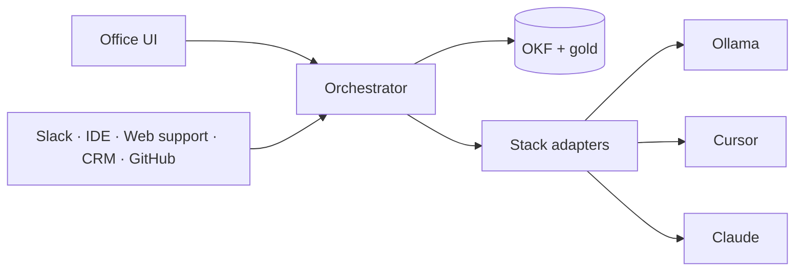

# AgentAnyStack

**Tagline:** Any stack. One orchestrator.  
**License:** Apache-2.0 · **Release:** v0 early · SemVer `0.3.4`

## What it is

**AgentAnyStack** is a **control plane for AI agents** — an agent office.

Operators seat agents (eng, sales, support, legal, …) at desks, put them on teams, and run them through one orchestrator. Agents can use different runtimes (local Ollama today; Cursor / Claude adapters planned). Shared knowledge is scoped (team room vs org/floor shelf × project). Side effects go through autonomy policy and human approvals. Office definitions and per-user gold memory live in git; shared facts use OKF in a database you own.

It is the workplace and policy layer for agents across stacks and roles — not another coding-agent product or a single-purpose chat app.

```text
Org → Floor (optional) → Team → Agent
         × Project (git / launch folder)
```

Reach the same desks from the office UI or from high-traffic work surfaces — **IDE / VS Code**, **Slack / Teams**, **CRM**, **customer-support chat on your website**, **GitHub** — via Connect. Analytics covers runs, API/MCP usage, approvals, and the knowledge graph. One backbone for company AI work, with **zero lock-in**.

## Problem

Teams already run agents in Cursor, Claude, scripts, and SaaS tools. Each tool works alone. There is no shared workplace: no common roles, memory boundaries, approvals, or run audit across stacks and business personas.

## Pillars

| # | Pillar | Product meaning |
| --- | --- | --- |
| 1 | **Agent office** | Desks, teams, floors, activity — operators manage agents like an org chart |
| 2 | **Controllability** | Autonomy 0–100 enforced by gates + HITL (not prompt instructions alone) |
| 3 | **Scoped memory** | Gold (per agent×user) + OKF at team / floor / org, filtered by project |
| 4 | **Zero lock-in** | BYO models and keys; office config in git; portable OKF; you keep your data and stacks |

---

## Product capabilities

Full product surface. Markers: **Available** · **In progress** · **Planned**

### Office & organization

| Capability | Status |
| --- | --- |
| Agent desks and role-based chat | Available |
| Multi-user concurrent desks; per-user gold | Available |
| Git-native agent definitions (`agent.yaml` + `AGENT.md`) | Available |
| Office system envelope on every run | Available |
| Org → floor → team → agent hierarchy | In progress (team live; floors next) |
| Floor connect lines (gated cross-team memory share) | Planned |
| Domain × channel × risk personas | Available / expanding |
| Live activity and desk presence | In progress |

### Memory & knowledge

| Capability | Status |
| --- | --- |
| Team room shared OKF (pipeline writes only) | Available |
| Deterministic pack: gold ∪ team ∪ project-filtered shelf | Available |
| Async extract from agent reports | Available |
| Office Q&A (status/knowledge without an agent) | Available |
| OKF export / import | In progress |
| Knowledge graph (facts + links) | Planned |
| Memory health, prune, earned agnosticism | Planned |
| Postgres at scale | Planned |

### Controllability & trust

| Capability | Status |
| --- | --- |
| Human approval board | Available |
| Effective autonomy (ceiling; user may tighten only) | In progress |
| Hard floors (external send, money, PII, prod, legal) | Planned |
| Run journal (`run_id`, `agent_id`, `user_id`, `channel`) | Available |
| Analytics: run explorer, API/MCP usage, HITL stats | Planned |
| Cost / tokens by agent and project | Planned |

### Any stack & tools

| Capability | Status |
| --- | --- |
| Ollama / OpenAI-compatible local models | Available |
| Cursor adapter | Planned |
| Claude API adapter | Planned |
| AWS Bedrock adapter | Built (`stack: bedrock` · Access Key ID + Secret + Region) |
| Unified stack models | `GET /stacks`, `GET /stacks/{stack}/models` |
| Org catalog: MCP · Skills · API/creds | Planned |
| Gated MCP (`_locked`) after human approve | Planned |
| Workspace / project path isolation | In progress |

### Connect — agents in the tools people already search for

| Capability | Status |
| --- | --- |
| Office UI | Available |
| Connect API (channel → same agent, memory, HITL) | Planned |
| Customer support widget on company website → support agent | Planned |
| Slack / Microsoft Teams → routed desks | Planned |
| IDE / VS Code extension → developer agent | Planned |
| CRM (e.g. Salesforce-class workflows) → sales / success agents | Planned |
| GitHub → eng / reviewer agents | Planned |

External apps call the orchestrator; AgentAnyStack does not embed those products.

---

## Architecture

```text
office/                            # desks = git data
  teams/<team>/agents/<id>/
    agent.yaml · AGENT.md · gold/<user>.md

apps/orchestrator/                 # FastAPI — route · pack · gate · adapt
apps/office-ui/                    # Team · Memory · Approvals · Analytics · Connect · Settings
```



---

## Quick start

Requires Python 3.12+ and Ollama (or another OpenAI-compatible endpoint).

```bash
git clone <repo-url>
cd AgentAnyStack
cp .env.example .env

cd apps/orchestrator
python -m venv .venv
source .venv/bin/activate          # Windows: .venv\Scripts\activate
pip install -e .
uvicorn agent_anystack.main:app --reload --port 8787
```

API: `http://127.0.0.1:8787/docs`  
Set `OFFICE_REPO_PATH`, `DATABASE_URL`, and `OLLAMA_BASE_URL` in `.env`.

---

## Documentation

| Doc | Contents |
| --- | --- |
| [PRODUCT_OVERVIEW.md](./PRODUCT_OVERVIEW.md) | Product definition |
| [V0_SCOPE.md](./V0_SCOPE.md) | Current release boundaries |
| [IMPLEMENTATION.md](./IMPLEMENTATION.md) | Engineering notes |
| [AGENT_DEFINITION.md](./AGENT_DEFINITION.md) | Agent file format |
| [MEMORY_ARCHITECTURE.md](./MEMORY_ARCHITECTURE.md) | Memory model |
| [ORCHESTRATOR.md](./ORCHESTRATOR.md) | Control plane |
| [ANALYTICS.md](./ANALYTICS.md) | Analytics |
| [CONNECT.md](./CONNECT.md) | External channels |
| [USE_CASES_MEMORY.md](./USE_CASES_MEMORY.md) | Scenarios |
| [mockups/](./mockups/) | UI vision |

---

## License

Apache License 2.0. See `LICENSE` at repository root.
