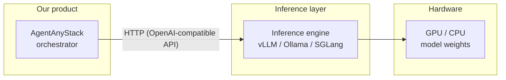
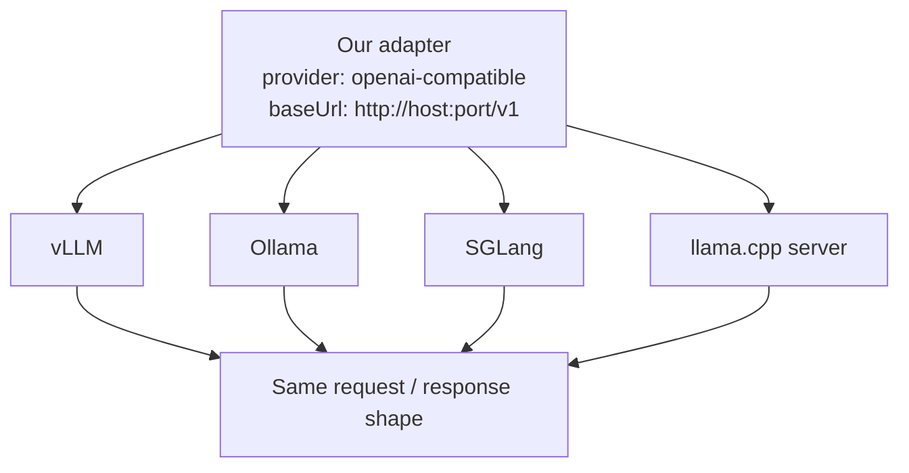
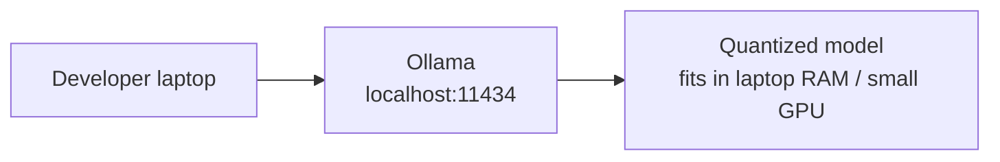
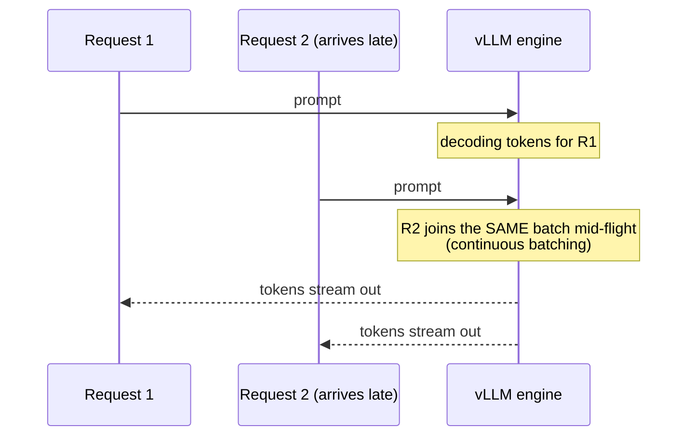
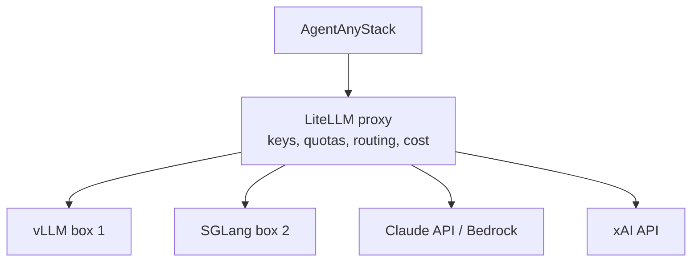
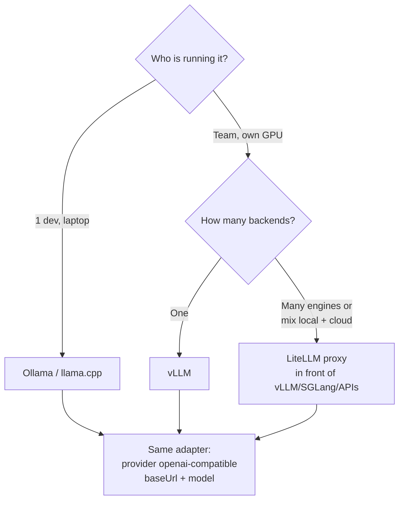
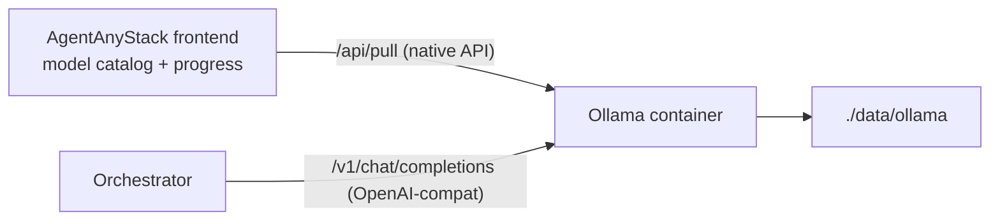

# Local Model Stack — Internal Knowledge

Simple notes on running open-weight LLMs ourselves (Ollama, vLLM, SGLang, OpenAI-compatible API, LiteLLM) and how it maps to **AgentAnyStack**.

**Audience:** internal. Simple English.
**Last updated:** 2026-08-03
**Related:** [PRODUCT_OVERVIEW.md](./PRODUCT_OVERVIEW.md) · [IMPLEMENTATION.md](./IMPLEMENTATION.md) (Python orchestrator talks to engines over OpenAI-compatible HTTP)

---

## 1. The big picture

We do not build models. We run models made by others (Llama, Qwen, DeepSeek, etc.) on our own machines using an **inference engine**. Our product talks to that engine over HTTP.



Key idea: **the engine is swappable**. If we talk the standard API, we do not care which engine runs below.

---

## 2. OpenAI-compatible API (the most important concept)

OpenAI made an HTTP format for chat: `POST /v1/chat/completions` with a JSON list of messages. It became the de-facto standard. Almost every engine copies it, so one client works with all engines.

- vLLM ships a FastAPI frontend that "extends the OpenAI API interface" ([PagedAttention paper, §5 — arXiv:2309.06180](https://arxiv.org/abs/2309.06180))
- Ollama, SGLang, llama.cpp server, LM Studio all expose the same style of endpoint (see each project's docs)



**Why we care:** AgentAnyStack needs **one** local adapter (base URL + model name), not one adapter per engine. Same "any stack" thesis we use for Cursor / Claude.

**Exception:** the standard covers chat, tools, streaming. Engine-specific extras (custom sampling flags, LoRA switching, etc.) are *not* standard — keep them in optional config, never in core logic.

---

## 3. Ollama — the laptop engine

**What:** a desktop-friendly tool. One command (`ollama run llama3`) downloads and runs a model. Made for one person on one machine.

**How it fits:**



**Pros**
- Easiest install of anything in this space
- Runs on Mac / Windows / Linux, CPU or GPU
- Good model library with ready quantized builds

**Cons / exceptions**
- Built for 1 user; limited batching — throughput drops fast with many parallel requests
- Weak multi-GPU story; few production ops features (metrics, autoscaling)

**Verdict for us:** default for **contributors and demos**, never the recommended production backend.

---

## 4. vLLM — the server engine (our production default)

**What:** an open-source serving engine from UC Berkeley, published at SOSP 2023. Its core invention is **PagedAttention** — it manages GPU memory for the KV cache like an OS manages virtual memory pages, so almost no memory is wasted and many requests fit on one GPU. Paper reports **2–4x throughput vs prior systems at the same latency** ([Kwon et al., SOSP 2023, arXiv:2309.06180](https://arxiv.org/abs/2309.06180)).

Second core feature: **continuous batching** — new requests join the running batch every step instead of waiting for the whole batch to finish.



**Real industry usage**
- **LinkedIn**: serves 50+ GenAI apps (Hiring Assistant, AI Job Search) on vLLM across thousands of hosts; profiling work with Red Hat gave ~7% TPOT gains ([Red Hat](https://www.redhat.com/en/topics/ai/how-vllm-accelerates-ai-inference-3-enterprise-use-cases), [ML at Scale case study](https://machinelearningatscale.substack.com/p/industry-case-study-vllm-linkedin))
- **Amazon**: Rufus shopping assistant (reported 250M customers in 2025) runs multi-node inference with vLLM + Trainium + EKS ([Red Hat](https://www.redhat.com/en/topics/ai/how-vllm-accelerates-ai-inference-3-enterprise-use-cases))
- **LMSYS Chatbot Arena**: moved to vLLM in 2023, cut GPU count ~50% at 30–60K daily requests ([gingerlabs summary](https://gingerlabs.ai/blog/pagedattention-vllm-throughput))

**Pros**
- Best-known throughput under concurrency (the exact problem agents create)
- OpenAI-compatible server built in
- Multi-GPU tensor parallel, quantization (AWQ/GPTQ), Prometheus metrics, K8s patterns

**Cons / exceptions**
- Needs a real NVIDIA/AMD GPU + driver setup; not a laptop tool
- More knobs to learn (`--max-model-len`, `--tensor-parallel-size`, quantization)

**Verdict for us:** the **documented default** for self-hosted teams.

---

## 5. SGLang — the fast alternative

**What:** another UC Berkeley / LMSYS engine. Key idea is **RadixAttention** — automatic KV-cache reuse across requests that share prefixes (very common in agent loops that resend the same system prompt).

**Real industry usage:** reported deployed on 400,000+ GPUs; **xAI uses SGLang to serve Grok**, and it ships in AMD and NVIDIA software stacks; LinkedIn and Cursor also run production workloads on it ([Inference.net guide](https://inference.net/content/sglang-complete-guide/), [NgKore Grok-2 on-prem deployment](https://docs.ngkorefoundation.org/ai-ml/grok2-deployment-via-sglang/)).

**Pros:** often faster on structured output and agentic patterns; OpenAI-compatible too.
**Cons:** younger ecosystem than vLLM; fewer tutorials.

**Verdict for us:** supported automatically via the same adapter. Mention in docs, don't make it the default.

---

## 6. LiteLLM — the gateway on top (different layer!)

**What:** not an engine. An open-source **proxy** that speaks the OpenAI format to clients and fans out to 20+ providers (OpenAI, Anthropic, Bedrock, xAI, self-hosted engines). Adds per-user keys, quotas, cost tracking, routing ([LiteLLM docs](https://docs.litellm.ai/), [xAI's own docs recommend it as an integration](https://docs.x.ai/developers/community)).



**Rule of thumb:** engines (vLLM/SGLang/Ollama) *host weights*; gateways (LiteLLM) *multiplex providers*. Production stacks often use both ([tech-stack comparison](https://futureagi.com/blog/llm-application-tech-stack-2025/)).

**Verdict for us:** never build quotas/routing ourselves — tell users to put LiteLLM in front when they run multiple backends.

---

## 7. Decision map for AgentAnyStack



Adapter config sketch (one adapter covers everything):

```yaml
runtime: local
provider: openai-compatible
baseUrl: http://gpu-box:8000/v1   # vLLM, Ollama, SGLang, LiteLLM — all fine
model: qwen2.5-coder-32b
apiKey: optional
```

---

## 8. Agent-specific gotchas (why this matters more for us)

1. **Fan-out:** one user turn = many LLM calls (think loop, tools, several agents on a floor). 10–50 product users can mean hundreds of concurrent inference requests → continuous batching is not optional.
2. **Tool calling quality:** small local models are weak at agentic tool use. Recommend 32B+ coder models (e.g. Qwen2.5-Coder) for Developer-type roles; small models OK for summarize-style roles.
3. **Context budget:** local models often run 8k–32k practical context vs 200k hosted. Our **scoped memory** (team/floor/org + floor links) is an advantage here — fetch less, fit more.
4. **Rough sizing:** one 24 GB GPU ≈ 7B–14B model with decent batch depth; 32B usually needs 48 GB+ or multi-GPU (quantization helps).

---

## 9. Product decision: quick-start local setup (Docker + Ollama)

**Decision (2026-07-31):** the quick-start bundles **Ollama** in the Docker stack. Users pick a model from a curated catalog in the AgentAnyStack frontend, the model downloads into a Docker volume, and agents run against it locally. vLLM / SGLang stay the documented "team / GPU server" upgrade path.

Prior art: Open WebUI ships the same pattern (an `open-webui:ollama` bundled image, models pulled from the UI into a volume) — users already understand it ([Open WebUI docs](https://docs.openwebui.com/)).

### Why Ollama here (not vLLM / SGLang)

| Reason | Detail |
| --- | --- |
| Model download is a built-in API | `POST /api/pull` streams progress → frontend shows a progress bar. vLLM/SGLang load one model at startup; "pull and switch" would be custom work |
| No GPU required | Quick-start users are on laptops. vLLM/SGLang effectively need NVIDIA + CUDA inside Docker; Ollama runs on CPU and uses a GPU if present |
| Quantized light models are native | Registry serves ready GGUF builds (`llama3.2:3b`, `qwen2.5:7b`) — the curated catalog is just a list of tags |
| Multi-model, one process | Loads/unloads on demand, no container restart per model |

### Architecture



Two API surfaces, on purpose:

- **Inference:** orchestrator talks OpenAI-compatible only (`http://ollama:11434/v1`) — same adapter later works against vLLM/SGLang/LiteLLM. Ollama is the quick-start default, **not** a hard dependency.
- **Model management:** pull / list / delete use Ollama's native API, isolated in a small "model manager" module. That is the only Ollama-specific code allowed.

Compose shape: `ollama/ollama` service + bind **`./data/ollama` → `/root/.ollama`**, orchestrator gets `OPENAI_COMPATIBLE_BASE_URL` (alias: `OLLAMA_BASE_URL`).

### Known caveats (document in user-facing quick start)

1. **CPU by default; GPU is opt-in.** Base `docker compose --profile ollama` runs Ollama on **CPU** (always starts). For NVIDIA, add `docker-compose.gpu.yml` (passes GPU devices). If that command fails (no driver / toolkit), drop the override — **CPU fallback**. Weights live on the host at **`./data/ollama`** either way. See [architecture/07_DOCKER.md](./architecture/07_DOCKER.md).
2. **GPU prereqs (NVIDIA + Docker):** current NVIDIA driver; Windows = Docker Desktop + WSL2 + NVIDIA Container Toolkit; Linux = NVIDIA Container Toolkit. Ollama then uses CUDA automatically. AMD/Intel: prefer **native** Ollama on the host.
3. **macOS + Docker loses the GPU.** Docker on Mac cannot access Apple's Metal GPU, so containerized Ollama is CPU-only there. Workaround (same as Open WebUI): Mac users install Ollama natively and the stack points at `host.docker.internal:11434` via `OLLAMA_BASE_URL`. One env var supports both layouts.
4. **Model quality expectations.** 3B–7B quantized models are fine for chat/summarize roles but weak at agentic tool calling. Flag catalog entries as "demo-grade" vs "can run a Developer agent" so the product isn't judged by a 3B model failing tool calls.
5. **Don't bake models into the image.** Weights go to **`./data/ollama`** (gitignored) at runtime; the image stays small and models survive container upgrades.

---

## 10. Cheat sheet

| Tool | Layer | Best for | One-line memory hook |
| --- | --- | --- | --- |
| **Ollama** | Engine | Laptop, 1 user | "The Docker Desktop of LLMs" |
| **vLLM** | Engine | Team server, concurrency | "PagedAttention = OS paging for KV cache" |
| **SGLang** | Engine | Agentic / structured, prefix reuse | "RadixAttention = auto prefix cache" |
| **llama.cpp** | Engine | CPU / tiny hardware | "Runs anywhere, slowly" |
| **LiteLLM** | Gateway | Keys, quotas, many providers | "One API in front of everything" |
| **OpenAI-compatible API** | Protocol | Everything above | "The USB-C of LLM serving" |

---

## 11. Sources

- Kwon et al., *Efficient Memory Management for LLM Serving with PagedAttention*, SOSP 2023 — [arXiv:2309.06180](https://arxiv.org/abs/2309.06180)
- Red Hat, *How vLLM accelerates AI inference: 3 enterprise use cases* (LinkedIn, Amazon Rufus) — [redhat.com](https://www.redhat.com/en/topics/ai/how-vllm-accelerates-ai-inference-3-enterprise-use-cases)
- *Industry case study: vLLM @ LinkedIn* — [machinelearningatscale.substack.com](https://machinelearningatscale.substack.com/p/industry-case-study-vllm-linkedin)
- *PagedAttention in vLLM* (LMSYS Arena numbers) — [gingerlabs.ai](https://gingerlabs.ai/blog/pagedattention-vllm-throughput)
- *SGLang: The Complete Guide* (xAI, NVIDIA, AMD, LinkedIn, Cursor usage; 400k+ GPUs) — [inference.net](https://inference.net/content/sglang-complete-guide/)
- NgKore, *Grok-2 on-prem deployment via SGLang* — [docs.ngkorefoundation.org](https://docs.ngkorefoundation.org/ai-ml/grok2-deployment-via-sglang/)
- xAI developer docs, community integrations (LiteLLM) — [docs.x.ai](https://docs.x.ai/developers/community)
- LiteLLM xAI provider docs — [docs.litellm.ai](https://docs.litellm.ai/docs/providers/xai)
- *LLM Application Tech Stack 2026* (engine vs gateway layering) — [futureagi.com](https://futureagi.com/blog/llm-application-tech-stack-2025/)

> Note: throughput claims (2–4x, 50% GPU cut, 400k GPUs) come from the cited sources, not our own benchmarks. Verify on our hardware before quoting externally.

---

## Changelog

| Date | Note |
| --- | --- |
| 2026-07-31 | Quick-start Docker + Ollama decision |
| 2026-08-03 | Link IMPLEMENTATION.md — Python orchestrator consumes OpenAI-compatible engines |
