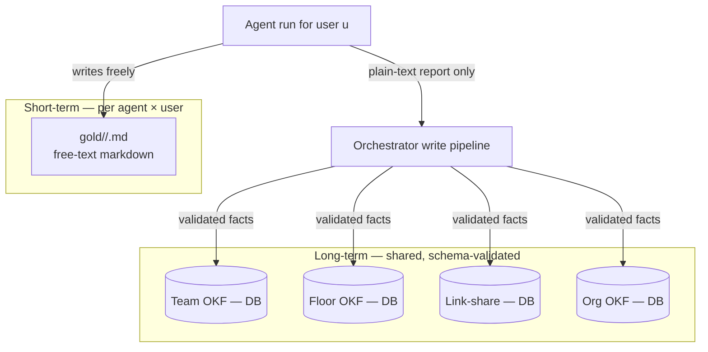
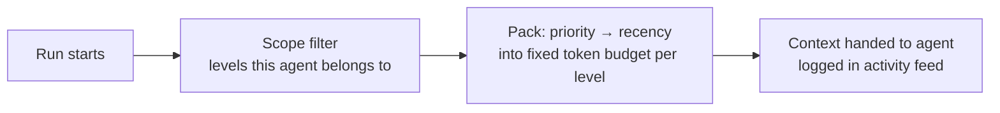
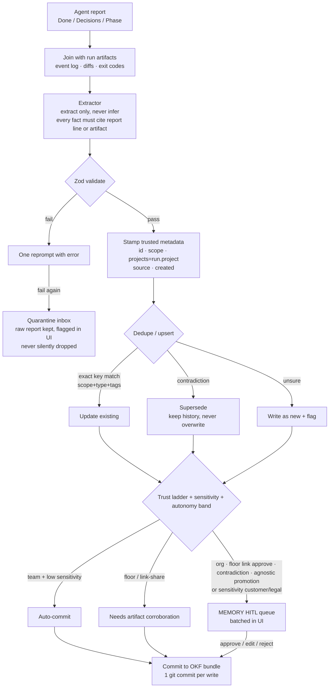

# Memory Architecture — AgentAnyStack

How memory works in the agent office. Simple language, decisions + reasons.

**Status:** design (agreed through 2026-08-03, not fully built)
**Target:** shared OKF in **DB** (Pydantic); gold in **git** per user; orchestrator **Python** — [IMPLEMENTATION.md](./IMPLEMENTATION.md)
**Related:** [PRODUCT_OVERVIEW.md](./PRODUCT_OVERVIEW.md) · [ORCHESTRATOR.md](./ORCHESTRATOR.md) · [USE_CASES_MEMORY.md](./USE_CASES_MEMORY.md) · [LOCAL_MODEL_STACK.md](./LOCAL_MODEL_STACK.md) · [IMPLEMENTATION.md](./IMPLEMENTATION.md)

Worked examples (2 teams × 1 project, multi-project, connect line): [USE_CASES_MEMORY.md](./USE_CASES_MEMORY.md)

---

## 1. Goals (in priority order)

1. **Deterministic retrieval** — same query + same memory state = same context, every time. No vector search as the primary mechanism.
2. **Provenance** — every fact knows who wrote it, from which run, when. Powers the transparency promise.
3. **Supersede, don't overwrite** — facts change; history stays.
4. **Write discipline** — only the pipeline writes to shared memory. Memory pollution is the #1 real-world failure.
5. **Speed** — least important at our scale. File/SQLite reads are microseconds next to LLM calls. "Fast" really means "selects well within token budget".

Everything must stay **real and boring**: facts grounded in artifacts (diffs, exit codes), minimal, truthful — this becomes the office-wide knowledge base.

---

## 2. Two tiers



| Tier | Owner | Format / store | Validation | Who writes |
| --- | --- | --- | --- | --- |
| **Short-term (gold)** | One **(agent, user)** pair | Free markdown in **git** | None | That user’s agent run |
| **Long-term (shared)** | Team / floor / link-share / org | OKF **shape**; **runtime in DB** (Postgres / SQLite CE) | Zod on frontmatter fields | Orchestrator pipeline only |

*(**Team** was formerly called **box**. **Office** nesting deferred — not a v1 memory scope.)*

**Multi-user:** several people may use the **same agent desk** concurrently. Each gets their own gold; shared OKF is the **room** (see §5 packing). Slogan: *users share the room; they don’t share the notepad.*

Why no schema on gold: the only consumer is that user’s run of the agent. Schema there = friction for zero benefit.

Why schema on shared: a fact written by a Cursor agent must be readable by a Claude agent and the UI. Shared memory is a **contract between stacks** — contracts need types.

---

## 3. Storage format: OKF

Long-term tiers are **OKF bundles** — [Open Knowledge Format](https://cloud.google.com/blog/products/data-analytics/how-the-open-knowledge-format-can-improve-data-sharing) (Google Cloud, June 2026): a directory of markdown files with YAML frontmatter; markdown links form the knowledge graph; `index.md` per directory for progressive disclosure.

Why OKF fits us:

- Portable interchange format — human-readable, no proprietary blob lock-in
- Built for cross-agent sharing ("a bundle synthesized by one LLM can be queried by another") — that is our any-stack problem in one line
- Frontmatter = the schema-validated part; body = free text. Reconciles both tiers cleanly
- Marketing line: *"your memory exports as OKF — take it anywhere"*

### Hybrid storage (agreed)

| Layer | Runtime store | Portability |
| --- | --- | --- |
| Office **config** (org/floor/team/agent/links/catalog) | **Git** | Clone = same desks |
| **Gold** | **Git** — `agents/<id>/gold/<user_id>.md` | Per-user notepad travels with repo |
| **Shared OKF** | **DB** — Postgres (scale) / SQLite (CE single-node) | **Export** OKF tree or release bundle on demand / schedule |
| Secrets (intended) | Vault / env | Never in git; see [Security TODOs](#9-security-known-gaps-todo) |

Day-to-day packing hits the **DB**. Git `memory/` export is backup / leave-path / DR — not the hot read path. Config + gold pull still give a new container the same office; restore shared facts via DB dump or OKF import.

See [PRODUCT_OVERVIEW.md — Office as a git repo](./PRODUCT_OVERVIEW.md#office-as-a-git-repo--same-environment-everywhere).

What OKF does **not** give us (still ours to build): retrieval rules, dedupe/supersede semantics, provenance fields, quarantine. OKF is a **format, not a framework**. Ecosystem is young; we write our own **Pydantic** models + DB mapper (JSON Schema first).

### Fact schema (domain-neutral — agents are not only coding)

Schema must work for BA, sales calling/texting, Slack support, legal, HR, finance — not only eng. Keep it small; rich schemas rot.

```yaml
---
# identity
id: fact-01H...
type: decision | constraint | fact | glossary | procedure | contact_policy | offer | outcome | risk
# procedure = how we do X; contact_policy = when/how we message customers;
# offer = pricing/product terms; outcome = call result / deal stage / ticket close;
# risk = compliance / legal flag
# (OKF requires at least `type`)

scope: team:sales-outbound | floor:gtm | org:...
projects: [campaign-q3-01H8X]   # stamped by pipeline; [] = agnostic (earned)
tags: [pricing, whatsapp, india]

# optional — packing / filter aid, not a second hierarchy
domain: sales | support | eng | ba | legal | hr | finance | ops | general | ...

# provenance
source: { agent: sales-caller-1, run: run-..., persona: sales_caller, user: user-... }
created_by_user: user-...   # audit only — NOT a packing filter (v1)
created: 2026-08-02T...
supersedes: null
pinned: false
archived: false
sensitivity: public | internal | customer | legal   # drives MEMORY HITL

# optional artifact links — any domain (not only git diffs)
artifacts:
  - kind: call_transcript | slack_msg | crm_record | file_diff | email | doc
    ref: crm:opp-9921
---
Body: one atomic sentence or short paragraph.
```

**Extractor may output only:** `type`, `content`, `tags`, `citation`, optional `domain`, optional `sensitivity` *suggestion*.  
**Pipeline stamps:** `id`, `scope`, `projects`, `source`, `created_by_user`, `created`; may **raise** sensitivity from PII/legal heuristics, never lower it.

**`created_by_user` is audit-only (v1).** Packing includes **all** users’ facts in the room (team union, etc.). Do **not** filter shared OKF by `user_id`. Private/user-scoped OKF is deferred. Concurrency noise is accepted; prune + HITL clean it.

**Atomicity rule** (smallest traceable knowledge block): one fact = one atom (one DB row / one exportable OKF file). If you can't supersede it as one unit, it's too big; if it can't stand alone with its citation, it's too small.

**The unit is the fact record** (exports as one OKF file). Supersede, dedupe, provenance operate per fact. "Paragraph-wise" granularity is at **write time**: max body length (~100 words); split longer extractions. Long documents live in the project / doc store; facts *cite* them.

Validated with **Pydantic** v2 (orchestrator is Python). Contract is **JSON Schema first, library second**. (Earlier docs mentioned Zod for the TS prototype — same schema idea.)

DB write + journal entry per memory commit; optional OKF export / git snapshot for portability. **Extract/upsert runs async after agent runs** — not inside office-chat or agent-chat await path ([ORCHESTRATOR.md](./ORCHESTRATOR.md) §2.9 · [IMPLEMENTATION.md](./IMPLEMENTATION.md)).

Persona seating (`domain` × `channels` × `risk_class`) lives in agent config, not in every fact — see [ORCHESTRATOR.md](./ORCHESTRATOR.md) §7.

---

## 4. Retrieval: deterministic, orchestrator-side

Agents do **not** wander the knowledge graph by default. The orchestrator selects and packs:



- Selection = scope → project → type/tags → priority → recency. Pure rules, no embeddings.
- Embeddings only later, only as a fallback *ranker* when a scope outgrows its budget — never the source of truth.
- Agent-driven browsing (OKF progressive-disclosure tools) may exist as an optional, logged tool — not the core path, because it breaks determinism.

---

## 5. Two axes: scope × project

Memory has **two independent axes**. Scope answers *who can read it* (umbrella: **org ⊃ floor ⊃ team**; office nesting deferred). Project answers *what it is about*. They correlate but are never merged.

### Scope levels (naming)

| Level | Role |
| --- | --- |
| **Team** *(was box)* | Main working unit — seats + shared **team memory** (the room) |
| **Floor** | Optional — related teams + **connect-line** graph for gated cross-team share |
| **Org** | Company-wide base |
| **Office** | Deferred (later BU/policy) — not a v1 memory scope |

### Floor connect lines (cross-team share)

Teams on a floor work **independently** until linked.


Rules:

1. **Link ≠ dump.** Connecting two teams does not merge gold (per user) or whole team bundles.
2. **Maturity may suggest** a link (e.g. both epics marked done); **human / orchestrator approves** what crosses (tags, types, sensitivity, trust ladder).
3. Shared payload is written as floor-scoped and/or explicit **link-share** records, still stamped with `projects`, still subject to `∩ P(p)` when packed above the team.
4. Unlinked peers on the same floor **do not** read each other’s team memory — only own team + floor memory + approved link-share + org slice.

### Projects

- One project = one git subfolder/repo. **Project ids are immutable and never reused** — a project can only be deleted, not renamed.
- **Id ≠ name.** Id = name + unique suffix (e.g. `morfgage-poc-01H8X...`), generated at creation. Names may repeat over time; ids never collide. This makes "delete a project, recreate one with the same name" a non-event: old facts stay inert because their stored id can never equal the new project's id. (Same reason databases use surrogate keys.) UI shows names; only the machine sees ids.
- **The project is derived, not declared.** One agent has one git repo/workspace access. The orchestrator derives `run.project` by a registry lookup on the acting agent's workspace path — *capability is the truth*. No team-level project binding. The orchestrator stays a pure coordinator — one config read, zero project judgment.
- **Teams are seating + memory scope.** A team is created even for a single agent (so the next hire has a desk). **Mixed-project teams are allowed** — project filter is per *run*, never per team.
- Repo-less agents (pure research/chat personas): derivation yields no project, and defaulting to agnostic would reopen the mislabel hole. Either require an explicit project at creation, or route their facts to the review queue by default. Never let "no repo" silently mean "universal truth".
- A fact carries `projects: [...]` — **array from day one** (0..n). One fact can serve many projects; knowledge is never duplicated per project (a shared fact *gains* a project id via upsert instead of being written twice).
- `projects: []` (empty) = **project-agnostic**: true regardless of project — house style, standing business facts, coding standards. Empty means "belongs to everything", not "belongs to nothing".
- Each project has a minimal registry concept file (`type: project`): unique id, display name, path, status `active | deleted`.
- Facts may also link `[[project-<id>]]` in the body for human navigation; the frontmatter array is the machine-readable truth.

### Agnosticism is earned, never asserted (mislabel defense)

The biggest hole would be the extractor marking a project-specific fact `projects: []` — packed into every run forever. No formula catches a semantic labeling mistake, so we make the mistake **impossible to express**:

1. **Rule A — the pipeline stamps the project, the extractor can't.** The extractor's output schema has **no `projects` field** (`.strict()` — extra keys fail validation). Between validation and upsert, plain code stamps `projects: [run.project]` — same trusted-metadata category as `source` and `created`. Facts are born project-specific, mechanically.
2. **Rule B — two paths to agnostic, both gated.** (i) *Corroboration:* when the upsert matches the same fact arriving from a run of a different project, the array grows (`[p1]` → `[p1, p2]`); facts seen across ≥2 projects become agnostic-promotion candidates in the human review queue. (ii) *Human seeding:* universal facts (house style, compliance) entered directly into org memory via review.
3. **Rule C — lexical veto.** Even human-proposed agnostic facts are string-checked against the source run's artifact list (diff paths, project slug, repo names); any match blocks agnosticism. Pure string matching, no LLM.

Why default-to-specific is correct — **the error costs are asymmetric**: a universal truth wrongly stuck as `[p1]` is temporarily invisible elsewhere and *self-heals* via corroboration when rediscovered; a project fact wrongly marked agnostic is permanent noise in every run, fixable only by pruning. Point all residual error at the cheap, self-correcting side.

### Deletion & archive

One generalized rule, evaluated whenever any project is deleted:

```text
archive(x)  ⇔  projects(x) ≠ ∅  ∧  every id in projects(x) has registry status = deleted
```

In words: the fact claims to serve specific projects, and every one of them is dead. Cases:

| Fact's array | On delete of p1 | Why |
| --- | --- | --- |
| `[p1]` only | **Archived automatically** | No living project can ever pack it again — provable, no judgment, no human |
| `[p1, p2]`, p2 alive | **Untouched** | Still serves p2; the dead id stays as inert provenance (a deleted id can never be the *current* project) |
| `[p1, p2]`, later p2 also dies | **Archived then** | The rule re-fires on p2's deletion and catches it — needed because team-level union would otherwise keep packing it into the room forever |
| `[]` agnostic | **Never touched by deletion flows** | `∅` is exempt by the rule's first clause; agnostic facts are supposed to outlive every project |

**Invariant: act on facts, never on arrays.** Ids are never removed from `projects` — arrays only grow (corroboration) or the whole fact archives. Removal is the only operation that could accidentally produce `[]` (fake-agnostic, packed everywhere forever) and it erases provenance; with no removal path in the codebase, that bug is structurally impossible.

Implementation (cheap, idempotent): registry flip to `deleted` → derived-index lookup of facts containing the deleted id → one boolean check per affected fact → archive flag + journal entry. ~30 lines of orchestrator code.

**Archive is the terminal state, not deletion.** Archived facts stay in the DB (flagged), excluded from packing, restorable; OKF exports may omit or put under `archive/`.

**Purge** (parked, decide later): admin-gated hard remove of archived rows for tidiness. Not needed for correctness. **Exception:** a secret in a fact body is a **security incident** (DB scrub + rotate keys) — never treat prune/purge as a security tool. See §9.

### Pruning (noise control)

The formulas and the earned-agnosticism rules block most noise, but three leaks remain: (1) **wrongly-promoted agnostic facts**; (2) **stale-but-never-superseded facts**; (3) **gold residue** — a user’s gold for an agent soaked in a dead project gets packed into that user’s future runs.

Rules:

- **Prune = archive, never delete.** Soft-archive in DB; restorable. Pruning only means "stop packing this."
- **Two classes:** the *provable* class (every referenced project dead) archives automatically via the deletion flow above. The *judgment* class goes through the review queue.
- **Deterministic candidates, human disposal** (judgment class). No autonomous cleaner. Orchestrator computes candidates — not packed/cited in N runs (`last_packed_at`), agnostic facts whose source run belonged to a deleted project, unresolved contradiction pairs — batched into the review queue.
- **Usage alone never auto-prunes.** `pinned: true` makes a fact prune-immune.
- **Gold hygiene:** on project deletion, queue a task per affected **(agent, user)** gold file. Blunt fallback: `reset <agent>` for that user (or admin).

### The formulas (plain English → rules)

Notation: agent `a`, acting **user** `u`, team `t(a)`, optional floor `f(a)`, org `g`; current project `p`; `mem(s)` = shared OKF at scope `s` (**all users** — `created_by_user` is not a filter); `gold(a,u)` = that user’s gold for agent `a`; `linkshare(a)` = facts approved across connect lines involving `t(a)`; `projects(x)` = project ids on fact `x`.

```text
1. Readable set (scope axis — access):
   R(a, u) = gold(a, u) ∪ mem(t(a)) ∪ mem(f(a)) ∪ linkshare(a) ∪ slice(a, mem(g))

2. Project relevance (project axis — aboutness):
   P(p) = { x | p ∈ projects(x)  ∨  projects(x) = ∅ }

3. Context packed for a run ("share the room, filter the building"):
   C(a, p, u) = gold(a, u)
              ∪ mem(t(a))                                              ← team: all users’ facts
              ∪ ( mem(f(a)) ∪ linkshare(a) ∪ slice(a, mem(g)) ) ∩ P(p)
   packed with budget per level,
   order: own-project + agnostic first, other-project team facts last;
          then scope specificity ↓, priority ↓, recency ↓

4. Conflict resolution (lower scope wins):
   x1 contradicts x2  ∧  scope(x1) deeper than scope(x2)
   ⇒ x1 wins inside scope(x1); x2 still holds everywhere else

5. Write rule (write low, promote up):
   scope(new x) = narrowest scope that needs x
   stamp created_by_user = u (audit only)
   promotion team→floor→org only via trust ladder, never automatic
   cross-team share only via approved floor connect line

6. Read/write asymmetry:
   agents: read C(a,p,u), write gold(a,u) + plain-text report
   shared tiers: written by the pipeline only
```

**Why the team is unfiltered (union) but floor/links/org are not:** privacy of *personal* scratch exists only at **gold(a,u)** — shared tiers are *published* within their scope; `∩` is a relevance filter. Teammate / other-user team facts pack **last** and can be **labeled** with `created_by_user` in the UI. Floor/org/link volume is larger — `∩ P(p)` sits there.

**Cross-team collaboration:** (1) live messages via orchestrator; (2) **floor connect line** for gated memory share; (3) corroboration widens `projects` arrays. Unlinked teams do not see each other’s team memory.

**Cross-project within a team** still uses conversation + corroboration. A project id never grants access across scopes. **If knowledge must be shared across teams, use a floor link (or promote to floor/org via trust ladder)** — not silent reads of peer team bundles.

UI note: team-memory screen may show multiple projects → project filter chip; optional “who wrote” chip from `created_by_user` (display only).

v1 levels: **team + floor + org** (+ per-user gold). Office deferred. Floor is optional until multi-team links are needed.

---

## 6. Write pipeline (agents don't manage long-term memory)

Principle: **agents propose, the pipeline disposes** — a mediated write path. The agent only: reads context → does the task → updates **gold(a,u)** → returns a plain-text report. Everything else is orchestrator code.

Why: direct agent writes would require every stack to know our schema (kills any-stack); N agents writing = N failure modes; one pipeline = one quality gate; and task execution vs knowledge curation are different jobs.

### Agent report — semi-structured, any model / any domain

Same three headings work for coding, BA, sales, Slack, etc.:

```
## Done      (what was achieved — logs / actions taken)
## Decisions (important choices + why — product, deal, policy, design)
## Phase     (milestones: epic done, stage closed, campaign launched)
```

Artifacts joined with the report are domain-appropriate: file diffs / exit codes (eng), call transcripts / CRM ids (sales), Slack message ids (support), doc refs (legal/BA).

### Pipeline



**MEMORY HITL** (knowledge into OKF) is one of two human pipelines; **ACTION HITL** (Slack/call/CRM/deploy) is separate — both owned by the orchestrator. See [ORCHESTRATOR.md](./ORCHESTRATOR.md) §6. Autonomy 0–100 tightens or loosens which trust-ladder steps auto-pass.

Hard rules:

1. **Extract, never infer.** No citation → no fact. (We moved hallucination risk from N agents to one extractor; this rule is the containment.)
2. **Artifacts beat prose.** Facts about code come from diffs/exit codes; facts about calls/CRM from transcripts/record ids — never from ungrounded self-report. Prose is trusted for decisions/rationale when no artifact exists.
3. **Retry policy: one reprompt, then quarantine.** Never loop, never drop.
4. **Trust ladder = hierarchy + sensitivity.** Team + low sensitivity may auto-commit; floor / link-share needs corroboration; org, **new floor connect lines**, contradictions, agnostic promotion, and `customer`/`legal` sensitivity → MEMORY HITL. Review is batched.
5. **Async.** Extraction runs after the run completes, off the critical path (must not delay chat).
6. **No autonomous "memory agent"** curating the base on a schedule. Explicitly rejected.
7. **Metadata is stamped, never claimed.** Extractor's `.strict()` schema: `type`, `content`, `tags`, `citation` (+ optional domain/sensitivity suggestion). Pipeline stamps `projects`, `scope`, `source`, `created`.

---

## 7. Orchestrator memory: operational state, not knowledge

The orchestrator does **not** get its own gold.md. To compare new facts with related knowledge it queries **the shared bundles themselves** (via `index.md` + scope/type/tags). A private orchestrator knowledge file would be a shadow copy of the truth — drift, duplication, noise.

What the orchestrator **does** own (pipeline bookkeeping, never enters agent context):

| Store | Purpose |
| --- | --- |
| Write journal | Every commit / supersede / reject decision + reason (audit trail next to git history) |
| Quarantine inbox | Failed-validation reports, raw, flagged in UI |
| Human review queue | MEMORY HITL: org writes, floor link approvals, contradictions, agnostic promotion, high sensitivity; prune candidates |
| Floor link registry | Connect lines between teams: status, allowed tags/types, who approved |
| Tag dictionary / alias map | "commission-split" = "commission_split" — makes dedupe matching work over time |
| Extraction stats | Which agents' reports fail validation most |

One line: **gold memory holds facts about the business; orchestrator files hold facts about the pipeline.**

### Derived index (cache, never truth)

If queries get slow: in-memory map or secondary indexes over the **DB** (or rebuild from OKF export). Property: **rebuildable**. Delete the cache, nothing is lost. DB rows (or last OKF export) stay the source of truth for shared memory; gold files stay in git.

---

## 8. Failure modes we designed against

| Failure | Defense |
| --- | --- |
| Memory pollution (auto-ingesting everything) | Only the pipeline writes; report + explicit `remember:` are the only inputs |
| Agent overclaiming in reports | Artifacts-beat-prose rule |
| Extractor hallucination | Extract-only + mandatory citation |
| Silent lost writes on validation failure | Quarantine inbox, visible in UI |
| Stale facts acted on | Supersede with history, materialized "current" view |
| Duplicate knowledge / noise | Upsert ladder (key match → supersede → new+flag) + tag dictionary |
| Human review fatigue | Trust ladder + batched review queue |
| Shadow source of truth | No orchestrator gold.md; derived indexes rebuildable only |
| Mislabeled project-agnostic facts packed forever | Earned agnosticism (extractor can't write `projects`; promotion via corroboration + review + lexical veto); prune candidates as backstop |
| Accidental fake-agnostic (`[]`) via array edits | Banned operation: ids never removed — arrays only grow, or the whole fact archives |
| Project name reuse resurrects dead knowledge | Unique project ids (name + generated suffix), never reused; purge not needed for correctness |
| Dead-project facts kept packed by team-level union | All-links-dead auto-archive, re-evaluated on every project deletion |
| Cross-team memory dump via floor membership | Connect line required; gated share + HITL; unlinked peers isolated |
| Stale facts accumulating (never contradicted) | Usage-based prune candidates + human review; `pinned` for prune-immune facts |
| Dead-project residue in gold memory | Gold hygiene task on project deletion per (agent, user); `reset` fallback |
| Multi-user gold collision | Separate `gold(a,u)` files — never one shared gold.md per agent |

---

## 9. Security — known gaps (TODO)

Accepted for now; must not be marketed as “secrets-safe.”

| Gap | Reality today | Later |
| --- | --- | --- |
| **Creds in OKF bodies** | Possible; DB is not encryption/scrubbing | Detect/redact on write; encrypt sensitive fields; rotate on incident |
| **Creds in gold** | Free-text — agents may paste keys accidentally | Scanner on write; size caps; easy reset; educate in UI |
| **Secrets in git (gold export)** | Gold is in the office repo | `.gitignore` patterns optional; prefer scrub before commit; vault for real secrets |
| **Intended path** | Catalog secrets in vault/env refs only | Keep; never put raw keys in agent.yaml |

MCP `_locked` / grant isolation: see [ORCHESTRATOR.md](./ORCHESTRATOR.md) Security TODOs — not a hard guarantee in v1.

---

## Changelog

| Date | Note |
| --- | --- |
| 2026-08-01 | Initial design: two tiers, OKF format, deterministic retrieval, mediated write pipeline, trust ladder, orchestrator operational state |
| 2026-08-01 | Added scope × project axes: immutable project ids, projects array + project-agnostic facts, atomicity rule, retrieval/conflict/write formulas |
| 2026-08-01 | Project deletion semantics (archive vs untouched vs agnostic-survives); unit locked to one file, write-time length guardrail |
| 2026-08-01 | Pruning: archive-only, deterministic candidates + human review, `pinned` facts, gold hygiene on project delete |
| 2026-08-01 | Earned agnosticism: pipeline stamps `projects` (extractor schema excludes it), corroboration + human review promote, lexical veto |
| 2026-08-01 | Project derived from agent's workspace grant (no box binding); mixed-project boxes allowed; repo-less agent rule |
| 2026-08-01 | Packing formula: box-level union ("share the room, filter the building"), packing order + project labels; ∩ retained floor+ |
| 2026-08-01 | Unique project ids (name + suffix, never reused); generalized all-links-dead archive rule; arrays never edited; purge parked as cosmetic/admin-gated |
| 2026-08-02 | Domain-neutral fact schema (types, domain, sensitivity, multi-kind artifacts); MEMORY HITL tied to sensitivity + autonomy; link ORCHESTRATOR.md |
| 2026-08-02 | Rename box→**team**; floor connect lines for gated cross-team share; office nesting deferred; packing/trust ladder updated |
| 2026-08-03 | Link USE_CASES_MEMORY.md (scenario walkthroughs) |
| 2026-08-03 | Office-as-git: OKF + gold in customer office repo with floors/teams/agents/catalog; pull = same env |
| 2026-08-03 | Hybrid: shared OKF in DB + export; gold per (agent,user); `created_by_user` audit-only pack-all-room; C(a,p,u); Security TODOs §9 |
| 2026-08-03 | Pydantic/Python target; extract async off chat path; link IMPLEMENTATION.md |
