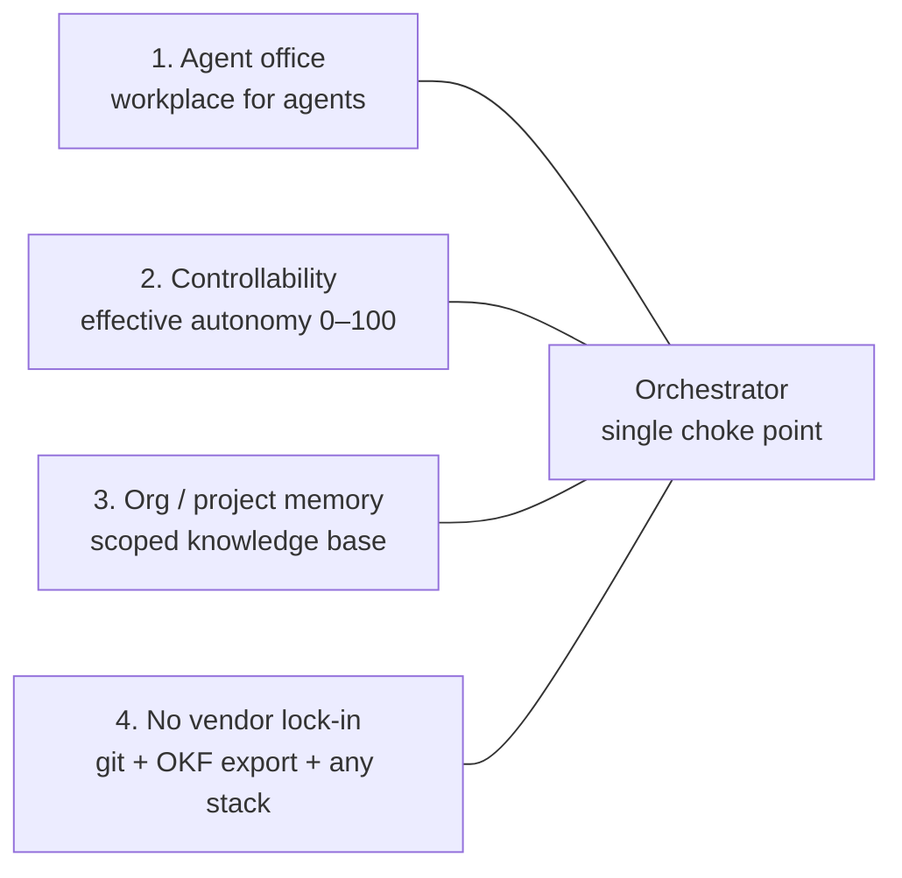
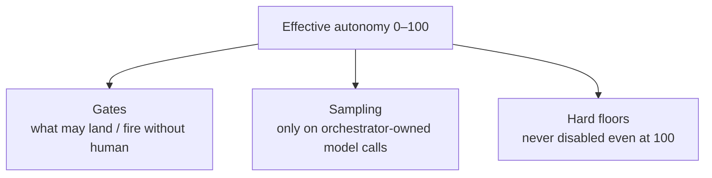
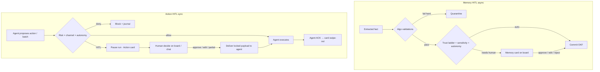
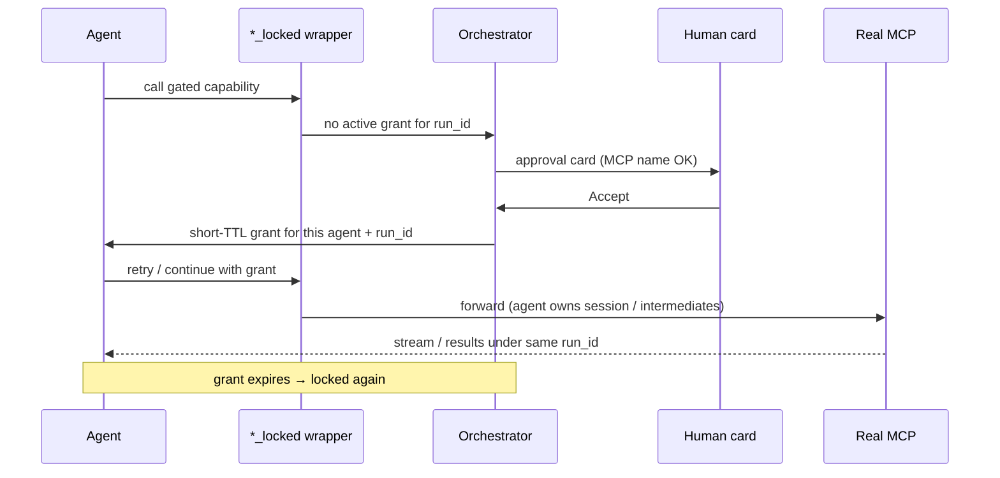

# Orchestrator — Control Plane

The orchestrator is **not an LLM persona**. It is the bridge: routes messages, packs context, runs write/action gates, triggers humans, and keeps operational books. Almost everything is **deterministic algorithm**; one fenced LLM step (the memory extractor) is the exception.

**Status:** design (agreed through 2026-08-04; not fully built)
**Target runtime:** **Python / FastAPI** (async) — see [IMPLEMENTATION.md](./IMPLEMENTATION.md) · [V0_SCOPE.md](./V0_SCOPE.md). This repo’s Fastify app is a behavior reference only.
**Related:** [PRODUCT_OVERVIEW.md](./PRODUCT_OVERVIEW.md) · [MEMORY_ARCHITECTURE.md](./MEMORY_ARCHITECTURE.md) · [IMPLEMENTATION.md](./IMPLEMENTATION.md) · [CONNECT.md](./CONNECT.md) · [ANALYTICS.md](./ANALYTICS.md)

---

## 1. Product pillars (what the orchestrator exists to serve)



| Pillar | Meaning |
| --- | --- |
| **Agent office** | Desks, teams, floors, visible activity — multi-user concurrent desks |
| **Controllability** | Effective autonomy (§4.1) — ceiling + tighten-only user override |
| **Memory** | Hierarchy × projects + connect lines; gold per user; shared OKF in DB |
| **No vendor lock-in** | Config/gold in git; OKF export; BYO stacks |

Competitors sell agents. We sell **an office with a volume knob on autonomy, a real knowledge hierarchy, and portable env**. Every message, memory write, and side effect passes through the orchestrator — so the knobs mean the same thing for a coding agent and a Slack/sales agent.

---

## 2. Responsibilities

### 2.1 Message routing (the bridge)

- Parse role grammar (`Analyst:`, `remember:`, `reset`) and dispatch
- Route between agents/teams; manage **floor connect lines** (suggest / approve gated cross-team share)
- Stream run events back to the UI

### 2.2 Context packing (memory read)

- Compute `C(a, p, u)` — **gold(a,u)** + whole **team** (all users’ OKF; `created_by_user` is audit-only) + project-filtered floor / link-share / org
- Derive `run.project` from the agent's workspace / grant (registry lookup)
- Multiple users may run the **same agent** concurrently — separate packs per `user_id`
- Log what was packed (transparency)

### 2.3 Memory write pipeline

- Collect report + artifacts → extractor → Zod → stamp (`created_by_user`) → upsert → trust ladder → **DB** (+ optional OKF export)
- See [MEMORY_ARCHITECTURE.md](./MEMORY_ARCHITECTURE.md)

### 2.4 Capabilities (MCP / skills / API)

- Org **catalog** (admin): MCP, skills, API+creds
- **Agent-level registration only** (no team/floor ACL matrix in v1)
- Direct vs **HIL-gated `_locked` wrappers**; grants after Accept; agent executes MCP under `run_id` (+ `user_id`)
- **v1 grant path is not hard isolation** — see §10 Security TODOs
- See §7

### 2.5 Action pipeline (side effects)

- Agent proposes Slack send / call / CRM write / git push / deploy / gated capability
- Catalog `hil` + **effective autonomy** (§4.1) + timer → allow / HITL card / deny
- After approve: deliver to **agent** to execute (ACK); journal

### 2.6 Human-in-the-loop

- Durable review queue for **memory** and **actions** / gated MCP
- Approve / edit / reject; never silent drop — **who may Approve** in §6.0.2
- Batched UI — avoid interrupt-fatigue

### 2.7 Multi-user concurrency

- Every API/WS message carries `user_id` (+ org membership / RBAC later)
- Same agent desk → **separate `run_id`s** (isolate pack, cancel/stop, MCP grant, activity)
- Gold: `agents/<id>/gold/<user_id>.md` — users share the room, not the notepad
- Desk UI: presence of colleagues; filter mine vs team runs

### 2.8 Operational state (not business knowledge)

- Write journal, quarantine, review queue, tag dictionary, extraction stats, derived index
- Capability catalog + bindings (secret refs) + per-agent registrations + short-TTL grants
- No orchestrator `gold.md`; orchestrator does **not** invent business facts

### 2.9 Office chat (status + knowledge — no agent)

Users may talk to the **office** without targeting an agent (`Office:` or default when no `Analyst:` / role prefix).

| Ask | Behavior |
| --- | --- |
| **Status** | Deterministic read of runs / activity / registry (“who is running what”) |
| **Knowledge** | Deterministic OKF query / pack slice for current team·project scope → optional LLM **only** to phrase answer; **every claim cites** `fact_id` / `run_id` |
| **Empty** | Say nothing found — **never hallucinate** fill |
| **Do work** | If user asks for side effects / build — route to an **agent**, don’t fake it in office chat |

**Not extraction:** office Q&A is a **read path**. Writing OKF still goes through the agent report pipeline / explicit `remember:` only.

**Latency:** status/knowledge retrieval stays on the request path (budgeted). Full memory **extract/upsert** after agent runs stays **async** (`create_task` / BackgroundTasks / later arq) — never block chat on long extract.

**Built (P12):** `POST /office/ask` — module flow + examples: [architecture/12_OFFICE_QA.md](./architecture/12_OFFICE_QA.md).

### Explicit non-responsibilities

- No free-roaming LLM persona that invents business facts
- Never invents business facts from its own judgment
- Never autonomously curates/prunes the knowledge base without policy
- Never lets an agent self-register new MCP/API mid-run
- Does not put the **global** catalog into agent context — only that agent's registered subset (scoped injection)
- **v0:** no Celery; no thread-pool / multiprocessing architecture — see [IMPLEMENTATION.md](./IMPLEMENTATION.md)

---

## 3. Deterministic vs soft

| Layer | Deterministic? |
| --- | --- |
| Routing, packing, project stamp, Zod, upsert, archive, catalog `hil` + timer, registration list, HITL cards / grants | **Yes** — pure algo |
| Memory **extractor** (plain English report → candidate facts) | **No** — only LLM step; fenced by schema + citations + quarantine |
| Agent mid-run use of **direct** (non-HIL) MCP inside Cursor/Claude | **Not intercepted every call** — scoped by registration + injection only |
| Prompt text (“please ask before send”) | **Soft** — not enforcement |
| Agent reasoning | **No** — outside orchestrator |

Honest framing: registration **scopes** what the agent may have; HITL is deterministic on the **approval / `_locked` unlock** path — not on every MCP round-trip unless proxied. Criticality **only** in the system prompt is not a guarantee.

---

## 4. Controllability knob (0–100)

One operator-facing slider. Internally it selects a **policy bundle** — not a prompt vibe.



### 4.1 Effective autonomy (ceiling + default + tighten-only override)

Precedence — define **once**, use for memory HITL, action HITL, and MCP `follow_autonomy`:

```text
org.default_autonomy
org.max_autonomy              // hard ceiling

agent.default_autonomy       // optional; else inherit org.default
agent.max_autonomy           // optional tighter ceiling for that desk

user.autonomy_override       // optional; may only set ≤ effective_max
                             // if unset → agent.default ?? org.default

effective_max = min(org.max_autonomy, agent.max_autonomy ?? 100)
effective     = clamp(
                  user.autonomy_override ?? agent.default_autonomy ?? org.default_autonomy,
                  0,
                  effective_max
                )
```

| Rule | Why |
| --- | --- |
| **Org/agent set the ceiling** | Controllability stays a company knob |
| **User may only go down** (or up to ceiling, never above `effective_max`) | Intern can be stricter; cannot self-promote past policy |
| **Role caps (later)** | Optional `role.max` in the `min()` (intern/contractor) |
| **One formula everywhere** | No per-pipeline drift |

**Avoid v1:** free per-user override with no max; or “strictest of all layers” with no defaults (confusing when org=40, agent=60, user unset).

### Example bands (presets over rules)

| Band | Memory | Actions |
| --- | --- | --- |
| **0–20** | Almost all writes → human queue | External / write systems → block or approve-only |
| **40–60** | Team auto; floor/link needs corroboration; org + new floor links HITL | Internal OK; external / prod / money → HITL |
| **80–100** | Trust ladder as designed | Allowlist grows; only irreversible / high-sensitivity remain |

**Hard floors** (never graduate off, even at 100): external customer send, legal/binding text, PII/PHI exposure, money movement, prod deploy — unless an admin explicitly widens policy.

Start strict; **auto-approve allowlist** grows from repeated human approvals (same action type + low risk). Timeout policy required for pending approvals (expire / escalate / fail-safe **reject** for external sends).

Bands apply to **`effective`** autonomy after §4.1.

---

## 5. Sampling policy (orchestrator-owned, never per-agent)

Temperature / top_p / seed **reduce variance**; they do not guarantee bit-identical outputs. Softness dial, not true determinism.

| Who sets sampling | Rule |
| --- | --- |
| Extractor (orchestrator LLM call) | Orchestrator only — low autonomy → near-zero temperature, strict schema |
| Local / OpenAI-compatible adapter | Orchestrator passes params on every request |
| Cursor / Claude BYO stacks | Often **cannot** control sampling → rely on **gates** |

**Banned:** agents (or their prompts) owning temperature / “be more creative” overrides. That bypasses the office knob and breaks any-stack consistency.

---

## 6. Dual HITL pipelines + approval board

Industry pattern: policy → durable queue → human (approve / reject / edit) → audit → **agent executes** (actions) or pipeline commits (memory). Gate irreversible / high-stakes; don’t rubber-stamp everything.

**Critical rule: orchestrator gates; agent executes.**  
Orchestrator may see all projects/registry for packing and the board — it does **not** send WhatsApps, dial, or push git with god-access. Agents keep project/channel grants. After human decide, the decision is **translated back to that agent’s run** (same idea as Cursor/Claude ask-back), then the agent runs its tools. Trace everything with `run_id` + `user_id` (+ `approval_id` / `item_id`).



Detail of memory storage: [MEMORY_ARCHITECTURE.md](./MEMORY_ARCHITECTURE.md).

---

## 6.0 Approval board (product surface)

One **Approval board** for the office. Same inbox for both pipelines; **not** the same card body.

| | **Action card** | **Memory card** |
| --- | --- | --- |
| Tag | `action` | `memory` |
| Timing | **Sync** — pauses the agent run | **Async** — usually after the run |
| Scope | **One agent + one run** only | One fact/batch from one run’s pipeline |
| Human UX | Multi-choice / scrollable options (Claude Code–style); batch rows (e.g. 10 of 10k drafts) | Approve / edit / reject / supersede |
| Visible in | Board **and** that agent’s chat (same durable card) | Board **and** optionally chat |
| Close when | Agent **ACK** that decided items are processed | Pipeline ACK that OKF write done (or reject/dismiss) |

### Card lifecycle

```text
proposed → pending_human → decided → delivered_to_agent → agent_acked → archived (swipe out of board)
                ↘ rejected | expired | user_dismissed
```

- Card stays visible until **`agent_acked`** (action) or pipeline terminal state (memory), unless rejected / expired / user dismissed.
- **Partial approve:** one card, checklist of items; progress e.g. `3/10 done`; swipe-out only when all **decided** items are acked (or remaining explicitly rejected).
- **User hide / swipe without agent receiving the ask:** allowed → `user_dismissed` = cancel. Agent is not required to execute. Journal it. Fine if the ask never arrives.
- **Processed cards** swipe out of the active board; history retained via journal + `run_id`.

### Offline agent

- Card footer: agent offline / unreachable + last seen + countdown toward timeout.
- Orchestrator may **nudge** when back (“reconfirm status”) — still deliver locked decision to the agent, not execute itself.
- If offline past **action timeout** (esp. external send): **expire as reject** — do not auto-send later without a fresh confirm.

### When the card path fails — gold is fallback, not approval

**Gold memory never approves.** Source of truth for decide/ACK is always the orchestrator journal + board.

If card approval fails (expired, dismissed, agent never acked, delivery broken): the human **talks to the agent in chat** and pieces the work together manually. The agent may use **that user’s gold(a,u)** as working notes to recover context (“what was I about to send?”). That is a **fallback conversation path**, not a second approval system. Gold must not silently re-approve or re-fire locked payloads.

### Traceability

Every card links: `approval_id` → `run_id` → `agent_id` → `user_id` (requester) → `project_id` → decision + ACK timestamps. Approval is auditable via **run id** across board, chat, and journal. (Storage shape for agent/run indexes deferred to agent-structure design — not specified here.)

---

## 6.0.1 HITL / board config options (so far)

| Config | Applies | Purpose |
| --- | --- | --- |
| `autonomy` / effective (§4.1) | both | Preset: which gates auto vs HITL |
| `hil` on catalog item | MCP / API | `always` \| `never` \| `follow_autonomy` |
| `hil_timer_hours` | MCP / API with HIL | Temporary elevate toward autonomy; then snap back to **original** `hil` default |
| `risk_class` | catalog item | **Optional** — advisory; `hil` is the operator control |
| `action_timeout` | action | Pending human → expire reject / escalate |
| `memory_timeout` | memory | Softer: remind; do not auto-commit on expiry |
| `offline_grace` | action | When to show offline state on card |
| `ack_timeout` | action | After approve, max wait for agent ACK before escalate |
| `require_reconfirm_after_offline` | action | Offline longer than X → second human confirm before deliver |
| `partial_allowed` | action batches | Approve subset of N drafts |
| `max_batch_size` | action | Chunk large batches into multiple cards |
| `allowlist` graduation | action | Auto after N approvals of same type |
| `user_dismiss_allowed` | both | Swipe = cancel (default true for drafts) |
| `board_retention` | both | How long acked cards stay in history view |
| `notify_channels` | both | In-app / Slack / email for pending cards |
| `sampling_*` | extractor only | Orchestrator-owned; never per-agent |
| `approver_mode` | both | `permissive` (v1 default) \| `strict` (later) — see §6.0.2 |

---

## 6.0.2 Who may Approve (v1 + later)

**v1 — `approver_mode: permissive`:** any of the following may Approve / Reject / Edit on a card:

| Actor | Why |
| --- | --- |
| **Requester** | User who started the run that produced the card |
| **Org admin** | Company override |
| **MCP / cred owner** | Catalog binding owner for that gated capability (action / MCP cards) |

Not “every seat in the org” by default — those three roles. Bind Accept to `run_id` + actor so User B cannot unlock User A’s grant unless they are admin or cred owner.

**Later — `approver_mode: strict`:** only **org admin** and/or **MCP/cred owner** (requester cannot Accept). Optional further tighten to admin-only or owner-only.

Memory cards without an MCP/cred: requester ∪ org admin (cred owner N/A).

---

## 6.1 MEMORY HITL — validations discovered so far

Two layers: **algo gates** (no human) and **human queue triggers**. Autonomy 0–100 only widens/narrows which trust-ladder steps auto-pass; it does not disable hard algo rules or hard floors.

### A. Algo validations (before / instead of human)

| # | Validation | Rule | On fail |
| --- | --- | --- | --- |
| M1 | **Schema (Zod `.strict()`)** | Extractor may only emit `type`, `content`, `tags`, `citation` (+ optional `domain`, `sensitivity` suggestion). No `projects` / `scope` / `source` / `created` | One reprompt → quarantine |
| M2 | **Citation required** | Every fact cites report line or artifact; extract-only, never infer | Same |
| M3 | **Atomicity / length** | Body over ~100 words → split into multiple facts before validate | Split or quarantine |
| M4 | **Metadata stamp** | Pipeline sets `id`, `scope`, `projects: [run.project]`, `source`, `created`; may **raise** sensitivity, never lower | N/A (code path) |
| M5 | **Project stamp source** | `run.project` from agent workspace/grant lookup — never from LLM | Repo-less agent: explicit project at create **or** all writes → human queue (never silent agnostic) |
| M6 | **Agnosticism impossible at birth** | Empty `projects: []` cannot be set by extractor; facts born project-specific | Structural |
| M7 | **Lexical veto (agnostic)** | Before any promote-to-`[]`, string-check body vs run artifacts (paths, project slug, repo names). Match → block agnostic | Stay project-stamped or HITL with veto note |
| M8 | **Upsert ladder** | Exact key (scope+type+tags) → update; contradiction → supersede candidate; unsure → new+flag | Contradiction → HITL (M-H3) |
| M9 | **Arrays never edited** | Ids never removed from `projects`; arrays only grow (corroboration) or whole fact archives | Structural invariant |
| M10 | **All-links-dead archive** | On project delete: `projects ≠ ∅` ∧ every id deleted → auto-archive (no human) | Mechanical |
| M11 | **Artifacts beat prose** | Code/call/CRM claims without matching artifact → drop or quarantine, not commit as fact | Quarantine / skip |
| M12 | **Pinned immune** | `pinned: true` never auto-pruned | Skip prune candidacy |

### B. Human queue triggers (MEMORY HITL)

| # | Trigger | Why human |
| --- | --- | --- |
| M-H1 | **Scope = org** (and deferred office/BU later) | Company-wide knowledge — trust ladder top |
| M-H2 | **Scope promotion** team→floor→org | Never automatic; earned via review |
| M-H2b | **Floor connect line** create/widen | Cross-team share is gated; maturity may suggest, human approves what crosses |
| M-H3 | **Contradiction / supersede** | Two facts conflict; human picks or confirms supersede |
| M-H4 | **Project-agnostic promotion** | After corroboration (≥2 projects in array) **or** human seeding of universal fact — empty `[]` only via this gate (+ lexical veto M7) |
| M-H5 | **Sensitivity** `customer` \| `legal` (and pricing/compliance when flagged) | High blast radius if wrong |
| M-H6 | **Autonomy band low** | e.g. 0–20: almost all memory writes → queue |
| M-H7 | **Floor without artifact corroboration** | Floor write lacking artifact → escalate to queue (or block until corroboration) |
| M-H8 | **Unsure upsert** (new+flag) | Dedupe couldn’t decide match vs new |
| M-H9 | **Quarantine resolution** | Failed validation after one reprompt — human fixes or discards raw report |
| M-H10 | **Prune candidates (judgment class)** | Unused in N runs; agnostic facts whose `source` run was a **deleted** project; weak leftover links — nominate only, human archives |
| M-H11 | **Gold hygiene ack** (optional) | After project delete, confirm users cleaned gold(a,u) (or `reset`) |

### C. Explicit non-triggers (do **not** ask humans)

- Sole-project facts on project delete when **all links dead** → auto-archive (M10)
- Team + low sensitivity + mid/high autonomy → auto-commit
- Array growth `[p1]→[p1,p2]` via corroboration → automatic; only **empty `[]` promotion** needs M-H4
- Multi-project facts with a living project id still present → leave untouched (stale deleted ids stay as provenance)

---

## 6.2 ACTION HITL — validations discovered so far

### A. Algo validations (before execute)

| # | Validation | Rule | On fail |
| --- | --- | --- | --- |
| A1 | **Catalog `hil` + effective autonomy + timer** | Item `always` / `never` / `follow_autonomy`; use §4.1 `effective`; elevation window then snap to default | Deny / HITL / allow |
| A2 | **Autonomy band** | When `follow_autonomy`: bands on **effective** 0–20 HITL-heavy; 80–100 allowlist + hard floors | Per band |
| A3 | **Hard floors** | External customer send, legal/binding, PII/PHI, money, prod — never auto at 100 without admin | Always HITL or deny |
| A4 | **Allowlist** | Repeated human approvals of same action type + low risk may graduate to auto-allow | Else HITL |
| A5 | **Payload lock** | Approved (or edited) payload delivered to agent must match what human saw | Re-queue |
| A6 | **Timeout** | Pending approval expires → escalate or **fail-safe reject** (especially external send) | Reject / escalate |
| A7 | **Preview required** | Card must include human-readable effect preview (MCP **name OK** on card) | Cannot approve blind |
| A8 | **Registration** | Agent may only use Direct MCP/API it registered; gated = `_locked` + grant | Deny |
| A9 | **Execute with agent** | After Accept, short-TTL grant → **agent** runs real MCP (intermediates, same `run_id`) | Escalate / expire |
| A10 | **One card ↔ one agent + run** | No cross-agent approve; grant bound to `run_id` + requester `user_id` | Structural |
| A11 | **Gated secret** | HIL MCP unlock secret is server-side only — never inject into agent prompt/chat/gold | Structural |
| A12 | **Approver allowlist** | Only actors in §6.0.2 for current `approver_mode` | Deny decide |

### B. Human queue triggers (ACTION HITL)

| # | Trigger | Examples |
| --- | --- | --- |
| A-H1 | **External send** | Slack/email/WhatsApp/SMS to customer; public social post |
| A-H2 | **Outbound call / dial** | Sales calling agent |
| A-H3 | **Money / contract** | PO, payment, signed terms, CRM stage that implies commitment |
| A-H4 | **Prod / irreversible infra** | `git push` to main, deploy, prod DB write, access grant |
| A-H5 | **PII / legal content** | Sending or writing content flagged sensitive |
| A-H6 | **CRM / ERP mutating writes** when risk ≥ system_write and not allowlisted | Ticket create may auto; account delete → HITL |
| A-H7 | **Autonomy low** | Band forces HITL even for otherwise medium actions |
| A-H8 | **Guardian / compliance flag** | Another agent or policy marks action for review |

### C. Usually auto (unless autonomy low / hard floor)

- Read-only tools, drafts saved privately, internal notes
- Team-local dry-runs, staging reads
- Allowlisted repeated safe actions after enough approvals

---

## 6.3 Shared HITL / board rules

| Rule | Detail |
| --- | --- |
| Durable queue | Survives restart; not only in-memory |
| One board, two card kinds | Tagged `memory` \| `action`; filter on board; shared shell, different bodies |
| Action sync / memory async | Action pauses run; memory usually post-run |
| Board + chat | Same durable card in approval board and that agent’s chat |
| Batch, don’t interrupt | Memory: prefer inbox. Action: pause mid-run when gate fires |
| Journal | Request → classification → human decision → deliver → ACK/outcome — append-only; link via `run_id` |
| Agent ACK (action) | Card stays until ACK (or reject/expire/dismiss); then swipe-out |
| User dismiss | Swipe/hide cancels outstanding ask; agent need not execute |
| Gold ≠ approval | Per-user gold is fallback context when card path fails; human asks agent in chat and pieces work together |
| Approvers | §6.0.2 — v1 permissive (requester ∪ org admin ∪ MCP/cred owner); later strict |
| Orchestrator ≠ free MCP user | Gated: grant unlocks **agent** to run MCP; Direct: registered only |
| Secret never in agent context | HIL unlock is server-side Accept — not paste-into-model |
| No LLM disposer | Humans (or deterministic allowlist) dispose |
| Autonomy never bypasses hard floors | Slider cannot remove A3 / M-H5 floors without admin |

---

## 7. Capabilities catalog (MCP · Skills · API)

**v1 simplicity:** one org catalog; **grants = agent-level registration only** (no team/floor ACL matrix). Operator opens an agent in the UI → registers MCP / skill / API+creds. Agent never browses the full org catalog in its prompt — only its registered subset is injected at run start (**scoped injection**).

### 7.1 Catalog kinds (no separate “Tools” tab)

| Kind | What admin adds | Notes |
| --- | --- | --- |
| **MCP** | Server package / URL + auth | External capabilities |
| **Skill** | Playbook (prompt + which MCP/API ids it needs) | Not a server — how we do work |
| **API** | External product: AWS, GitHub/git, Firecrawl, custom REST | `baseUrl` + `secretRef`; presets + custom |

Native stack built-ins (e.g. Cursor git/shell) may appear as stack defaults or a thin `native` row later — do **not** duplicate MCP tool lists as a fourth taxonomy.

Secrets **should** live in vault / env refs — never deliberately in OKF facts or agent gold. Accidental leaks possible in v1 — see §10.

**Platform vs catalog:** `DATABASE_URL`, office path, process auth = **platform config** (env). Do **not** register them as agent API/creds. v0 UI: platform settings **read-only**; passwords **masked by default**, admin **may reveal**. See [IMPLEMENTATION.md §7.1](./IMPLEMENTATION.md#71-configuration-buckets--ui-v0).

### 7.2 HIL policy on the catalog item (admin)

When adding MCP or API/creds, admin sets:

| Field | Values |
| --- | --- |
| `hil` | **`always`** \| **`never`** \| **`follow_autonomy`** (three options only) |
| `hil_timer_hours` | Optional: elevate toward autonomy for N hours, then **snap back** to the **original** `hil` set at create |
| `risk_class` | **Optional** |

No agent-level `force_hil` / inherit matrix in v1. Timer elevations are admin-started and journaled.

```text
effective behavior at call / unlock time:
  if within elevation window → treat closer to autonomy (per product rule)
  else → use catalog hil default
  follow_autonomy → autonomy 0–100 band decides HITL vs allow on the approval path
```

### 7.3 Two pools: Direct vs Gated (`_locked`)

| Pool | When | What agent runtime gets |
| --- | --- | --- |
| **Direct** | `hil: never`, or temporarily elevated | Real MCP/API bound — use freely mid-run (orchestrator does **not** validate every tool hop) |
| **Gated** | `hil: always` (default HIL) | **Real MCP is never attached.** Agent only sees a **`_locked` wrapper** name |

Example: real server `@modelcontextprotocol/server-everything` → agent-facing `@modelcontextprotocol/server-everything_locked`.

- Agent may **see and register** HIL MCPs in the UI.
- Backend: only the `_locked` entry is wired into the agent tool list.
- A **server-side secret** is generated when the HIL MCP is created; **never paste it into the agent chat / prompt / gold** (user instructed not to share with the agent). Accept on the approval card applies the unlock **server-side**.
- Not 100% safe (name obscurity is weak; security = “no raw MCP + grant required”). Accepted for v1 simplicity.



**Agent remains E2E task owner:** MCP runs **with the agent** after unlock (intermediates stay in the agent loop, same `run_id`, knowledge not isolated in an office-only runner). Orchestrator = vault + HITL + grant; not a second persona chatting MCP.

### 7.4 Soft vs hard (honest split)

| Mechanism | Role |
| --- | --- |
| Registration + scoped injection | Deterministic **scope** — what this agent may request / have |
| Direct MCP mid-run | Free use inside adapter — **not** per-call orchestrator HITL |
| `_locked` + card + grant | Deterministic **gate** before real MCP is usable — **best-effort v1**, not hard isolation (agent runs tools after unlock; no full proxy) |
| Prompt “ask before send” | Soft only |

### 7.5 Explicit non-goals (v1)

- No team/floor capability ACL matrix  
- No orchestrator inventing facts without retrieval (office chat = retrieve + cite only — §2.9)  
- No relying on paste-key-into-model as the unlock mechanism  
- Full MCP proxy that inspects every byte — optional later; `_locked` + grant is the simple path  
- Claiming `_locked` is 100% safe against a compromised or malicious agent runtime  

---

## 8. Personas: domain × channel × risk (not a closed market list)

Persona templates are **not** an exhaustive list of industries. Markets never finish. Open axes:

| Axis | Answers | Examples |
| --- | --- | --- |
| **Domain** | What kind of work | eng, sales, legal, hr, support, marketing, finance, security, ba, ops, data, … (extensible) |
| **Channels / tools** | What can fire | git, shell, slack, email, phone, whatsapp, crm, erp, docs, … |
| **Risk class** | Default gate strictness | read_draft · system_write · external_send · money_legal_pii |

```yaml
# persona template (seating metadata — not a memory fact)
persona: sales_caller
domain: sales
channels: [phone, whatsapp]      # side-effect surfaces (descriptive)
stack: openai-compatible         # or cursor | claude | ...
workspace: null | path/to/repo
# capabilities: registered per agent instance in UI (MCP / skill / API ids)
# — not a team-level grant list in v1
```

Coding agents are just `domain: eng` + stack defaults + registered APIs/MCPs as needed. Same office, same memory rules, same knob.

**Full agent file format + fixed Office Envelope (prepended every run):** [AGENT_DEFINITION.md](./AGENT_DEFINITION.md).

### Starter catalog (illustrative — users can add more)

| Domain family | Examples | Typical risk |
| --- | --- | --- |
| Assistant | Summarizer, briefing, research | read_draft |
| Analyst / BA | Requirements, forecasting | system_write (memory) |
| Tasker / ops | Tickets, CRM update, data entry | system_write |
| Sales / GTM | Calling, texting, outreach | external_send |
| Support / CS | Slack/email replies | external_send |
| Coding / eng | Repo, PR, deploy | system_write → prod |
| Finance / risk | Anomaly, credit, contracts | money_legal_pii |
| Legal / counsel | Contract review, redlines, policy | money_legal_pii |
| HR / people | Recruiting, policy Q&A, onboarding | money_legal_pii (PII) |
| Marketing | Campaign copy, social, brand | external_send |
| Product / PM | PRDs, roadmaps | read_draft / memory |
| Data / analytics | SQL, dashboards | system_write / PII |
| Security / SOC | Alert triage, access reviews | system_write |
| DevOps / SRE | Incidents, infra | prod |
| Procurement | RFQ, PO drafts | money_legal_pii |
| Guardian / compliance | Policy check, audit | meta — reviews others |

Regulated verticals (e.g. healthcare/PHI) may need extra hard floors — not only a persona row.

---

## 9. Module split (implementation note)

Keep two rhythms inside the orchestrator codebase (**Python / FastAPI** target):

| Module | Path | Failure mode |
| --- | --- | --- |
| **Runtime coordinator** | Routing, packing, office chat retrieve, action gates, capability grants / `_locked`, WS | Latency-sensitive; must not block on extraction |
| **Memory / HITL pipeline** | Extract, upsert, review queue | **Async job** after run; stuck extraction must never delay chat |

Shared: registry, derived index, journal, **effective autonomy** (§4.1), **capability catalog + bindings + registrations**, multi-user run isolation.

**Concurrency (v0):** async/await everywhere for I/O; `asyncio.create_task` / FastAPI BackgroundTasks for extract/export; rare `asyncio.to_thread` only for sync SDKs; **no** threading architecture; **no** Celery; **no** multiprocessing unless profiled. Later scale jobs with **arq**. Detail: [IMPLEMENTATION.md](./IMPLEMENTATION.md).

---

## 10. Security — known gaps (TODO)

Do not market these as solved. Accepted for v1; track for hardening.

| Gap | Reality | Later |
| --- | --- | --- |
| **`_locked` / grant** | Accept → server-side grant → **agent** runs MCP under `run_id` is best-effort; not a hard sandbox | Full MCP proxy, short-lived scoped tokens, no raw key in agent context, stronger runtime isolation |
| **Creds in gold** | Free-text `gold(a,u)` may accidentally store API keys | Detect/redact on write; size caps; easy reset; UI warning |
| **Creds in OKF** | Fact bodies may contain secrets; DB ≠ encryption-at-rest / field scrub | Scrub pipeline; encrypt sensitive; purge + key rotation on incident |
| **Intended secret path** | Catalog vault / env refs — never in agent.yaml | Keep; audit accidental leaks |
| **Platform password reveal (v0)** | Admin UI may Show DB/platform secrets (read-only edit via env) | Optional no-reveal / vault-only for multi-tenant |

Memory-side detail: [MEMORY_ARCHITECTURE.md §9](./MEMORY_ARCHITECTURE.md#9-security--known-gaps-todo).

---

## Changelog

| Date | Note |
| --- | --- |
| 2026-08-02 | Initial: pillars, responsibilities, controllability 0–100, sampling policy, dual HITL, domain×channel×risk personas |
| 2026-08-02 | §6.1–6.3: full MEMORY/ACTION validation catalogs (agnostic promotion, lexical veto, quarantine, prune, hard floors, allowlist, payload lock) |
| 2026-08-02 | §6.0 approval board: action sync / memory async cards, execute-back-to-agent + ACK, offline, configs; gold = fallback only when card path fails (not approval) |
| 2026-08-02 | Hierarchy rename box→team; floor connect-line HITL (M-H2b); office nesting deferred |
| 2026-08-02 | §7 Capabilities: org catalog MCP/Skills/API; agent-only registration; hil 3-way + timer; Direct vs `_locked` gated; grant→agent runs MCP; no ACL matrix / no orchestrator Q&A |
| 2026-08-03 | Multi-user: C(a,p,u), gold(a,u), §4.1 effective autonomy; §6.0.2 approvers; `_locked` honesty; §10 Security TODOs |
| 2026-08-03 | §2.9 Office chat (cite-bound Q&A); Python/FastAPI target; async job rules; link IMPLEMENTATION.md |
| 2026-08-04 | Platform config ≠ catalog; v0 read-only UI + admin password reveal — link IMPLEMENTATION §7.1 |
| 2026-08-04 | Link AGENT_DEFINITION.md (yaml+md, Office Envelope, workspace by stack) |
| 2026-08-04 | Link V0_SCOPE, ANALYTICS, CONNECT — channel on runs; journal for trust surface |
