# AgentAnyStack — Product Overview

**Tagline:** *Any stack. One orchestrator.*
**Working name:** AgentAnyStack (`agent-anystack`)
**Status:** Vision + docs; `cursor_teams` = early **TS** prototype. **Target rebuild:** Python orchestrator — see [IMPLEMENTATION.md](./IMPLEMENTATION.md).

---

## Core idea: the agent office

The product **is an office where agents work** — a great place to work for agents. Desks, **teams**, optional **floors** (with collaboration links), shared memory, and visible activity. Users walk in, see who is working on what, talk to agents by role, and everything the agents learn stays in the right room.

**Any stack** is the headline *feature* of this office, not the core: desks for coding, sales, support, BA, … under one orchestrator. Runtimes stay **few kinds** (Inference / coding harness / external); orgs compose most non-coding desks from **Inference + Guardrails catalog** (MCP / Tools / Skills / External tools, e.g. Firecrawl). Deep Cursor/Canva/Harvey parity is not year-one — see [STACK_ADAPTERS.md](./STACK_ADAPTERS.md).

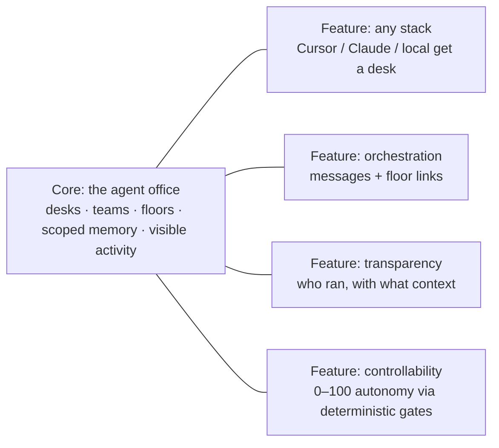

## Four product pillars

**Unchanged.** Analytics and external connect are **headline features under these pillars**, not new pillars.

| Pillar | What it is | Attached features |
| --- | --- | --- |
| **1. Agent office** | Workplace for agents — desks, teams, floors, visible activity | UI desks; **Connect** = same desks via AutoCAD/web/IDE plugins ([CONNECT.md](./CONNECT.md)) |
| **2. Controllability** | 0–100 autonomy knob + HITL gates | **Approvals** inbox; **Guardrails** catalog ([ORCHESTRATOR.md](./ORCHESTRATOR.md) §7); **Analytics** ([ANALYTICS.md](./ANALYTICS.md)) |
| **3. Org / project memory** | Scoped knowledge across org → floor → team × projects | Packing; later OKF **graph** in Analytics |
| **4. No vendor lock-in** | Any stack + office-as-git + OKF export + BYO | Plugins hit **your** orchestrator; data stays yours |

Wedge: competitors sell agents; we sell **an office with a volume knob on autonomy, a real knowledge hierarchy, multi-user desks, and no forced agent vendor**. Personas are not coding-only — sales, support, legal, BA, Slack, finance, CAD, etc. — via open **domain × channel × risk** templates.

**Pitch hooks (survey-backed):** org should move **one business direction**; verification debt (Sonar); shadow AI vs exec confidence (Okta); unknown agents (CSA); monitoring gap (Gravitee). Full punch-line stories + speaker notes: [USE_CASES_MEMORY.md](./USE_CASES_MEMORY.md) (Pitch opener + More punch-line stories).

**v0 base:** working core + simple nav shell (stubs for Analytics/Connect) — [V0_SCOPE.md](./V0_SCOPE.md).

Control plane detail: [ORCHESTRATOR.md](./ORCHESTRATOR.md)  
Office-as-git + hybrid memory: [§ Office as a git repo](#office-as-a-git-repo--same-environment-everywhere) · [MEMORY_ARCHITECTURE.md](./MEMORY_ARCHITECTURE.md)  
**Build handoff:** [IMPLEMENTATION.md](./IMPLEMENTATION.md) · [V0_SCOPE.md](./V0_SCOPE.md) · [AGENT_DEFINITION.md](./AGENT_DEFINITION.md)

## One sentence

An **office for agents** from **any stack**, with a **controllability knob**, **scoped memory**, **multi-user concurrent desks**, **office Q&A** (status/knowledge without an agent), and **no vendor lock-in** — config and per-user gold in **your git repo**, shared OKF in a DB you own (exportable as OKF).

---

## Problem (simple)

Teams have agents in many tools: Cursor, Claude Code, custom scripts, SaaS runners. Each tool is good alone. But they have no shared workplace — no common roles, memory, approvals, or visibility. Joining them into one **business workflow** is hard.

We do not fight over "best coding agent". We give agents an **office to work in** — and fix **integration + orchestration + explainability** on the way.

---

## Hierarchy: Org → Floor → Team → Agent

*(Former name **box** = **team**. **Office** as a nesting layer is deferred — later optional BU/policy boundary, not required in v1.)*

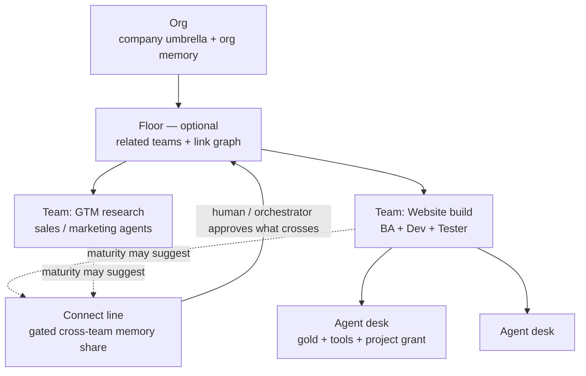

| Level | Meaning | Active job |
| --- | --- | --- |
| **Agent** | One persona on any stack | Gold memory, tools, project grant — runs work |
| **Team** *(was box)* | Main working unit — seats + **shared team memory** | Day-to-day product surface (chat, desks, activity) |
| **Floor** | Optional home for **related teams** | Floor memory + **connect lines** between teams for gated share |
| **Org** | Company umbrella | Org memory slices; many teams/floors |
| **Office** | Deferred | Later: business-unit + policy boundary — not an empty wrapper in v1 |

**Floor connect line (first-class):** Teams work independently (e.g. eng building a site; sales doing research). When both have matured epics/activities, the product may **suggest** a link. A human (via orchestrator / MEMORY HITL) **approves what may cross** — not automatic merge of both memories. Link ≠ dump; share is gated (tags/types/sensitivity + trust ladder).

Rule: **hierarchy = memory scope**. Team = the shared room (unfiltered among teammates). Floor / linked share / org = filtered by project (“the building”). See packing formulas in [MEMORY_ARCHITECTURE.md](./MEMORY_ARCHITECTURE.md).

Second axis: **projects** (derived from the agent’s git workspace). Scope grants access; project filters relevance above the team.

Full memory design: [MEMORY_ARCHITECTURE.md](./MEMORY_ARCHITECTURE.md)  
Real-life packing scenarios: [USE_CASES_MEMORY.md](./USE_CASES_MEMORY.md)  
Orchestrator: [ORCHESTRATOR.md](./ORCHESTRATOR.md)

---

## System architecture

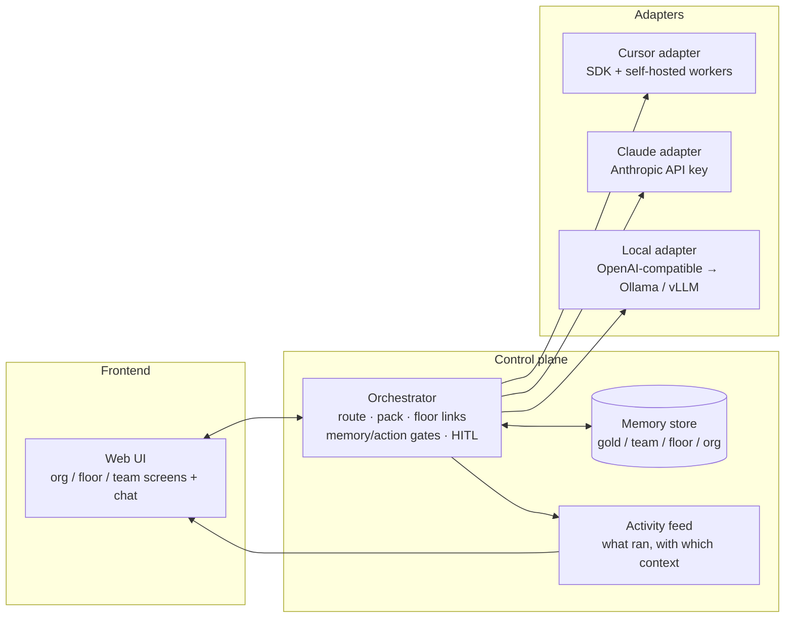

One message, end to end:

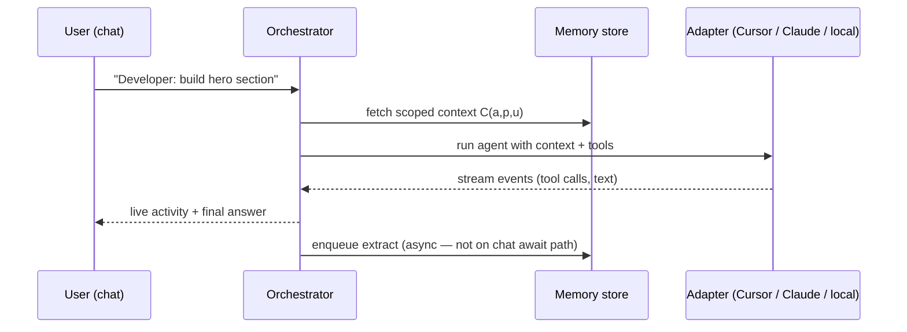

**Office chat** (no agent): user asks status/knowledge → orchestrator retrieves journal/OKF → optional cite-bound LLM phrase. See [ORCHESTRATOR.md §2.9](./ORCHESTRATOR.md) · [IMPLEMENTATION.md](./IMPLEMENTATION.md).

---

## Target tech stack

| Layer | Technology |
| --- | --- |
| Orchestrator | **Python 3.12+ / FastAPI** — async/await; Pydantic; no thread-pool architecture in v0 |
| Background work | `asyncio.create_task` / FastAPI BackgroundTasks; later **arq** — **not Celery in v0** |
| Shared OKF | SQLite → Postgres |
| Config + gold | Git office repo |
| UI | TypeScript (Vite/React) |
| Adapters | Prefer official SDK language; TS sidecar OK if Cursor/etc. is JS-native |
| Definitions | YAML in git |

Full build notes: [IMPLEMENTATION.md](./IMPLEMENTATION.md).

---

## Frontend screens (how it looks)

Full vision mockup (pure HTML+CSS): [`mockups/ui-overview.html`](./mockups/ui-overview.html) — open in any browser. **Mockup = compass** (richer than v0). Screenshots below are from it; regenerate with `powershell -File docs/mockups/_shoot.ps1`.

**v0 app UI:** simpler than the mockup — functional shell; see [V0_SCOPE.md](./V0_SCOPE.md).

Screen map (product direction):

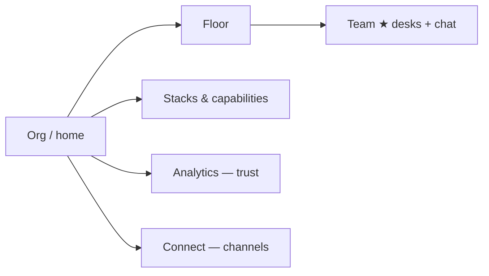

### v0 nav shell (simple)

```text
Team ★ | Memory | Approvals | Guardrails (stub) | Analytics (stub) | Connect (stub) | Settings
```

| Tab | v0 |
| --- | --- |
| Team | Works — desks + chat |
| Memory | Works thin — fact list |
| Approvals | One HITL path (inbox) |
| Guardrails | Stub — catalog MCP · Tools · Skills · External tools ([ORCHESTRATOR.md](./ORCHESTRATOR.md) §7) |
| Analytics | Stub — [ANALYTICS.md](./ANALYTICS.md) |
| Connect | Stub — [CONNECT.md](./CONNECT.md) |
| Settings | Platform read-only when ready |

*(HTML mockups under `mockups/` may still use older “office / box” labels.)*

### 1. Org / home

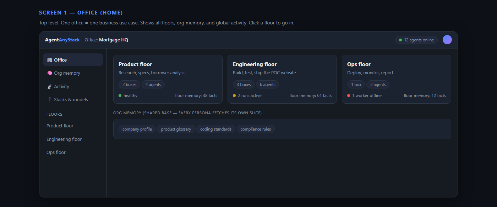

- Cards for **floors** and/or **teams** (agent count, health, active runs)
- **Org memory** panel
- Sidebar: org memory / activity / stacks & models / approval board

### 2. Floor screen — teams + links

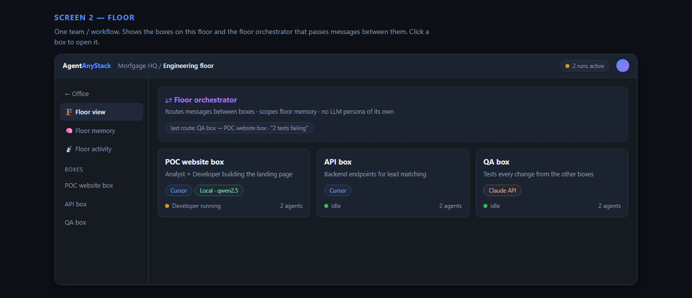

- Cards for each **team** on this floor (stack badges, status)
- **Connect lines** between teams (suggested when epics mature; human approves what may cross)
- Floor activity: routes and link events (orchestrator is not an LLM persona)

### 3. Team screen — the main working screen ★ *(was box)*

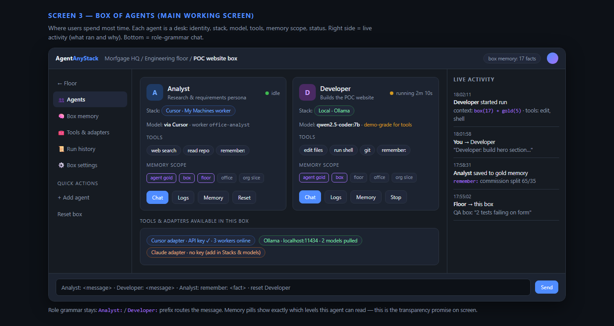

Where users spend most time. Layout:

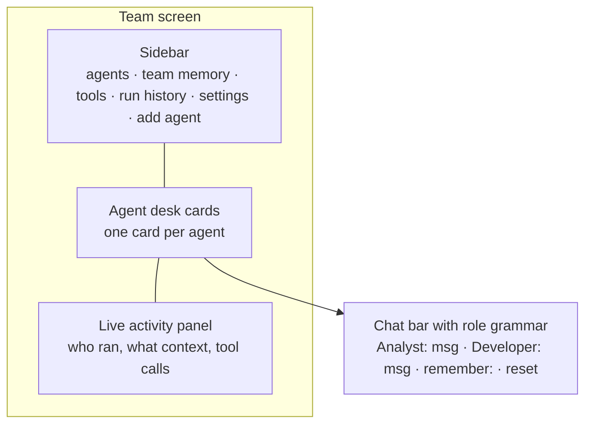

Each **agent desk card** shows everything accessible about the agent:

| Element | Example | Why |
| --- | --- | --- |
| Identity | Analyst — "research persona" | who it is |
| Status dot | idle / running 2m 10s / error | live state |
| Stack badge | Cursor worker / Local · Ollama / Claude API | any-stack promise, visible |
| Model | `qwen2.5-coder:7b` + grade tag (demo / agent-grade) | set expectations |
| Tools chips | registered MCP / Tools / skills / External tools (scoped; gold.* default) | what it may use |
| Memory pills | gold ✓ team ✓ floor ✓ org ✗ | exact read scope = transparency on screen |
| Buttons | Chat · Logs · Memory · Reset / Stop | all controls in one place |

The **live activity panel** shows every run with the context used (e.g. `thread + team(17) + gold(5)`) and tool calls — this is the "explainable" promise made visible.

### 4. Stacks & capabilities screen

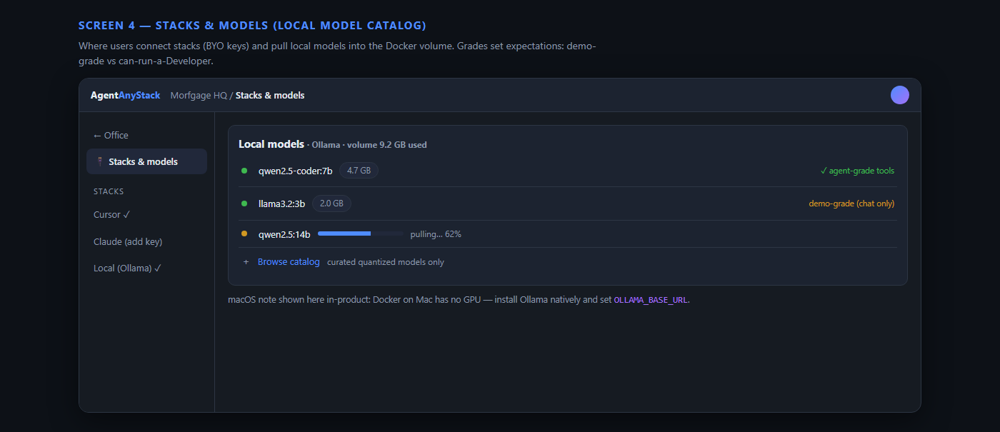

**Stacks tab** = BYO **connections** only (not agent create). Three kinds:

| Kind | User adds | Card shows |
| --- | --- | --- |
| **Inference** | Bedrock / Claude API / Ollama / … credentials | Status, models allowlist, used-by |
| **Coding harness** | OpenCode / Cursor / Claude Code + optional “models via” Inference | Status, linked Inference, used-by desks |
| **External agent** | MCP/A2A endpoint (later) | Discovered agents, status |

List = **one card per connection** (not per model). Full UX: [STACK_ADAPTERS.md §3](./STACK_ADAPTERS.md).

**Guardrails** (own nav, not Stacks): org catalog — **MCP · Tools · Skills · External tools** + admin `hil`. Stacks = connections only.

- **Agent desk** (Team): pick a **connected** stack; register MCP / skill / External tool for that agent. Built-in Tools `gold.read` / `gold.update` default-inherit agent desks  
- **Local model catalog** (Ollama): pull into volume when using Inference · Ollama  

See [ORCHESTRATOR.md](./ORCHESTRATOR.md) §7 · [STACK_ADAPTERS.md](./STACK_ADAPTERS.md).

### 5. System / platform settings (v0)

**Not** part of the Guardrails catalog. Platform = how the orchestrator runs (DB, office path, process secrets).

| v0 rule | Detail |
| --- | --- |
| **UI** | Read-only for admins (values from env/deploy) |
| **Edit** | `.env` / Docker / host — not from UI |
| **Secrets** | Masked by default; **admin may Show/reveal** password (accepted v0 tradeoff) |
| **API** | Do not send secrets on normal GET; only on explicit reveal | 

Non-secrets (DB host, port, database name, user, `OFFICE_REPO_PATH`, pack budget) display as plain text. Full bucket list: [IMPLEMENTATION.md §7.1](./IMPLEMENTATION.md#71-configuration-buckets--ui-v0).

---

## What exists today (prototype)

In this repo (`cursor_teams` / Agent Office v0) — **legacy TS reference**, not the target stack:

- Web chat + office desks UI (Vite)
- Role grammar (`Analyst:` / `Developer:` / `Tester:`)
- Fastify orchestrator + WebSocket activity feed
- Gold memory files
- **Cursor** runtime via SDK + My Machines self-hosted workers
- Docker-friendly office deploy; workers on the host

**Greenfield:** rewrite orchestrator in Python per [IMPLEMENTATION.md](./IMPLEMENTATION.md); keep docs + UI ideas.

---

## Office as a git repo — same environment everywhere

**Rule:** durable **definitions** live as files in a git repo the customer owns. UI and API are editors over that tree. **Shared OKF** is hybrid: **DB at runtime**, OKF **export** for portability.

When someone starts another container and pulls the office repo (+ restores DB or imports OKF + injects secrets), they see the **same floors, teams, agents, links, catalog, skills, and per-user gold** — and the same shared knowledge after memory restore.

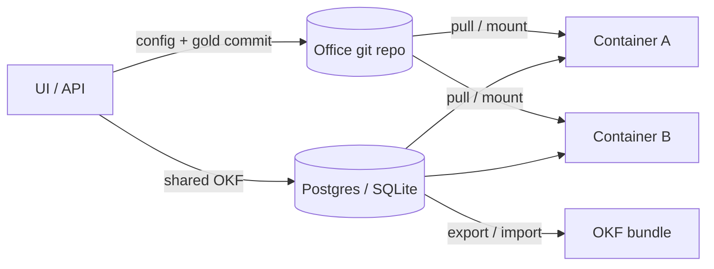

### What lives where

| Kind | Examples (intent) | Store |
| --- | --- | --- |
| **Org / floor / team** | `org.yaml`, `floors/*/floor.yaml`, `teams/*/team.yaml` | **Git** |
| **Connect lines** | `floors/*/links/*.yaml` | **Git** |
| **Agents** | persona, stack, model, autonomy defaults, desk seating | **Git** |
| **Catalog** | MCP / Tools / Skills / External tools *descriptors* (`hil`, scopes) | **Git** |
| **Registrations** | which agent may use which catalog item (`gold.*` default-inherit) | **Git** |
| **Gold** | `agents/<id>/gold/<user_id>.md` — per user on shared desks | **Git** |
| **Agent definition** | `agent.yaml` + `AGENT.md` (persona) — see [AGENT_DEFINITION.md](./AGENT_DEFINITION.md) | **Git** |
| **Shared OKF** | team / floor / org / link-share facts | **DB** (export to OKF / `memory/` for DR + leave-path) |
| **Secrets (intended)** | API keys, tokens | **Vault / env** — refs only in git |

```text
office/                          # customer-owned git repo
  org.yaml
  floors/<floor-id>/
    floor.yaml
    links/<link-id>.yaml
  teams/<team-id>/
    team.yaml
    agents/<agent-id>/
      agent.yaml                 # stack, workspace, registrations — AGENT_DEFINITION.md
      AGENT.md                   # persona prompt
      gold/<user_id>.md          # per-user notepad
  catalog/
    mcp/<id>.yaml
    tools/<id>.yaml              # gold.read / gold.update built-in
    skills/<id>/...
    external_tools/<id>.yaml     # HTTP APIs (Firecrawl, …) — not MCP
  memory/                        # optional OKF export snapshot (not hot path)
    ...
```

### Multi-user (same agent)

Several users may work on the **same agent** at once → separate `run_id`s, separate gold files, separate **recent desk threads**, shared room OKF (`created_by_user` = audit only). Packing: `recent_thread ∪ gold ∪ team ∪ (shelf ∩ project)`. Soft jobs (extract, office Q&A, optional thread summarize) use **`OFFICE_MODEL`**, not the desk persona model. Approvers and autonomy: [ORCHESTRATOR.md](./ORCHESTRATOR.md) §4.1 · §6.0.2 · §2.3.1.

### Product implications

- **Create config = commit.** Agent / floor / team / link / catalog changes update git.
- **Shared OKF write = DB** (+ journal); periodic or on-demand OKF export for backup / leave-path.
- **Clone = onboard.** New host: clone repo + inject secrets + restore DB (or import OKF) → same office.
- **No lock-in.** Keep git + OKF export; re-point stacks as needed.
- **Runtime vs definition.** Live runs / approval board may be ephemeral or local DB; definitions + gold must reappear from git; shared memory from DB/export.

Detail: [MEMORY_ARCHITECTURE.md](./MEMORY_ARCHITECTURE.md) · [ORCHESTRATOR.md](./ORCHESTRATOR.md).

---

## Product principles

1. **The office is the product** — desks, teams, floors; a great place to work for agents
2. **Controllability at the choke point** — everything passes the orchestrator; **effective** autonomy 0–100 (ceiling + tighten-only user override)
3. **Any stack / any persona** — coding, sales, support, legal, BA, … via domain × channel × risk; integrate, don't replace stacks
4. **Hierarchy = memory scope** — team / floor / org; floor **links** for gated cross-team share; projects as the horizontal axis
5. **Office-as-git / no vendor lock-in** — config + per-user gold in git; shared OKF in DB with OKF export; secrets intended in vault
6. **Multi-user concurrent desks** — same agent, many users; share the room, not the notepad; recent thread is per-user continuity (not gold/OKF)
7. **Office chat** — status/knowledge via orchestrator without an agent; cite-bound; **office model** for soft jobs; no invented facts
8. **Create · manage · explain** — easy for operators, not only developers
9. **Transparency** — activity, context used, run status, HITL decisions, all on screen
10. **BYO credentials** — users bring API keys / workers; we don't launder consumer subscriptions
11. **Async control plane** — I/O with async/await; extract off the chat path; no threading architecture in v0

---

## Security — known gaps (TODO)

Accepted for v1 — do not claim “secrets-proof” or “hard MCP sandbox.”

| Gap | Note |
| --- | --- |
| Creds may land in **gold** or **OKF** bodies | Keep as-is for now; scrub/encrypt later |
| MCP **`_locked`** grant | Inference: complete intercept. Harness: catalog-only path (no native twin / leaked creds). Not a hard sandbox |
| Intended path | Vault/env for real secrets |

Full lists: [ORCHESTRATOR.md §10](./ORCHESTRATOR.md#10-security--known-gaps-todo) · [MEMORY_ARCHITECTURE.md §9](./MEMORY_ARCHITECTURE.md#9-security--known-gaps-todo).

---

## Runtime & ToS (short)

| Stack | Supported path | Avoid |
| --- | --- | --- |
| **Cursor** | Official SDK + API key + self-hosted workers | Reselling Cursor access as your own metered service |
| **Claude Code** | Official CLI/SDK + **API key** / commercial terms | Third-party harness on Pro/Max **OAuth**; pooled consumer sub |
| **OpenCode** | Official integration path + BYO credentials | Re-implementing OpenCode’s full UI inside the office |
| **API / Bedrock / Ollama** | Chat desks (`tools.mode: none`); soft jobs via `OFFICE_MODEL` | Treating chat APIs as full coding agents without a worker stack |
| **Local models** | Quick start: bundled **Ollama** in Docker; upgrade: vLLM/SGLang | Ollama-specific code outside the model manager; baking weights into images |

**Coding strategy:** prefer **coding harnesses** (OpenCode first, then Cursor / Claude Code) for implement desks; **Inference + catalog tools** for sales/marketing/support/BA. Cap Stacks kinds at ~2–3 so desks stay the hero. UI says **Connect {product}**, not “adapter.” Details: [STACK_ADAPTERS.md](./STACK_ADAPTERS.md).

**IDE-first eng:** **human seats** — BYO Cursor/Claude/CLI; office supplies pack + WorkPacket sync + MEMORY HITL only (no gold, no autonomy, no ACTION gate). Prefer git/CI hooks over transcript scrape. Details: [IDE_FIRST.md](./IDE_FIRST.md).

Driving Claude from an orchestrator on a consumer login counts as **programmatic / third-party harness** use — "the binary is `claude`" is not a safe ToS argument. Document BYO API keys clearly.

Local setup architecture and engine trade-offs: [LOCAL_MODEL_STACK.md](./LOCAL_MODEL_STACK.md) (see §9 for the quick-start Docker + Ollama decision, incl. the macOS/Docker GPU caveat).

*(Not legal advice — review Anthropic, Cursor, and other stack terms before public launch.)*

---

## Open source plan (intent)

| Edition | License (intent) | Includes |
| --- | --- | --- |
| **Community** | Apache-2.0 | Core orchestrator, UI, adapters, self-host |
| **Enterprise** | Commercial | SSO/SCIM, audit, multi-tenant orgs, advanced policy/memory governance, SLA |

Claim name early: empty GitHub `agent-anystack`, npm name, domain (`agentanystack.com` / `.dev` / `.ai`).

See [OPEN_SOURCE_MARKET_RESEARCH.md](./OPEN_SOURCE_MARKET_RESEARCH.md) for market and naming research.

---

## Positioning vs lookalikes

| Category | Examples | Difference |
| --- | --- | --- |
| Pixel office sims | harishkotra/agent-office, pixel-agents | Simulation / sprites — not multi-stack control plane |
| Cursor-only offices | This repo today, ai-team | We expand to **any stack** + hierarchy |
| Message buses | AgentNexus (Claude MCP inbox) | Messaging only — not team/floor/org memory + floor links |
| Agent frameworks | ClearAgent, CrewAI, LangGraph | Libraries — not operator UX + business scopes + autonomy knob |
| SWE fleets | Devin, Factory, Tembo | Compete on coding agent quality; we compete on **office + control + memory + git-portable env** |
| Meta-harness ADE | **Spotify Xirp** | Same altitude (vendor-neutral coding sessions); they optimize eng parallel worktrees + Portal — we are **office + multi-domain + HITL + OKF**. Detail: [OPEN_SOURCE_MARKET_RESEARCH.md §4.4](./OPEN_SOURCE_MARKET_RESEARCH.md) |
| Locked SaaS agent hubs | Vendor-hosted memory + agents only | **Office-as-git** — clone elsewhere; BYO stacks; secrets stay yours |
| Sales/support agent SaaS | Agentforce, Relevance-style GTM tools | Vertical tools; we are the **office + memory + controllability** across domains |

---

## Success metrics (later)

- Time to connect a second stack (e.g. Cursor + Claude API)
- Clear run trace: who ran (`user_id`), what context, what tools
- Operators can create a team/floor (and a floor link) without writing harness code
- Self-host CE installs without sales call
- Two users on the same agent concurrently without gold/run collision
- Clone office repo + restore DB/OKF + inject secrets → identical hierarchy and memory
- Export/leave path: customer can read config from git + OKF export without our UI

---

## Changelog

| Date | Note |
| --- | --- |
| 2026-07-29 | Initial product overview; AgentAnyStack naming; ToS short note |
| 2026-07-31 | Local model runtime: quick-start Docker + Ollama decision, link to LOCAL_MODEL_STACK.md |
| 2026-07-31 | Simplified language; added hierarchy/architecture/flow diagrams; added Frontend screens section + HTML/CSS mockup (`mockups/ui-overview.html`) |
| 2026-07-31 | Repositioned: core = the agent office (great place to work for agents); any-stack is the headline feature, not the core |
| 2026-08-01 | Memory design agreed and documented in MEMORY_ARCHITECTURE.md (two tiers, OKF, mediated write pipeline) |
| 2026-08-01 | Projects axis finalized: derived from workspace, unique ids, box-level union packing, earned agnosticism, archive/prune/purge rules — see MEMORY_ARCHITECTURE.md |
| 2026-08-02 | Three pillars (office · controllability · memory); ORCHESTRATOR.md (dual HITL, autonomy 0–100, domain×channel×risk); domain-neutral memory schema |
| 2026-08-02 | Hierarchy: box→**team**; floor = teams + connect-line links; office nesting deferred; org→floor→team→agent |
| 2026-08-02 | Capabilities: agent-only MCP/skill/API registration; hil 3-way + timer; `_locked` gated MCP; link ORCHESTRATOR §7 |
| 2026-08-03 | Link USE_CASES_MEMORY.md for team/project packing scenarios |
| 2026-08-03 | Fourth pillar: no vendor lock-in; office-as-git (agents/floors/teams/links/MCP/skills/OKF/gold in repo; secrets out; pull = same env) |
| 2026-08-03 | Hybrid OKF (DB + export); multi-user gold(a,u); pack-all-room audit user_id; Security TODOs; link ORCHESTRATOR approvers + autonomy §4.1 |
| 2026-08-03 | Target stack Python/FastAPI; office chat; link IMPLEMENTATION.md; principles async + office Q&A |
| 2026-08-04 | System/platform settings UI: read-only v0; admin may reveal masked passwords; not in API-creds catalog |
| 2026-08-04 | Link AGENT_DEFINITION.md — agent.yaml + AGENT.md + Office Envelope |
| 2026-08-04 | Pillars unchanged + feature map; V0_SCOPE; Analytics/Connect stubs; UI simpler than mockup |
| 2026-08-07 | Pack recent_thread; OFFICE_MODEL for extract / office Q&A / optional summarize; HITL stays deterministic |
| 2026-08-11 | Coding = worker stacks (Cursor/Claude Code/OpenCode); link STACK_ADAPTERS.md; ToS rows updated |
| 2026-08-11 | IDE-first pack/extract sidecar — [IDE_FIRST.md](./IDE_FIRST.md) |
| 2026-08-11 | Positioning: Spotify Xirp as meta-harness ADE lookalike — link market research §4.4 |
| 2026-08-12 | Human seats + WorkPacket hooks in IDE_FIRST |
| 2026-08-12 | Stacks tab: Inference / Harness / External connections — link STACK_ADAPTERS §2–3 |
| 2026-08-12 | Any-stack = few runtimes + many desks; Inference+catalog compose; coding wedge OK |
| 2026-08-12 | Pitch hook: org direction + AI confidence gap → link USE_CASES_MEMORY |
| 2026-08-13 | More survey punch-line stories in USE_CASES_MEMORY (A–G) |
| 2026-08-14 | `_locked`: Inference complete; harness catalog-only — link ORCHESTRATOR §7.3 |
| 2026-08-14 | Guardrails nav vs Approvals; catalog = MCP · Tools · Skills · External tools; gold.* inherit |
