# Why teams, projects, and shared memory? (presentation deck)

AgentAnyStack is an **office for agents**. Each story = **one-line real business** + diagram + **speaker notes** for a large audience.

**Related:** [PRODUCT_OVERVIEW.md](./PRODUCT_OVERVIEW.md) · [MEMORY_ARCHITECTURE.md](./MEMORY_ARCHITECTURE.md) · [IMPLEMENTATION.md](./IMPLEMENTATION.md) (build handoff)

> **How to use speaker notes:** Say the bold one-liner first, then the notes. Keep each story under ~60–90 seconds. **Shelf** = shared company/launch board (not one team’s private whiteboard).

---

## Pitch opener — org direction + AI confidence gap

**Does this example make sense?** **Yes** — if you frame it as *business alignment + governed AI work*, not “we force every line of AI code to be human-reviewed” (that’s Sonar/CI’s job). The leap eng → whole org works: if **devs** already skip verification, sales/support/legal agents with **no** shared rules or approvals are worse.

### Punch lines

1. **Your org should sync and move in one direction — aligned with the business.**  
2. **Surveys show many developers don’t always review AI-generated code** (e.g. Sonar *State of Code*: only **~48% always** check AI-assisted code before commit — so roughly **half don’t always verify** — while **~96%** don’t fully trust that code is correct). *[Cite: Sonar State of Code Developer Survey / coverage such as IT Pro, Jan 2026.]*  
3. **If eng already has a confidence gap, how will the rest of the org trust AI doing “correct” work?** That’s why **AgentAnyStack** — an office where agents share direction, memory boundaries, and human gates.

### Industry problems → how AgentAnyStack helps

| Industry problem | What goes wrong | How AgentAnyStack addresses it |
| --- | --- | --- |
| **Agents don’t share business direction** | Each Cursor/Claude/SaaS chat invents its own “truth” | **Scoped OKF** (team room + shelf × project) packed into every run — org/floor policies + team facts |
| **No shared workplace** | Roles, memory, approvals split across tools | **Agent office** — desks, teams, visible activity, one orchestrator |
| **Blind trust / verification debt** | AI acts (send, deploy, CRM write) with weak review | **Controllability** — autonomy 0–100 + **ACTION HITL**; MEMORY HITL for promotion/sensitive facts |
| **“Is it doing the right work?”** | No audit of who ran what with what context | **Run journal** (`run_id`, `user_id`, agent, channel) + activity / Analytics path |
| **Knowledge doesn’t cross roles** | BA epic never reaches Dev/Tester cleanly | Pack + extract; Connect / IDE sidecar / human seats for fan-in/out |
| **Vendor lock / tool sprawl** | Org stuck in one coding agent product | **BYO stacks** (Inference / harness); compose desks with MCP/API (Firecrawl, CRM…) |
| **Noise becomes “company truth”** | Unreviewed chat → shared wiki soup | Pipeline extract + trust ladder; promote only via MEMORY board |

### What we do **not** claim

- We are **not** a replacement for PR review, Sonar, or security scanners.  
- We **do** make sure agents **see the same business rules**, **side effects need approval when risk is high**, and **operators can see and govern** AI work across desks — so the org can move **one direction** with eyes open.

### Speaker notes (60–90s)

**Say first:** *“Half the time, even engineers don’t always verify AI code — and almost nobody fully trusts it. Now scale that to sales and support agents with no shared playbook.”*

Then: AgentAnyStack is the **office**: shared memory = business direction; autonomy + approvals = confidence gates; desks = who does what; any stack = keep Cursor/OpenCode/Bedrock. We’re not another coder — we’re how the **company** stays aligned while AI works.

---

## More punch-line stories (survey-backed)

Each story = **stat → business fear → AgentAnyStack move**. Cite on slides; don’t invent numbers. We still **don’t** claim to replace PR review, DLP, or identity discovery products.

### Story A — Verification debt (eng → whole org)

**Punch:** *Half the time, even engineers don’t always verify AI code — and almost nobody fully trusts it.*

| | |
| --- | --- |
| **Survey** | Sonar *State of Code*: **~96%** don’t fully trust AI code is correct; only **~48% always** review before commit. *[IT Pro / Sonar, 2026]* |
| **Fear** | If **devs** skip checks, sales/support/legal agents with no playbook will ship “truth” anyway |
| **AAS** | Shared OKF = business direction; **ACTION HITL** on send/deploy/CRM; **MEMORY HITL** before chat becomes company truth; journal = who ran what |

**Speaker notes:** Start with Sonar. Pivot: we’re not Sonar — we’re the **office gate** so the rest of the company doesn’t copy eng’s verification debt.

---

### Story B — Shadow AI vs executive confidence

**Punch:** *Leaders think they can see AI. Half the workforce already uses tools without approval.*

| | |
| --- | --- |
| **Survey** | Okta *AI Agents at Work 2026*: **90%** of execs confident in visibility; **95%** confident employees use AI responsibly — but **52%** of employees use AI **without approval** (often personal accounts). Of those, **54%** paste internal mail, **45%** HR data, **39%** confidential docs. *[Okta / Apprize360]* |
| **Fear** | Policy lives in a PDF; work happens in personal ChatGPT |
| **AAS** | **BYO stacks on the office** (sanctioned Inference / harness) + desk identity (`user_id`, `run_id`); pack org rules into the run; HITL on side effects; don’t ban tools — **seat them** |

**Speaker notes:** “You don’t have an AI strategy. You have **shadow AI** plus a confidence slide.” Offer the office as the **sanctioned workplace** so people stop going around IT.

---

### Story C — Unknown agents in the building

**Punch:** *Most enterprises already have AI agents they didn’t know were running.*

| | |
| --- | --- |
| **Survey** | CSA (Jan 2026, n≈418): **82%** found **unknown AI agents** in their environment; **65%** had agent-related incidents in 12 months (data exposure **61%**, disruption **43%**, financial loss **35%**). **68%** still report high visibility confidence. *[Cloud Security Alliance / Token]* |
| **Fear** | Scripts, SaaS automations, and LLM plugins acting with no owner |
| **AAS** | **Desks = named agents** with team, stack, registrations; no anonymous god-agent; activity + journal; catalog + scoped MCP (not “whatever plugin the intern installed”) |

**Speaker notes:** CSA is identity/discovery-heavy. Be honest: we don’t scan the whole VPC. We **stop the office from becoming another unknown fleet** — every agent has a seat, owner, and audit trail.

---

### Story D — Agents unmonitored while confidence rises

**Punch:** *Agent fleets doubled. Monitoring didn’t. Confidence went up anyway.*

| | |
| --- | --- |
| **Survey** | Gravitee *State of AI Agent Security 2026* (750 leaders): fleets ~**doubled** in four months; mean monitoring coverage **~52%** (≈**half** of production agents unsecured/unmonitored); visibility **confidence** rose (**~83% → ~92%**) while coverage barely moved. *[Gravitee, Apr 2026]* |
| **Fear** | “We’re fine” is a lagging indicator |
| **AAS** | Every office run is journaled (`run_id`, agent, user, channel, pack pills); Approvals board = visible gates; Analytics path later — **controllability you can see**, not a vibe |

**Speaker notes:** Use Gravitee for the **confidence–reality inversion**. Our wedge: operators **see** desks, context, and HITL — not another invisible agent estate.

---

### Story E — Policy exists; workers can’t find it

**Punch:** *Execs say AI policy is clear. More than half of workers say it isn’t.*

| | |
| --- | --- |
| **Survey** | Okta 2026: even when leaders call policies “very clear,” **57%** of knowledge workers disagree (unclear, hard to find, or unusable). |
| **Fear** | Playbooks in Confluence; agents never see them |
| **AAS** | **Hierarchy = memory scope** — org/floor shelf packed into runs; `remember:` / extract → OKF with promotion HITL; agents don’t “know policy” unless it’s **in the pack** |

**Speaker notes:** Don’t sell another wiki. Sell **policy that shows up in the agent’s context** every run.

---

### Story F — Governance delay vs shadow speed

**Punch:** *Governance delays AI by months. Employees don’t wait.*

| | |
| --- | --- |
| **Survey** | AvePoint / Osterman *State of AI 2026* (750 leaders): nearly **9 in 10** delayed genAI/agentic rollouts **~6 months** on security/governance; **~47%** of employees use agents daily/weekly; **~88%** of orgs had ≥1 agent-related security incident last year; unsanctioned-tool **blind spot nearly tripled** (2025→2026). |
| **Also** | Microsoft + LinkedIn Work Trend Index (2024): **~78%** of AI users bring **their own tools** to work. Gartner: **69%** of cyber leaders suspect/evidence prohibited public GenAI; **>40%** of orgs predicted to see shadow-AI security/compliance incidents by **2030**. |
| **Fear** | Ban → shadow; slow CoE → shadow; only a **usable sanctioned office** wins |
| **AAS** | Fast path: Inference + catalog MCP (Firecrawl, CRM, Slack) + harness for dev; **HITL** instead of a six-month freeze; human seats / IDE-first so eng keeps Cursor **and** org memory |

**Speaker notes:** “If official AI is slow, unofficial AI is instant.” We’re the **fast sanctioned lane**: same tools they want, with desks, memory, and gates.

---

### Story G — One direction (close the loop)

**Punch:** *Your org should sync and move in one direction — aligned with the business.*

| Fragmented today | One direction with AAS |
| --- | --- |
| Personal ChatGPT + Cursor + Salesforce Einstein + a Zapier agent | **One office**, many desks, few runtime kinds |
| Each chat invents pricing / policy | **Team room + shelf OKF** packed every run |
| No owner, no `run_id` | Desk + user + journal |
| Send/deploy with hope | Autonomy + **ACTION HITL** |
| Wiki rot / hallucinated “facts” | Extract pipeline + **MEMORY** promotion |

**Speaker notes:** Close with the original line. Surveys prove **trust, visibility, and shadow AI**. AgentAnyStack is how the **business stays one organism** while people keep their stacks.

---

### Cite hygiene (for slides)

| Stat | Source (verify before external publish) |
| --- | --- |
| 96% / 48% AI code trust & review | Sonar State of Code Developer Survey (~2026) |
| 52% unapproved AI use; 90% exec visibility confidence | Okta *AI Agents at Work 2026* |
| 82% unknown agents; 65% incidents | CSA + Token, Apr 2026 press |
| ~52% mean agent monitoring coverage | Gravitee Agent Security 2026 |
| ~78% BYO AI tools at work | Microsoft + LinkedIn Work Trend Index 2024 |
| 69% suspect prohibited GenAI; 40% incident forecast by 2030 | Gartner (cyber leader survey / predictions) |
| ~6 month AI delay; unsanctioned blind spot up | AvePoint / Osterman State of AI 2026 |

---

## Big picture

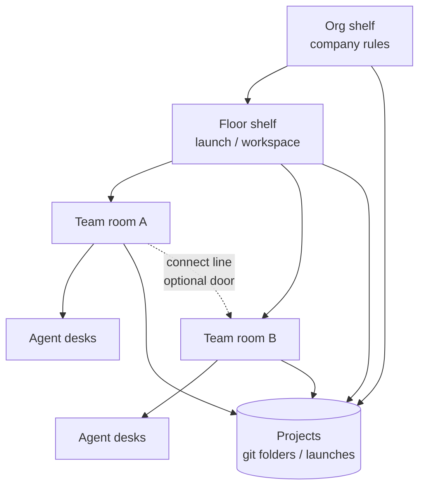

| Piece | Think of it as | Product |
| --- | --- | --- |
| **Team** | Daily **room** | Shared working notes for that squad |
| **Project** | **Folder / launch** | What work is about (often git) |
| **Org / floor** | **Shelf** | Policies, checklists |
| **Connect line** | **Door** between rooms | Share selected notes on purpose |

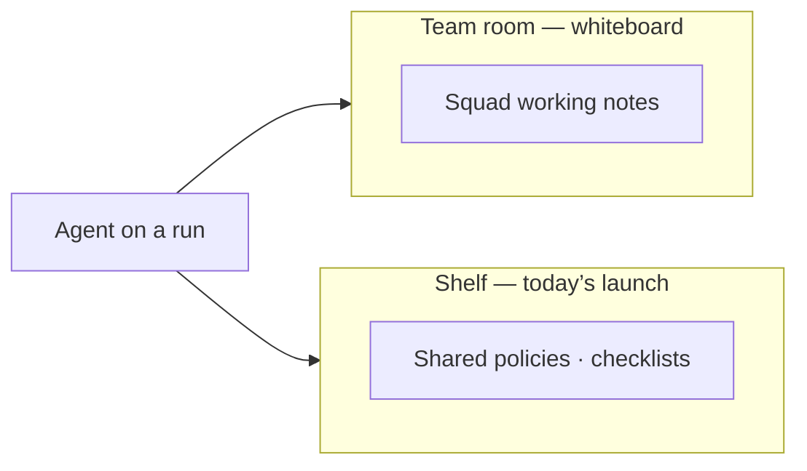

**Speaker notes**

- Open with: “We don’t invent a new org chart — we give AI agents the same rooms and shelves humans already use.”
- Point at the diagram: left/right = **rooms** (teams); top = **shelf** (org/floor); dotted line = **door** you open on purpose.
- Define **shelf** once: shared launch or company board — commission rules, brand tone, checklists — *not* Eng’s PR debates.
- Hook: “Same project folder does not mean we dump every squad’s notes into every agent.”
- Transition: “I’ll show this with businesses you already recognize — lending, solar, hospitals…”

---

## Story 1 — Loan aggregator portal: build vs DSA outreach

**You’re building an aggregated home-loan platform for borrowers and DSAs; Eng ships the portal while GTM WhatsApps DSAs on the same launch.**

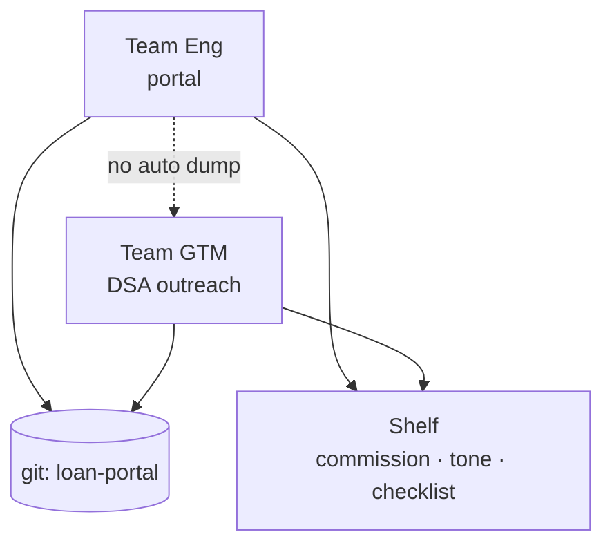

| Shelf (both) | Eng room only | GTM room only |
| --- | --- | --- |
| Commission split, formal tone, go-live checklist | Tailwind hero, broken PR | DSA X wants WhatsApp, best script |

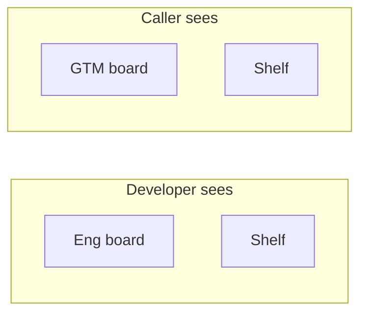

**Speaker notes**

- “Imagine Morfgage-style: one loan portal, two jobs — ship UI, and sign up DSAs.”
- Tap the table: shelf = one truth on commission; rooms = specialist noise stays local.
- Ask the room: “Would you want your coding agent reading 50 WhatsApp scripts?” Pause — “That’s why rooms exist.”
- Close: “One launch, two rooms, one shelf — that’s the product.”

---

## Story 2 — Same eng squad: borrower app + lender admin

**Same product company; one Eng room builds the borrower web app and a separate lender-admin console as two git projects.**

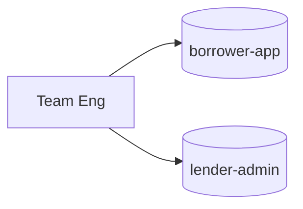

Stable squad, two folders — room keeps shared habits; today’s project focuses the shelf.

**Speaker notes**

- “Real eng pods don’t dissolve every time you open a second repo.”
- “Team = who we are; project = which folder we’re in today.”
- “Habits like coding standards stay in the room; portal-only bugs don’t flood a borrower-app day.”

---

## Story 3 — DSA needs one product fact for the pitch

**GTM must tell DSAs “eligibility shows in under 2 minutes” — Eng already decided that in the portal build; open a door for that one note only.**

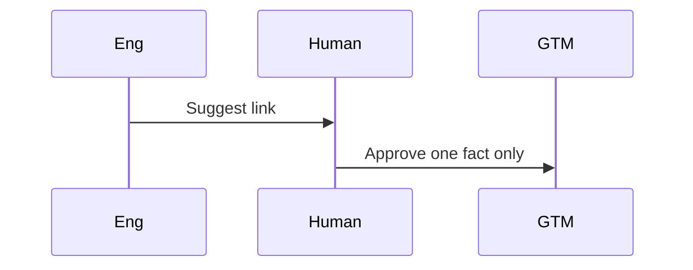

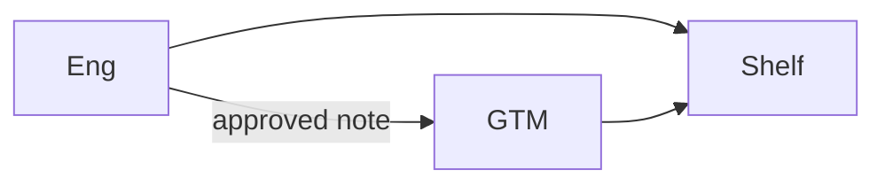

**Speaker notes**

- “Sales needs one product sentence — not Eng’s entire backlog.”
- Walk the sequence: suggest → human approves → door opens for **that** note.
- Punchline: “Collaboration is a door, not a merge of two WhatsApp groups.”

---

## Story 4 — Classic: one delivery team, one repo

**A small fintech squad (BA + Dev + Tester) only owns the MVP loan portal repo — room and project feel like one thing.**

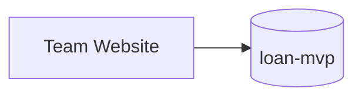

**Speaker notes**

- “Most startups start here — one squad, one repo. That’s fine.”
- “We’re not forcing matrix org on day one; the model still works when you grow.”
- Reassure: “If this is you, you won’t feel the complexity.”

---

## Story 5 — Broken EMI calculator: support + eng

**Customer says EMI estimate is wrong on the loan portal; Support owns the ticket, Eng owns the fix in the same product repo.**

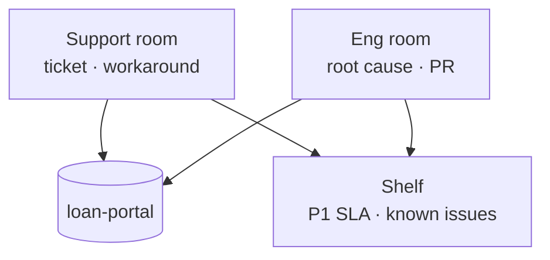

**Speaker notes**

- “Same customer, same product — still two crafts: talk to the user vs fix the code.”
- Shelf = SLA and known issues; rooms = ticket chatter vs PR chatter.
- “Putting Support inside Eng’s team just to share the repo is how orgs get noisy agents.”

---

## Story 6 — Solar: site survey vs install crew

**You’re connecting homeowners to rooftop solar; Survey team captures roof/shade notes, Install team schedules panels — same customer job folder.**

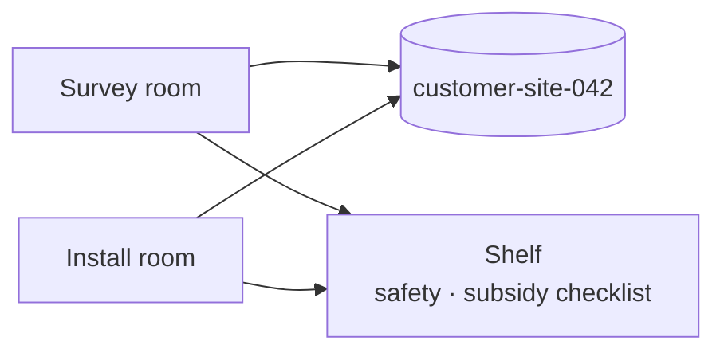

**Speaker notes**

- “Outside software: same job card, surveyor vs installer.”
- “Install day needs subsidy checklist on the shelf — not three pages of shade photos unless you open a door.”
- Shows the model isn’t only for coding agents.

---

## Story 7 — Solar GTM + legal on claims

**Sales texts prospects “save 40% on bills”; Legal must clear claims for the same solar campaign.**

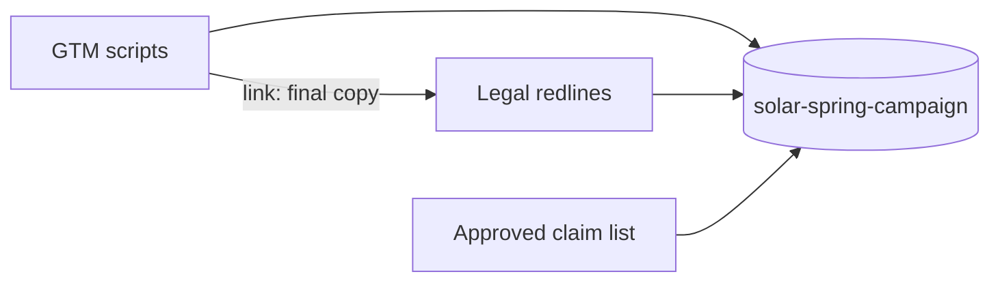

**Speaker notes**

- “Regulated claims: Sales invents, Legal clears.”
- Shelf = approved claim list for everyone; door = send final script for redline only.
- “This is controllability — not just memory.”

---

## Story 8 — EV charger lead-gen + field ops

**You’re generating leads for home EV chargers; Digital acquires leads, Field Ops books electrician visits — same lead pipeline project.**

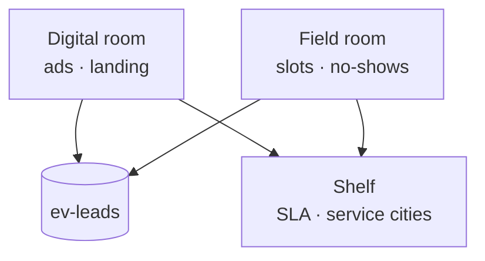

**Speaker notes**

- “Funnel vs truck: same lead ID, different jobs.”
- Shelf = which cities you serve and SLA; don’t mix ad creative debates into the electrician’s agent.

---

## Story 9 — Insurance aggregator: quotes API + partner desk

**You’re building a multi-insurer quote engine; Eng ships APIs while Partner desk onboards insurers on the same platform program.**

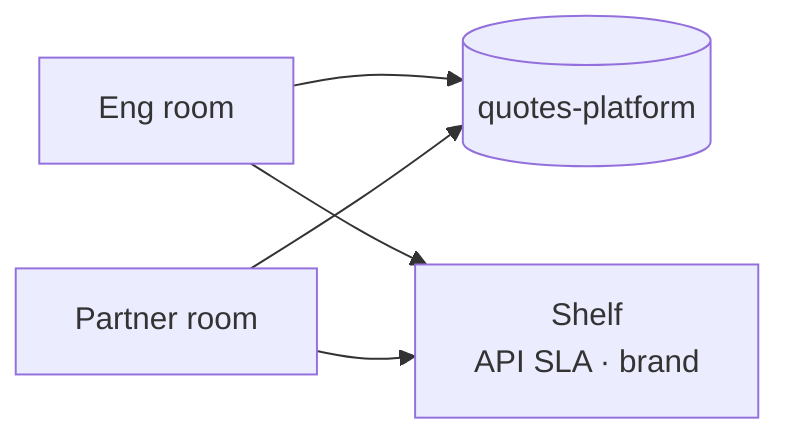

**Speaker notes**

- “Platform eng vs insurer onboarding — classic B2B split.”
- Both care about API SLA on the shelf; partner negotiation notes stay in Partner room.

---

## Story 10 — NBFC collections: calling floor + legal recovery

**Collections agents call overdue borrowers; Legal recovery handles notices — same loan account batch, different rooms.**

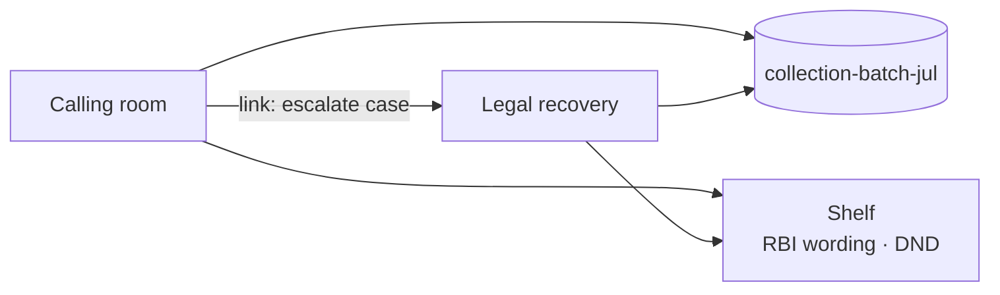

**Speaker notes**

- Sensitive domain — lean in: “Wording and DND are shelf; call scripts stay in calling room.”
- Escalation = door for one case, not full call recordings into Legal’s daily context.
- Good slide for “why hierarchy beats one mega-agent.”

---

## Story 11 — Edtech: course content + student success

**You run an online exam-prep product; Content team ships lessons, Success team handles student WhatsApp — same product, two rooms.**

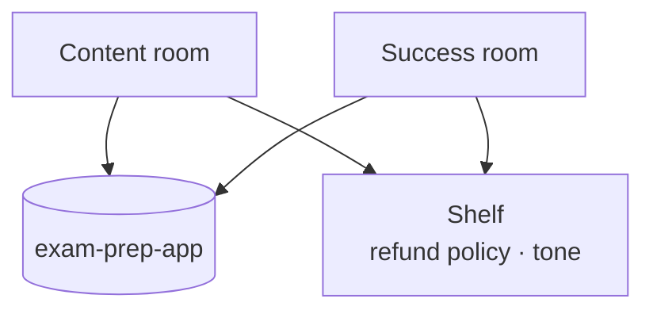

**Speaker notes**

- “Curriculum vs empathy inbox.”
- Refund policy on shelf; lesson outlines vs angry-student threads stay separated.

---

## Story 12 — Hospital OPD app: product eng + clinic ops

**You’re digitizing OPD appointments; Eng builds the app, Clinic Ops configures doctors/slots — same hospital rollout project.**

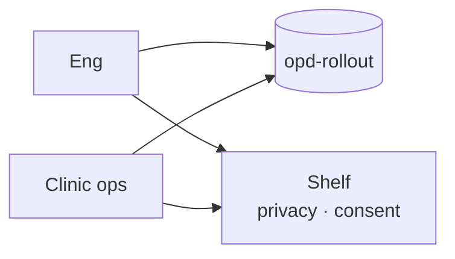

**Speaker notes**

- Healthcare: privacy/consent are shelf — non-negotiable.
- Ops knows doctor rosters; Eng knows deploy notes; merging rooms is how PHI chatter leaks into the wrong agent.

---

## Story 13 — Two cities, two solar campaigns, one brand

**North and West solar GTM pods run different city campaigns; both must use the same company brand and “no false savings %” rules.**

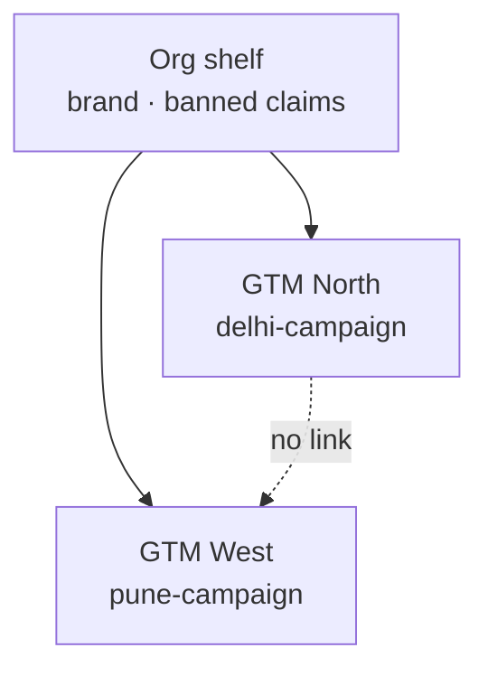

**Speaker notes**

- “Same company voice, different city lists.”
- Org shelf = brand once; no need for Delhi to see Pune’s lead list.
- “This is why org memory exists.”

---

## Story 14 — BA + Dev + Tester on the DSA portal

**One delivery room (BA, Developer, Tester) builds the DSA onboarding portal together — they share one team whiteboard by design.**

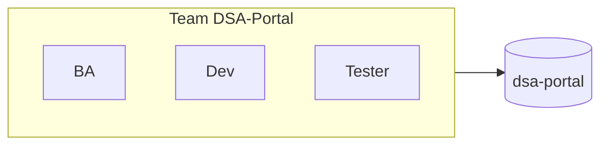

**Speaker notes**

- Flip the script: “Sometimes you *want* one room — that’s a team.”
- BA/Dev/QA should share requirements and bugs; no connect line required inside the squad.
- “Team isn’t bureaucracy — it’s the people who should hear each other.”

---

## Story 15 — New tester joins mid loan-portal launch

**A new Tester agent joins Eng halfway through the aggregated loan portal launch and should inherit room + shelf context immediately.**

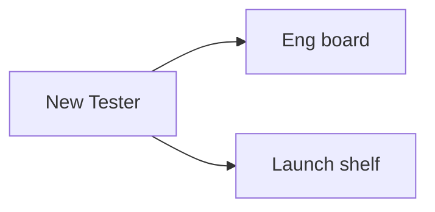

**Speaker notes**

- “Onboarding is the silent killer of agent projects.”
- Sit them in the room + shelf — they inherit Tailwind decisions and go-live checklist without a 2-hour briefing.
- Product line: “Memory is how agents join mid-flight.”

---

## Story 16 — Standing compliance for lending

**RBI-style “no guaranteed loan approval” wording must follow every loan/DSA agent forever — not die when a campaign repo is deleted.**

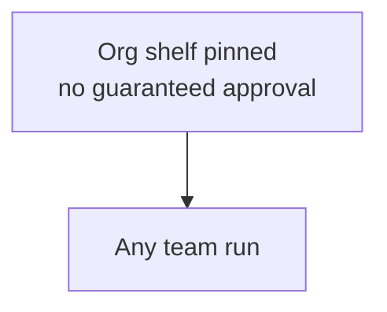

**Speaker notes**

- “Projects die; compliance doesn’t.”
- Pin on org shelf / agnostic — every agent, every campaign.
- Ties to controllability and trust — audience of lenders/NBFCs will nod here.

---

## Story 17 — Shared Firecrawl/AWS, separate squads

**Data and Eng both use company Firecrawl + AWS; they do not share each other’s analysis whiteboards.**

```mermaid
flowchart LR
    Cat[Catalog\nAWS · Firecrawl]
    Data[Data room]
    Eng[Eng room]
    Cat --> Data
    Cat --> Eng
```

**Speaker notes**

- Common confusion: “Same API key = same team?”
- No — **catalog** is tools; **rooms** are memory.
- One sentence: “Shared screwdriver, separate workbenches.”

---

## Story 18 — Loan POC ends; keep what matters

**The loan portal POC project is retired; campaign-only notes archive, but “formal English to DSAs” stays as company knowledge.**

```mermaid
flowchart LR
    P[poc deleted] --> Arch[Archive project-only notes]
    Keep[Agnostic / pinned rules] --> Org[Stay on org shelf]
```

**Speaker notes**

- “What happens when the experiment ends?”
- Project-tagged clutter archives; house style remains.
- Shows memory lifecycle — not a junk drawer that never shrinks.

---

## Story 19 — Growth floor: Eng ↔ GTM ↔ Legal doors

**On the growth floor for the loan platform, Eng links to GTM for product facts, GTM links to Legal for claims — Eng and Legal stay unlinked.**

```mermaid
flowchart TB
    Floor[Floor: Growth]
    E[Eng]
    G[GTM]
    L[Legal]
    Floor --> E
    Floor --> G
    Floor --> L
    E ---|link| G
    G ---|link| L
    E -.->|no link| L
```

**Speaker notes**

- Floor = neighborhood of rooms; links = who has keys.
- Chain is normal: product → sales → legal; Eng doesn’t need Legal’s redline pile daily.
- “Selective doors beat all-to-all memory.”

---

## Story 20 — Agri-input marketplace: seller KYC vs buyer app

**You’re building a marketplace for farm inputs; KYC team onboards sellers while App team ships the buyer experience — same company program, two rooms.**

```mermaid
flowchart LR
    P[(agri-market)]
    KYC[KYC / seller room]
    App[Buyer-app Eng]
    Shelf[Shelf\nKYC policy · categories]
    KYC --> P
    App --> P
    KYC --> Shelf
    App --> Shelf
```

**Speaker notes**

- Marketplace = two sides of one program.
- KYC docs stay in KYC room; buyer UX in Eng; category policy on shelf.
- Relatable beyond fintech — shows breadth of the office metaphor.

---

## Story 21 — Logistics: lane pricing vs driver app

**Freight company: Pricing team sets lane rates, Mobile team ships the driver app — shared “rates must match app” shelf rules.**

```mermaid
flowchart TB
    P[(driver-app + rates)]
    Price[Pricing room]
    Mob[Mobile eng]
    Shelf[Shelf\nrate card rules]
    Price --> P
    Mob --> P
    Price --> Shelf
    Mob --> Shelf
```

**Speaker notes**

- “If the app shows a different rate than the card, you lose the driver — that’s shelf.”
- Pricing experiments stay in Pricing room until promoted.

---

## Story 22 — HR payroll tool: payroll ops + IT security

**Internal payroll product; Payroll Ops configures payslips, Security reviews access — same HR-systems project.**

```mermaid
flowchart LR
    P[(payroll-system)]
    Pay[Payroll ops]
    Sec[Security]
    Shelf[Shelf\nPII · access policy]
    Pay --> P
    Sec --> P
    Pay --> Shelf
    Sec --> Shelf
```

**Speaker notes**

- Internal tools count too — not only customer products.
- PII policy on shelf; Security doesn’t need every payslip config debate in context.
- Close the examples block: “Same pattern — banking, solar, hospital, HR.”

---

## Busy cheat sheet

| You want… | Use |
| --- | --- |
| People who work together daily | **One team** |
| A launch / repo / job folder | **Project** |
| Rules every squad on that work must follow | **Shelf** |
| Share one note across squads | **Connect line** |
| Same tool (WhatsApp, AWS) for many | **Catalog** — don’t merge rooms |

```mermaid
flowchart TD
    Q1{Daily together?} -->|yes| Team[Same team]
    Q1 -->|no| Q2{Same launch rules?}
    Q2 -->|yes| Shelf[Shelf + same project]
    Q2 -->|no| Sep[Keep separate]
    Shelf --> Q3{Need their working notes?}
    Q3 -->|yes| Link[Open connect line]
    Q3 -->|no| Done[Shelf is enough]
```

**Speaker notes**

- End the talk on this slide — leave it up for Q&A.
- Recap in 15 seconds: “Room, project, shelf, door — that’s the whole memory product.”
- Invite challenge: “Where would *your* agents sit, and what belongs on the shelf?”
- Optional CTA: demo team screen + org memory panel next.

---

## For implementers

[MEMORY_ARCHITECTURE.md](./MEMORY_ARCHITECTURE.md)

---

## Changelog

| Date | Note |
| --- | --- |
| 2026-08-03 | Technical scenarios → busy stories → more Mermaid |
| 2026-08-03 | Each story = real 1-liner business |
| 2026-08-03 | Speaker notes on big picture, all 22 stories, and cheat sheet |
| 2026-08-03 | Link IMPLEMENTATION.md for coding-agent handoff |
| 2026-08-12 | Pitch opener: org sync + AI confidence gap (Sonar-style survey) → AAS problem/solution table |
| 2026-08-13 | Survey punch-line stories A–G (shadow AI, unknown agents, monitoring, policy, governance delay) |
