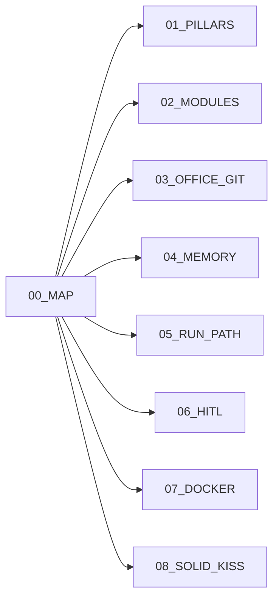

# Architecture map

Coding knowledge for AgentAnyStack. Product truth stays in [`docs/`](../).



| File | Topic |
| --- | --- |
| [01_PILLARS.md](./01_PILLARS.md) | Four pillars |
| [02_MODULES.md](./02_MODULES.md) | Packages / classes |
| [03_OFFICE_GIT.md](./03_OFFICE_GIT.md) | Desks on disk |
| [04_MEMORY.md](./04_MEMORY.md) | Gold vs OKF |
| [05_RUN_PATH.md](./05_RUN_PATH.md) | Chat → model → extract |
| [06_HITL.md](./06_HITL.md) | Autonomy + approvals |
| [07_DOCKER.md](./07_DOCKER.md) | Compose + volumes |
| [08_SOLID_KISS.md](./08_SOLID_KISS.md) | SOLID / YAGNI |

```text
+ OK: read these before changing orchestrator code
- BAD: invent a Python Agent subclass package
```

**Built now (P1–P4):** health, empty office, create/list/get agents, Docker.  
**Later:** chat, gold write path, OKF, HITL UI, office Q&A.
