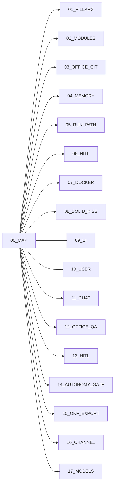

# Architecture map

Coding knowledge for AgentAnyStack. Product truth stays in [`docs/`](../).



| File | Topic |
| --- | --- |
| [01_PILLARS.md](./01_PILLARS.md) | Four pillars |
| [02_MODULES.md](./02_MODULES.md) | Packages / classes |
| [03_OFFICE_GIT.md](./03_OFFICE_GIT.md) | Desks on disk |
| [04_MEMORY.md](./04_MEMORY.md) | Gold vs OKF · seed + pack + extract flows |
| [05_RUN_PATH.md](./05_RUN_PATH.md) | Chat → pack → stream → journal → extract |
| [06_HITL.md](./06_HITL.md) | Autonomy formula index → 13 + 14 |
| [07_DOCKER.md](./07_DOCKER.md) | Compose + volumes |
| [08_SOLID_KISS.md](./08_SOLID_KISS.md) | SOLID / YAGNI |
| [09_UI.md](./09_UI.md) | Office UI shell |
| [10_USER.md](./10_USER.md) | Community admin · multi-user header |
| [11_CHAT.md](./11_CHAT.md) | Chat flow: main → router → modules |
| [12_OFFICE_QA.md](./12_OFFICE_QA.md) | Office Q&A flow: main → classify → journal/OKF |
| [13_HITL.md](./13_HITL.md) | HITL board flow: propose → decide → journal |
| [14_AUTONOMY_GATE.md](./14_AUTONOMY_GATE.md) | Autonomy gate flow: effective → allow/hitl/deny |
| [15_OKF_EXPORT.md](./15_OKF_EXPORT.md) | OKF export flow: SQLite → office/memory/ |
| [16_CHANNEL.md](./16_CHANNEL.md) | Unified channel: office + agent + approvals SSE |
| [17_MODELS.md](./17_MODELS.md) | Stacks: curated Ollama pull / list / delete |

```text
+ OK: read these before changing orchestrator code
- BAD: invent a Python Agent subclass package
```

**Built now (P1–P16 + P17 models):** health, desks, Docker, UI, chat, gold tools, team OKF, office Q&A, HITL, autonomy gate, OKF export, unified channel, **Stacks local model pull**.  
**Optional later:** shelf ∩ P(p), OKF import, Settings read-only page, BYO Cursor/Claude keys UI.  
**Out of v0 cut:** floors / full MCP / Analytics BI.
