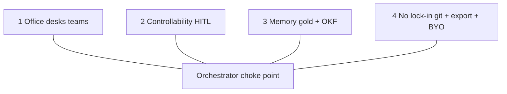

# Pillars

Not a chatbot. An **office** for agents.



| Pillar | Meaning |
| --- | --- |
| Office | Desks in `office/`; UI create only |
| Controllability | Autonomy 0–100 + approvals |
| Memory | Gold notepad + shared room OKF |
| No lock-in | Git desks + OKF export + Ollama/BYO |

```text
+ OK: same rules for BA desk and sales desk
- BAD: one mega chatbot with no desks / no memory walls

+ OK: agent.yaml + AGENT.md in git → revert = restore desk
- BAD: agent persona only in a proprietary cloud DB
```

Analytics / Connect are **features under** these pillars — stubs later, not new pillars.
