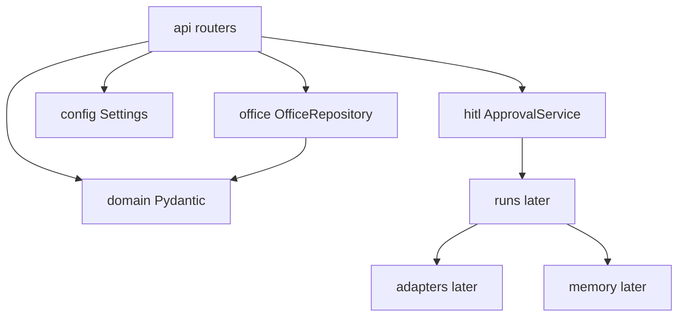

# Modules

Desk **data** ≠ orchestrator **code**.



## Package layout

```text
apps/orchestrator/src/agent_anystack/
  main.py              # app factory
  config.py            # env / .env (platform bucket)
  api/health.py        # GET /health
  api/agents.py        # GET/POST agents, GET /org
  domain/agent.py      # AgentConfig, CreateAgentRequest, …
  domain/org.py        # OrgConfig
  office/repository.py # load/write office/ tree
  adapters/            # llm.py — StackAdapter + OpenAICompatibleAdapter (+ later wires)
  memory/              # OkfStore + pack (team OKF); gold under office/
  runs/                # ChatRunService + journal
  hitl/                # ApprovalCard store + permissive decide
  office_qa.py         # Front-desk status / knowledge
```

## Major types (now)

| Name | Role |
| --- | --- |
| `Settings` | Platform env (`OFFICE_REPO_PATH`, DB, Ollama URL, `APPROVER_MODE`) |
| `OrgConfig` | `office/org.yaml` |
| `AgentConfig` | One desk’s `agent.yaml` |
| `CreateAgentRequest` | UI/API create payload |
| `OfficeRepository` | Read/write desks on disk |
| `AgentExistsError` | Duplicate agent id |
| `AutonomyCeilingError` | Agent autonomy > org max |
| `OkfStore` / `OkfFact` | Team shared facts |
| `ChatRunService` | Pack → stream → journal → extract hook |
| `OfficeQaService` | Front-desk Q&A |
| `ApprovalCard` / `ApprovalService` | HITL board (action tag) |

```text
+ OK: from agent_anystack.office import OfficeRepository, AgentExistsError
- BAD: Python class AnalystAgent under apps/.../agents/

+ OK: AgentConfig = yaml settings; AGENT.md = persona text (separate file)
- BAD: put full AGENT.md body inside AgentConfig always
```

## Major types (later)

| Name | Role |
| --- | --- |
| Autonomy gate on catalog `hil` | Slice 9 — effective autonomy decides allow vs card |
| Memory HITL cards | Async review queue |
| MCP `_locked` + grant | After Accept, agent executes |
