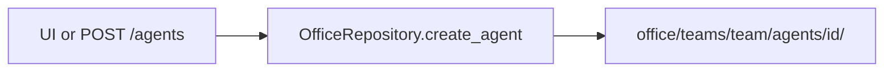

# Office as git

Desks are **files**, not code classes.



## Layout

```text
office/
  org.yaml                 # org max_autonomy, defaults
  projects.yaml            # project registry (id, name, slug, path, status)
  memory/                  # OKF export snapshot (P15) — not hot pack
    index.md
    teams/<team>/…
  teams/
    <team>/
      agents/
        <id>/
          agent.yaml       # machine contract (workspace required on create)
          AGENT.md         # persona markdown
          gold/            # gold/<user_id>.jsonl per-user notepad

projects/                  # PROJECTS_ROOT — one git tree per project (not office git)
  <slug>/                  # working dir; LFS optional later
```

**Ship empty:** no seed analysts/developers. Create via API/UI only.

**Compulsory workspace:** `POST /agents` requires `workspace.project_id` for an **active** project. If none exists, `POST /projects` first (creates registry row + `projects/<slug>/` + `git init`). Path on the agent is taken from the registry.

```text
+ OK: POST {id:ba, team:eng, ...} → office/teams/eng/agents/ba/
- BAD: commit pre-built office/teams/eng/agents/developer/ as product default

+ OK: agent.yaml = stack, model, autonomy, workspace path
- BAD: put workspace project source code inside office/

+ OK: GET /agents → [] until someone creates a desk
- BAD: hardcode agent names in Python

+ OK: project under projects/; pointer in agent.yaml workspace
- BAD: create agent without an active project
```

## Two files per desk

| File | Job |
| --- | --- |
| `agent.yaml` | Settings → `AgentConfig` |
| `AGENT.md` | Persona text → `read_persona()` (HTTP later) |

`system_prompt_file: ./AGENT.md` is a **path**, not the markdown body.
