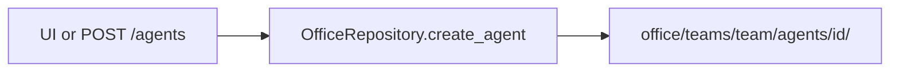

# Office as git

Desks are **files**, not code classes.



## Layout

```text
office/
  org.yaml                 # org max_autonomy, defaults
  teams/
    <team>/
      agents/
        <id>/
          agent.yaml       # machine contract
          AGENT.md         # persona markdown
          gold/            # per-user notepad later
```

**Ship empty:** no seed analysts/developers. Create via API/UI only.

```text
+ OK: POST {id:ba, team:eng, ...} → office/teams/eng/agents/ba/
- BAD: commit pre-built office/teams/eng/agents/developer/ as product default

+ OK: agent.yaml = stack, model, autonomy, workspace path
- BAD: put workspace project source code inside office/

+ OK: GET /agents → [] until someone creates a desk
- BAD: hardcode agent names in Python
```

## Two files per desk

| File | Job |
| --- | --- |
| `agent.yaml` | Settings → `AgentConfig` |
| `AGENT.md` | Persona text → `read_persona()` (HTTP later) |

`system_prompt_file: ./AGENT.md` is a **path**, not the markdown body.
