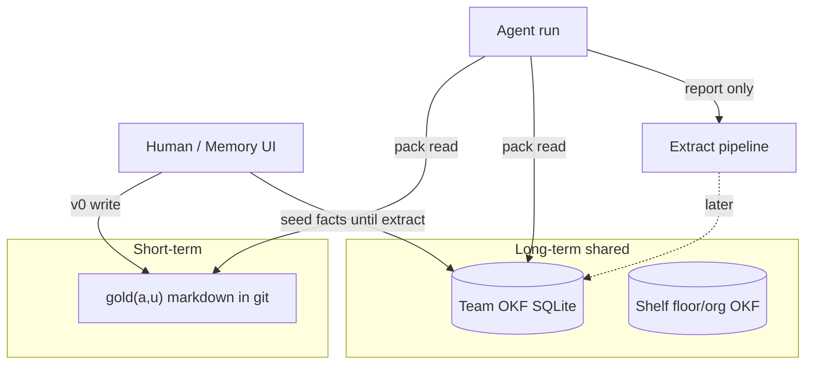
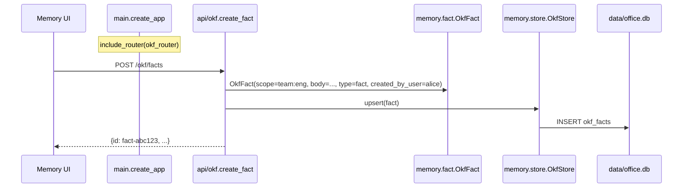
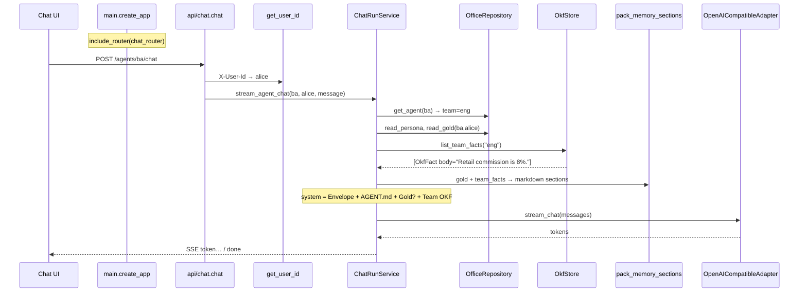

# Memory

Users share the **room**; they do not share the **notepad**.



## Pack formula (v0)

```text
C(a,p,u) ≈ gold(a,u) ∪ mem(team)
```

Shelf / floor / org ∩ `P(p)` not packed yet. Team facts are **not** filtered by `created_by_user` (audit label only).

| Tier | Store | Who writes (v0) |
| --- | --- | --- |
| Gold | `gold/<user_id>.md` | **Human** via `PUT /gold` / Memory UI |
| Team OKF | SQLite `okf_facts` (`DATABASE_URL`) | **Human seed** `POST /okf/facts` until extract |
| Shelf | — | Later |

## Modules

| Piece | Path |
| --- | --- |
| Fact model | `memory/fact.py` |
| SQLite store | `memory/store.py` |
| Pack markdown | `memory/pack.py` |
| HTTP | `api/okf.py` — `GET/POST /okf/facts`, `DELETE` archive |
| Chat | `ChatRunService` packs gold + team OKF into system prompt |

`FactType` is only a **category** on a row (`decision`, `fact`, …). The knowledge the model uses is the free-text **`body`** (plus id for citations).

## Example flow: main → route → memory → chat

**Scenario:** Alice seeds “Retail commission is 8%.” for team `eng`, then asks desk `ba` (team `eng`): “What’s our retail commission?”

### A) Seed fact (write)

```http
POST /okf/facts
X-User-Id: alice
{"team":"eng","body":"Retail commission is 8%.","type":"fact"}
```



### B) Chat packs that fact (read)

```http
POST /agents/ba/chat
X-User-Id: alice
{"message":"What's our retail commission?"}
```



**Team OKF snippet in the system prompt:**

```text
## Team OKF (shared room)
- [fact-abc123] (fact, agnostic, by alice): Retail commission is 8%.
```

(`fact` = type enum; the sentence is `body`.)

### Module map for the example

| Step | Module |
| --- | --- |
| Boot | `main.create_app` registers `okf` + `chat` routers |
| Write fact | `api/okf` → `fact.OkfFact` → `store.OkfStore` |
| Identity | `deps.get_user_id` (`alice`) + path `ba` |
| Orchestrate | `runs/service.ChatRunService` |
| Desk files | `office/repository` (yaml, AGENT.md, gold) |
| Shared facts | `memory/store` |
| Prompt glue | `memory/pack` + `envelope` |
| Model | `adapters/llm.OpenAICompatibleAdapter` |

Chat run path detail: [11_CHAT.md](./11_CHAT.md).

## Who writes gold

**v0 decision:** gold write is **human-only**. Do not build `append_gold` for the stream agent in this cut.

```text
+ OK (v0): human edits gold; agent uses packed notes in chat
- BAD (v0): stream agent writes gold / append_gold tool

+ OK (v0): human seeds team OKF; chat packs mem(team)
- BAD: desk LLM INSERT into okf_facts

+ OK: extract after run via BackgroundTasks (next)
- BAD: await long extract inside chat response

+ OK: pack all teammates’ room facts (created_by_user = audit only)
- BAD: filter shared OKF by user_id on pack (v0)
```

**Status (P10):** gold + **SQLite team OKF pack** done. Extract / shelf / export still later.
