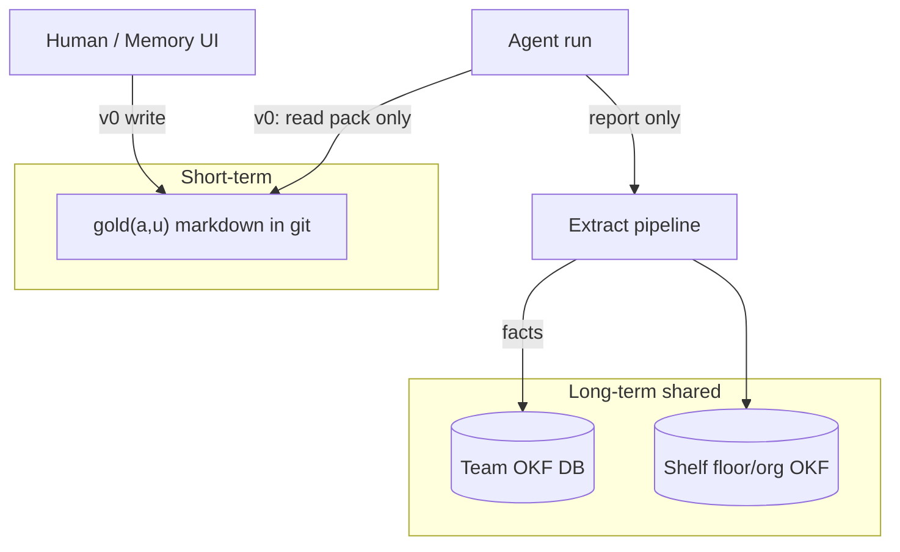
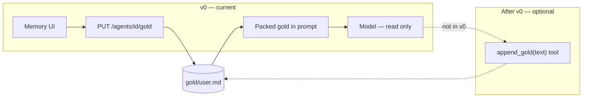

# Memory

Users share the **room**; they do not share the **notepad**.



## Pack formula (later)

```text
C(a,p,u) = gold(a,u) ∪ mem(team) ∪ (shelf) ∩ P(p)
```

| Tier | Store | Who writes (v0) |
| --- | --- | --- |
| Gold | `gold/<user_id>.md` | **Human** via `PUT /gold` / Memory UI only |
| Team / shelf OKF | SQLite → export OKF | Pipeline only (later) |

## Who writes gold

**v0 decision:** gold write is **human-only**. Do not build `append_gold` for the stream agent in this cut. Chat **packs/reads** gold; it does not update the file.



- **v0:** human/API writes; chat **reads** and packs labeled gold into the system prompt.
- **After v0 (optional):** model emits `append_gold(text)` only; `ChatRunService` binds `agent_id` + `user_id` from the run and calls `write_gold`. See [11_CHAT.md](./11_CHAT.md).

```text
+ OK (v0): human edits gold; agent uses packed notes in chat
- BAD (v0): stream agent writes gold / append_gold tool

+ OK (later): agent updates gold via mediated tool for this user
- BAD: agent INSERT into shared OKF table

+ OK: extract after run via BackgroundTasks
- BAD: await long extract inside chat response

+ OK: pack all teammates’ room facts (created_by_user = audit only)
- BAD: filter shared OKF by user_id on pack (v0)
```

**Status:** gold(a,u) **human** read/write + pack into chat = done. Agent gold tool = **out of v0**. Team/shelf OKF still later.
