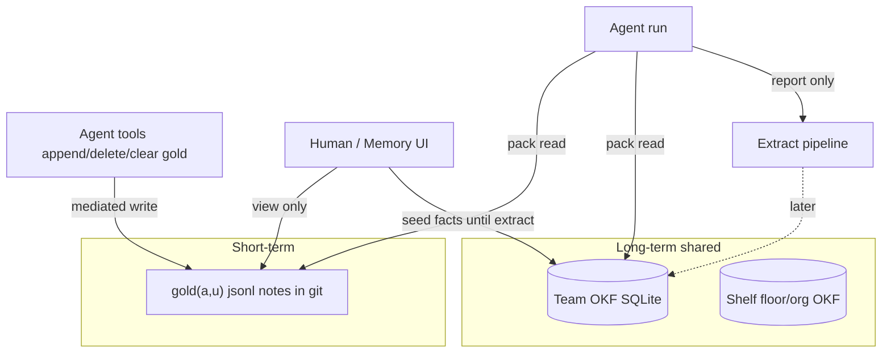
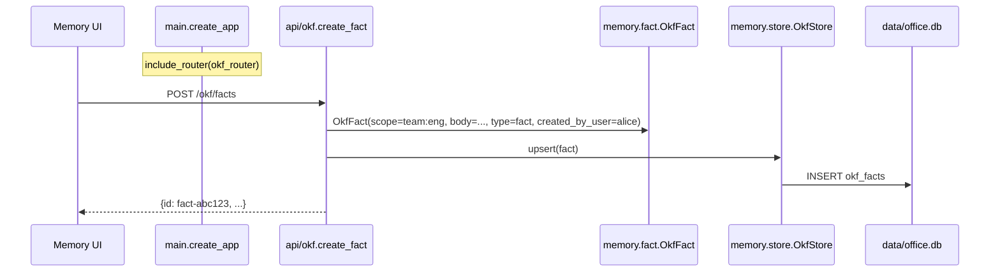
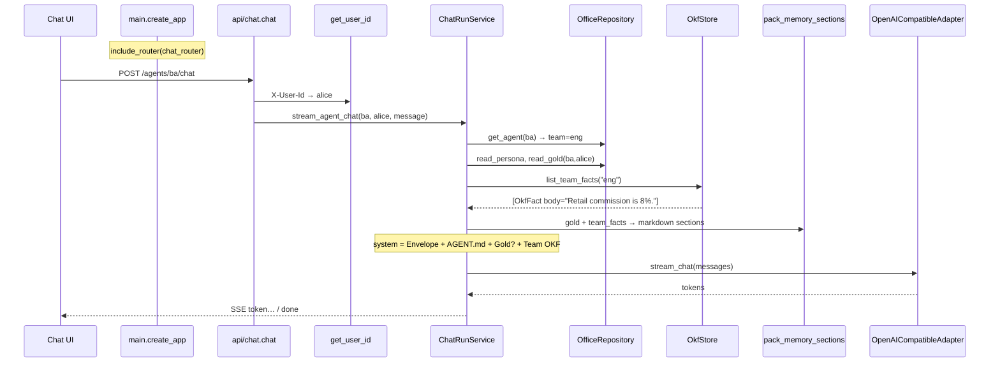
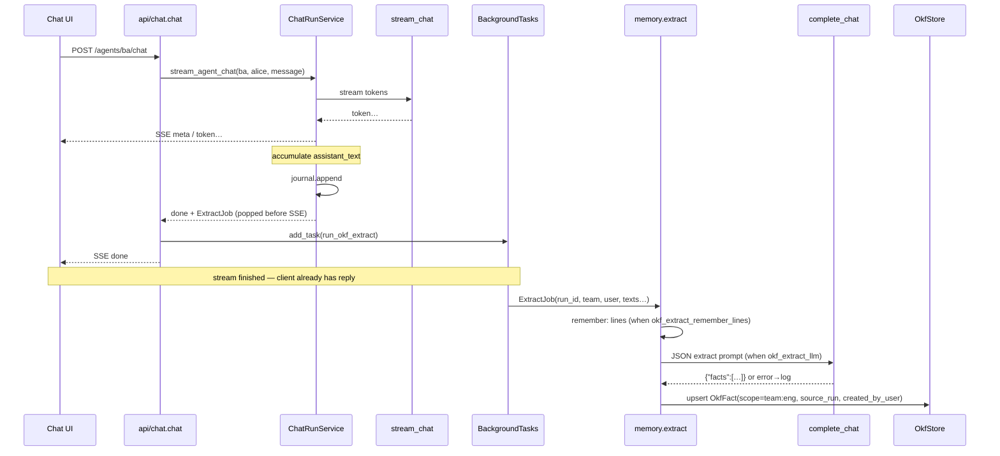

# Memory

Users share the **room**; they do not share the **notepad**.



## Pack formula (v0)

```text
C(a,p,u) ≈ gold(a,u) ∪ mem(team)
```

Shelf / floor / org ∩ `P(p)` not packed yet. Team facts are **not** filtered by `created_by_user` (audit label only).

| Tier | Store | Who writes |
| --- | --- | --- |
| Gold | `gold/<user_id>.jsonl` | **Agent** via `read_gold` / `append_gold` / `delete_gold` / `clear_gold` (Memory UI view-only; HTTP PUT for ops) |
| Team OKF | SQLite `okf_facts` (`DATABASE_URL`) | **Human seed** `POST /okf/facts` until extract |
| Shelf | — | Later |

## Modules

| Piece | Path |
| --- | --- |
| Fact model | `memory/fact.py` |
| SQLite store | `memory/store.py` |
| Pack markdown | `memory/pack.py` |
| Extract | `memory/extract.py` — post-run BackgroundTasks |
| HTTP | `api/okf.py` — `GET/POST /okf/facts`, `DELETE` archive |
| Chat | `ChatRunService` packs gold + team OKF; schedules extract on `done` |

`FactType` is only a **category** on a row (`decision`, `fact`, …). The knowledge the model uses is the free-text **`body`** (plus id for citations).

## Example flow: main → route → memory → chat

**Scenario:** Alice seeds “Retail commission is 8%.” for team `eng`, then asks desk `ba` (team `eng`): “What’s our retail commission?”

### A) Seed fact (write)

```http
POST /okf/facts
X-User-Id: alice
{"team":"eng","body":"Retail commission is 8%.","type":"fact"}
```



### B) Chat packs that fact (read)

```http
POST /agents/ba/chat
X-User-Id: alice
{"message":"What's our retail commission?"}
```



**Team OKF snippet in the system prompt:**

```text
## Team OKF (shared room)
- [fact-abc123] (fact, agnostic, by alice): Retail commission is 8%.
```

(`fact` = type enum; the sentence is `body`.)

### Module map for the example

| Step | Module |
| --- | --- |
| Boot | `main.create_app` registers `okf` + `chat` routers |
| Write fact | `api/okf` → `fact.OkfFact` → `store.OkfStore` |
| Identity | `deps.get_user_id` (`alice`) + path `ba` |
| Orchestrate | `runs/service.ChatRunService` |
| Desk files | `office/repository` (yaml, AGENT.md, gold) |
| Shared facts | `memory/store` |
| Prompt glue | `memory/pack` + `envelope` |
| Model | `adapters/llm.OpenAICompatibleAdapter` |

## Post-run extract (P11)

After a successful chat stream, `api/chat` schedules `BackgroundTasks` → `memory/extract.run_okf_extract` when `okf_extract_enabled` and at least one of `okf_extract_llm` / `okf_extract_remember_lines`. Chat SSE is **not** blocked.

### Example

```http
POST /agents/ba/chat
X-User-Id: alice
{"message":"remember: Retail commission is 8%.\nWhat else should I know?"}
```

Stream returns tokens as usual. After `done`, extract runs in the background and may upsert team OKF (visible on next Memory refresh / next chat pack).



### Who fills what on extract

| Field | Set by |
| --- | --- |
| `body`, proposed `type` | Extractor (LLM JSON) and/or `remember:` line |
| `scope` | Orchestrator → `team:{agent.team}` |
| `created_by_user` | Orchestrator → run `user_id` |
| `source_run` | Orchestrator → `run_id` |
| `id`, `created` | Orchestrator defaults |
| `projects` | Orchestrator → desk `workspace.project_id` if any |

Desk LLM does **not** INSERT into SQLite mid-stream.

### Steps (short)

1. Collect user message + full assistant text during the stream.
2. Deterministic: lines matching `remember: …` in the user message.
3. Soft: one non-streaming LLM call (`complete_chat`) on **`office_model`** (`OFFICE_MODEL`) — extract only, no invent. Not the desk’s `agent.model`.
4. Stamp trusted metadata → `OkfStore.upsert`.

Toggle: `OKF_EXTRACT_ENABLED` (default true). Failures are logged; they do not fail the chat response.

```text
+ OK: extract after SSE completes via BackgroundTasks
- BAD: await long extract inside the token stream
+ OK: remember: line still works if LLM extract fails
- BAD: desk agent INSERT into okf_facts mid-run
```

**Gold write:** agent-owned via `append_gold` / `delete_gold` / `clear_gold` (orchestrator-mediated; unique note ids). Memory UI is view-only.

```text
+ OK: agent tools update gold; Memory UI view-only
- BAD: model calls PUT /gold or invents user/agent ids in tool args
+ OK: delete by note id(s); each append gets a unique id (run_id = provenance only)
- BAD: delete-by-chat-run_id as the only key when multiple notes share a run

+ OK (v0): human seeds team OKF; chat packs mem(team)
- BAD: desk LLM INSERT into okf_facts

+ OK: soft extract uses configurable office_model (OFFICE_MODEL)
- BAD: extract reuses desk agent.model for office housekeeping

+ OK: pack all teammates’ room facts (created_by_user = audit only)
- BAD: filter shared OKF by user_id on pack (v0)
```

**Status:** gold tools + team OKF pack + extract + office Q&A + **OKF export** ([15_OKF_EXPORT.md](./15_OKF_EXPORT.md)). Shelf ∩ P(p) / import later.
