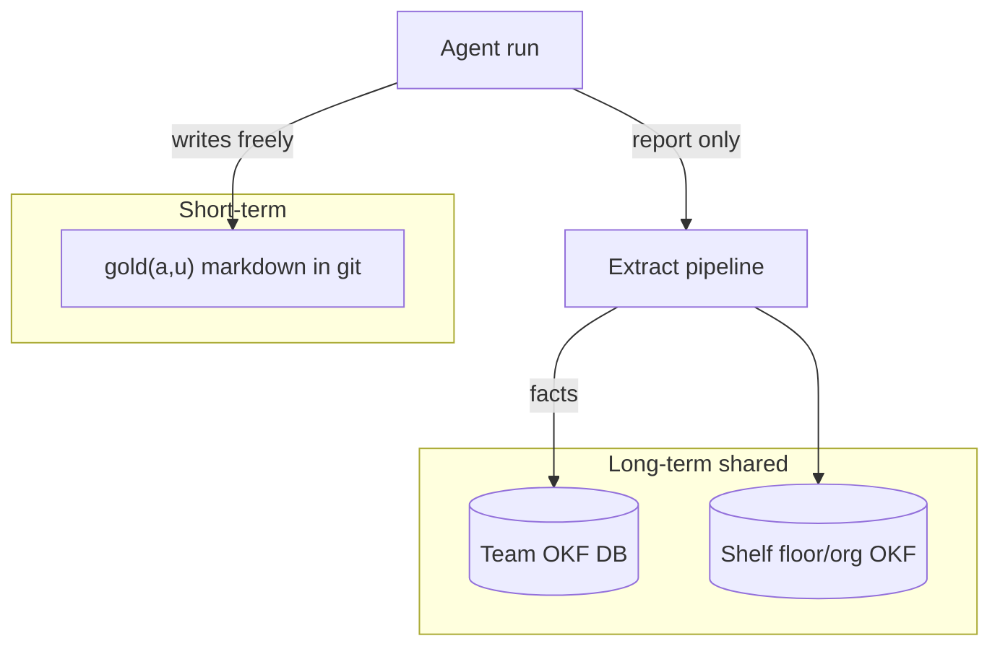

# Memory

Users share the **room**; they do not share the **notepad**.



## Pack formula (later)

```text
C(a,p,u) = gold(a,u) ∪ mem(team) ∪ (shelf) ∩ P(p)
```

| Tier | Store | Who writes |
| --- | --- | --- |
| Gold | `gold/<user_id>.md` | That user’s run |
| Team / shelf OKF | SQLite → export OKF | Pipeline only |

```text
+ OK: agent updates gold bullets for this user
- BAD: agent INSERT into shared OKF table

+ OK: extract after run via BackgroundTasks
- BAD: await long extract inside chat response

+ OK: pack all teammates’ room facts (created_by_user = audit only)
- BAD: filter shared OKF by user_id on pack (v0)
```

**Status:** design ready; code in later phases. Gold folder created empty on desk create.
