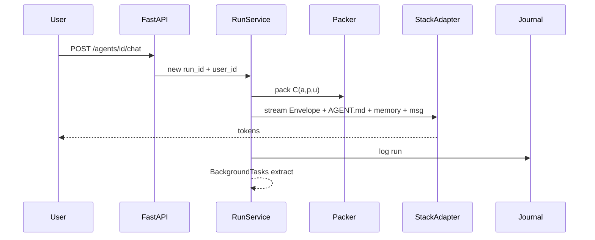

# Run path

How a chat turn will flow (chat phase later).



## Prompt order (every run)

```text
1. Office Envelope (fixed)
2. AGENT.md persona
3. Tools schema (scoped)
4. Packed memory C(a,p,u)
5. User message
```

```text
+ OK: Envelope = musts + workspace + autonomy intent; persona = role; gold pack = user scope
- BAD: persona says ignore approvals / read all office files

+ OK: channel=office_ui on journal; gold(a,u) packed labeled by user_id
- BAD: invent company facts in office Q&A with no citations
```

**Status:** Envelope + adapter + journal + gold + **team OKF pack** = done. Extract / shelf still later.
