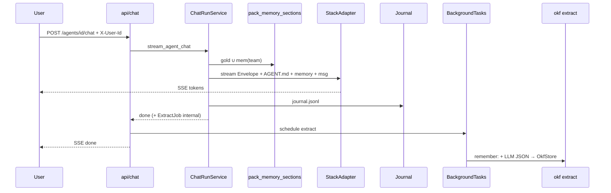

# Run path

Chat turn: pack → stream → journal → **background extract**.



## Prompt order (every run)

```text
1. Office Envelope (fixed)
2. AGENT.md persona
3. Packed memory C ≈ gold ∪ mem(team)
4. User message
```

## After the stream (P11)

Extract is **not** in the prompt path. It runs after SSE completes — see [04_MEMORY.md](./04_MEMORY.md) § Post-run extract.

```text
+ OK: Envelope = musts + workspace + autonomy intent; persona = role; gold pack = user scope
- BAD: persona says ignore approvals / read all office files

+ OK: channel=office_ui on journal; gold(a,u) packed labeled by user_id
- BAD: invent company facts in office Q&A with no citations

+ OK: BackgroundTasks extract after done
- BAD: block token stream on extract LLM
```

**Status:** Envelope + adapter + journal + gold + team OKF pack + post-run extract + office Q&A + **HITL board** = done. Autonomy-on-gate later.
