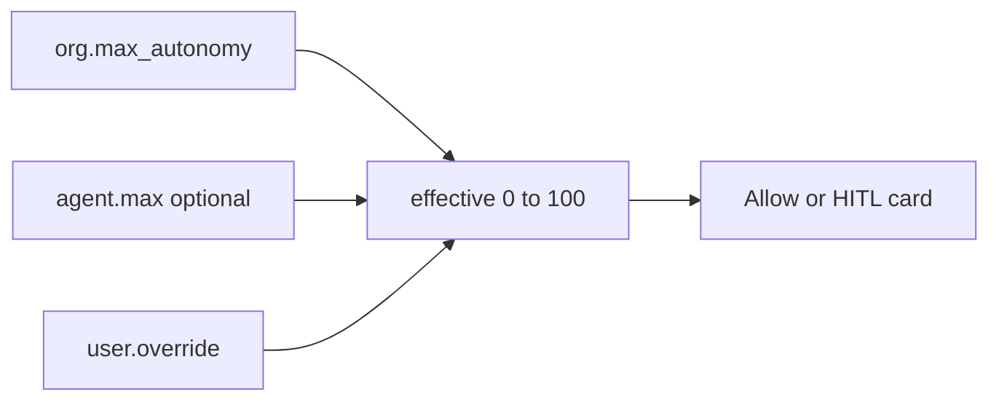

# HITL + autonomy

Controllability knob — same meaning for every stack.



## Formula

```text
effective_max = min(org.max_autonomy, agent.max ?? 100)
effective = clamp(user.override ?? agent.default ?? org.default, 0, effective_max)
```

```text
+ OK: org max 70; agent max 80 → rejected at create (AutonomyCeilingError)
- BAD: agent silently runs above org ceiling

+ OK: user may tighten autonomy for themselves
- BAD: user self-promotes above effective_max

+ OK: one approval card path; permissive approvers in v0
- BAD: silent drop of gated actions
```

**Status:** ceiling checked on create; full gates + Approvals UI later.
