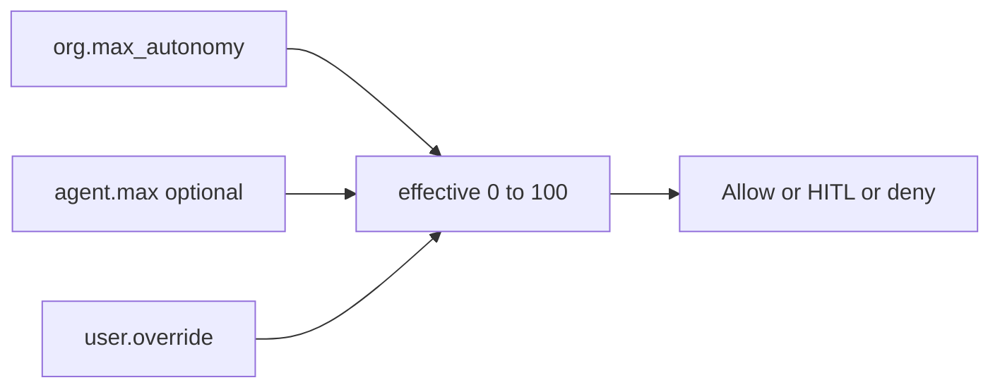

# HITL + autonomy

Controllability knob — same meaning for every stack.

| Doc | Topic |
| --- | --- |
| **[13_HITL.md](./13_HITL.md)** | P13 board — propose (HITL path) → Accept/Reject → journal |
| **[14_AUTONOMY_GATE.md](./14_AUTONOMY_GATE.md)** | P14 gate — `external_send` allow \| hitl \| deny from effective |



## Formula (§4.1)

```text
effective_max = min(org.max_autonomy, agent.max ?? 100)
effective = clamp(user.override ?? agent.default ?? org.default, 0, effective_max)
```

Ceiling on **agent create** (`AutonomyCeilingError`). Runtime: `hitl/autonomy.compute_effective` (chat Envelope + propose gate).

```text
+ OK: org max 70; agent max 80 → rejected at create
- BAD: agent silently runs above org ceiling

+ OK: user may tighten only (clamped to effective_max)
- BAD: user self-promotes above effective_max
```

## external_send bands (P14)

```text
≤20  → deny
21–79 → hitl (board)
≥80  → allow (auto + journal)
```

Full sequences + module map: **[14_AUTONOMY_GATE.md](./14_AUTONOMY_GATE.md)**.

**Next v0 (optional):** shelf ∩ P(p), OKF import, Settings read-only page.
