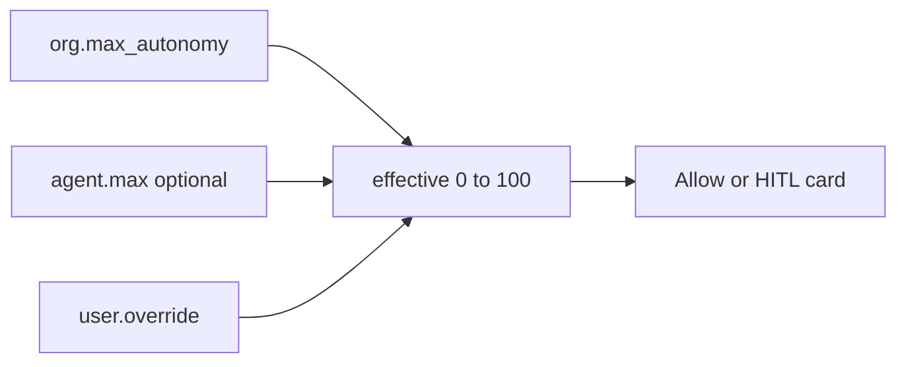

# HITL + autonomy

Controllability knob — same meaning for every stack.

**P13 board (propose → decide → journal):** full reviewable flow → **[13_HITL.md](./13_HITL.md)**.  
**This file:** autonomy formula + what the next gate slice uses.



## Formula (§4.1)

```text
effective_max = min(org.max_autonomy, agent.max ?? 100)
effective = clamp(user.override ?? agent.default ?? org.default, 0, effective_max)
```

Ceiling is already enforced on **agent create** (`AutonomyCeilingError`).

```text
+ OK: org max 70; agent max 80 → rejected at create
- BAD: agent silently runs above org ceiling

+ OK: user may tighten autonomy for themselves
- BAD: user self-promotes above effective_max

+ OK: one approval card path; permissive approvers — see 13_HITL
- BAD: silent drop of gated actions
```

## Built vs next

| Piece | Status |
| --- | --- |
| Approval board (action card, Accept → journal) | **P13** — [13_HITL.md](./13_HITL.md) |
| Effective autonomy on **one** action gate | **Next** (slice 9 / P14) |
| MCP `_locked` + grant after Accept | After v0 thin cut |
| Memory HITL cards | Later |

**Next:** when a gated action is proposed, use `effective` to **auto-allow** vs **open card** vs **deny** — card path stays [13_HITL.md](./13_HITL.md).
