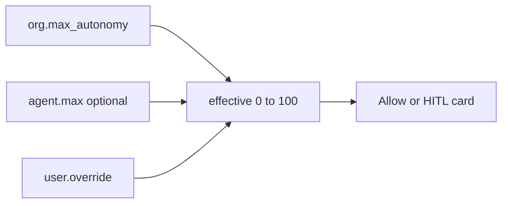
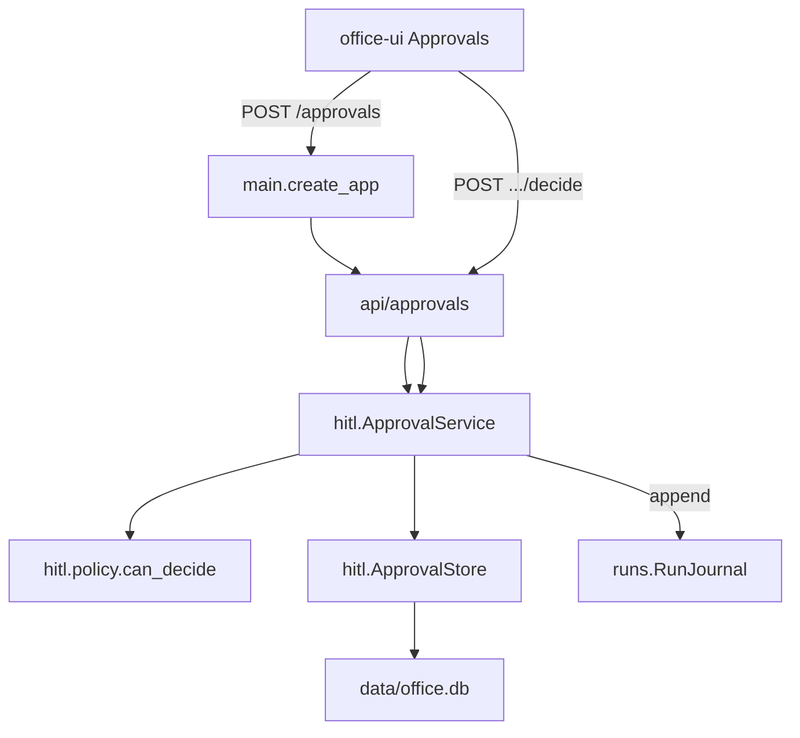
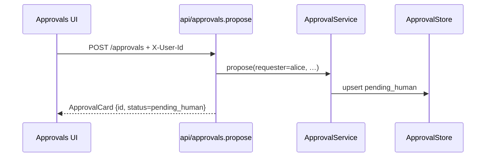
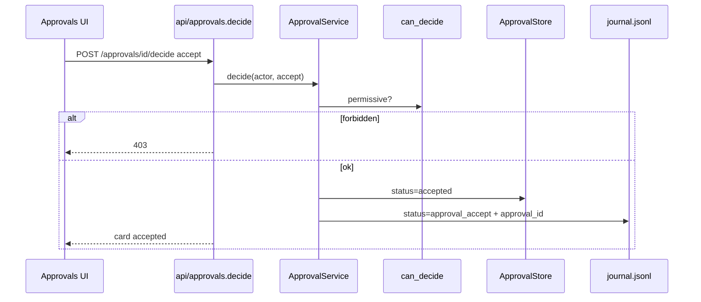

# HITL + autonomy (P13 board)

Controllability knob — same meaning for every stack. **P13:** one **action** card path + permissive decide → journal. Autonomy-on-gate = next slice.



## Formula

```text
effective_max = min(org.max_autonomy, agent.max ?? 100)
effective = clamp(user.override ?? agent.default ?? org.default, 0, effective_max)
```

```text
+ OK: org max 70; agent max 80 → rejected at create (AutonomyCeilingError)
- BAD: agent silently runs above org ceiling

+ OK: user may tighten autonomy for themselves
- BAD: user self-promotes above effective_max

+ OK: one approval card path; permissive approvers in v0
- BAD: silent drop of gated actions
```

---

## Example flow: propose → board → Accept → journal

**Scenario:** Alice proposes a demo gated action for desk `ba`. Bob is not admin and not requester → 403. Alice Accepts → card `accepted` + journal row.

### Request contract

```http
POST /approvals
X-User-Id: alice
{"agent_id":"ba","team":"eng","action_type":"external_send","summary":"Send Slack to #sales"}
```

```http
POST /approvals/{id}/decide
X-User-Id: alice
{"decision":"accept"}
```

| Value | Source |
| --- | --- |
| requester | `X-User-Id` on propose |
| actor | `X-User-Id` on decide |
| Permissive | actor == requester **or** actor ∈ `ORG_ADMINS` |
| Strict (later) | org admin only |
| Community default | `ORG_ADMINS=admin` (sole seat; multi-user lock switch later) |

### End-to-end modules



### A) Propose



### B) Accept → journal



### Module map

| Step | Module |
| --- | --- |
| Boot | `main` registers `approvals` router |
| HTTP | `api/approvals.py` |
| Policy | `hitl/policy.can_decide` |
| Store | `hitl/store.ApprovalStore` (SQLite `approval_cards`) |
| Service | `hitl/service.ApprovalService` |
| Audit | `runs/journal` — `approval_id`, `decision`, `decided_by` |

```text
+ OK: Accept writes journal; board lists pending
- BAD: auto-execute Slack/send from orchestrator on Accept (agent executes later)

+ OK: P13 = board + decide; no run pause / MCP grant yet
- BAD: build full dual HITL + `_locked` matrix in this slice
```

**Status (P13):** one action card + Approvals UI + permissive decide → journal = done.  
**Next:** effective autonomy on one gate (slice 9). Ceiling already checked on agent create.
