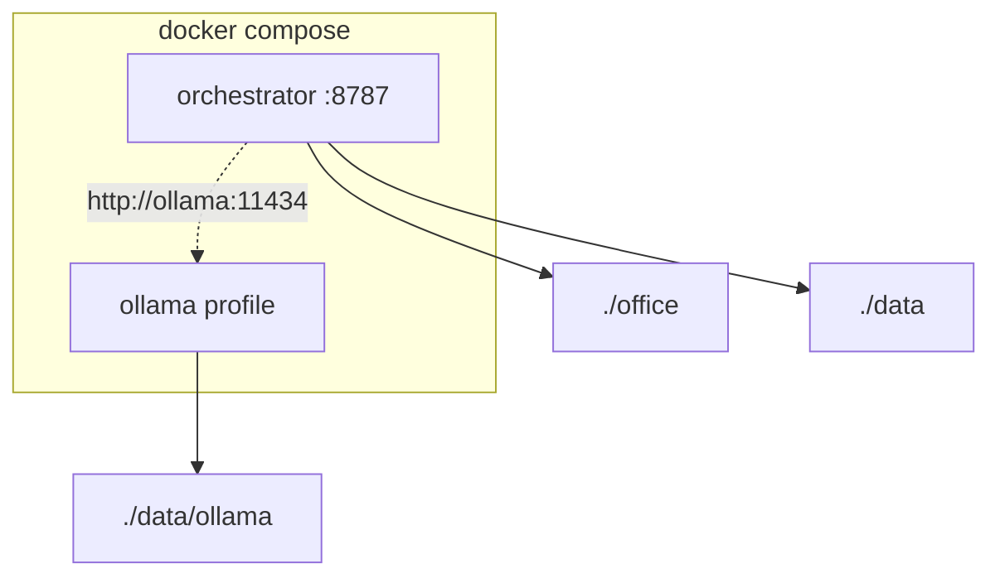

# Docker

Product ships as containers. Desks live on host mounts.



## Commands

```bash
docker compose up --build -d              # API only
docker compose --profile ollama up -d     # + Ollama (CPU — always safe)
```

### Ollama GPU (NVIDIA) with CPU fallback

Compose **cannot** auto-attach a GPU. Default profile is **CPU**. Opt into GPU with the override file; if that fails (no driver / no toolkit), fall back to the CPU command above.

```bash
# Prefer GPU when NVIDIA + Docker GPU support are installed
docker compose --profile ollama -f docker-compose.yml -f docker-compose.gpu.yml up -d

# Fallback — CPU only (same ./data/ollama bind; models already pulled stay)
docker compose --profile ollama up -d
```

| Path | Detail |
| --- | --- |
| Prereqs (GPU) | NVIDIA driver; Docker Desktop + WSL2 (Windows) or Linux NVIDIA Container Toolkit |
| Runtime | Ollama uses CUDA when devices are passed; otherwise CPU |
| macOS + Docker | No Metal in Docker → **CPU** in container. Prefer native Ollama + `OLLAMA_BASE_URL=http://host.docker.internal:11434` |
| Weights | Host **`./data/ollama`** → container `/root/.ollama` (gitignored; shared CPU/GPU) |

See also [LOCAL_MODEL_STACK.md](../LOCAL_MODEL_STACK.md) §9 · [17_MODELS.md](./17_MODELS.md).

| Path in container | Host | Holds |
| --- | --- | --- |
| `/office` | `./office` | org + desks + gold |
| `/data` | `./data` | SQLite + channel history |
| `/root/.ollama` | `./data/ollama` | model weights (Ollama) |

Env inside compose: `OFFICE_REPO_PATH=/office`, `OPENAI_COMPATIBLE_BASE_URL=http://ollama:11434/v1`.

```text
+ OK: create agent via API → files appear under host ./office
- BAD: bake seed agents into the Docker image

+ OK: .dockerignore skips venv, .env, data contents
- BAD: COPY secrets into the image

+ OK: default ollama = CPU; gpu via docker-compose.gpu.yml
- BAD: require GPU in base compose (breaks laptops without NVIDIA)
```

Image: Python 3.12, `uvicorn agent_anystack.main:app`.
