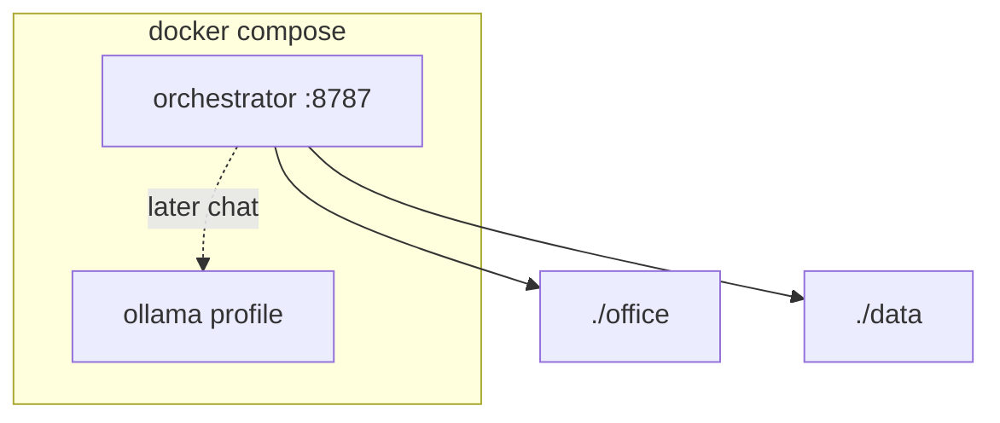

# Docker

Product ships as containers. Desks live on host mounts.



## Commands

```bash
docker compose up --build -d              # API only
docker compose --profile ollama up -d     # + Ollama
```

| Path in container | Host | Holds |
| --- | --- | --- |
| `/office` | `./office` | org + desks + gold |
| `/data` | `./data` | SQLite later |
| Ollama volume | named `ollama_models` | model weights |

Env inside compose: `OFFICE_REPO_PATH=/office`, `OPENAI_COMPATIBLE_BASE_URL=http://ollama:11434/v1`.

```text
+ OK: create agent via API → files appear under host ./office
- BAD: bake seed agents into the Docker image

+ OK: .dockerignore skips venv, .env, data contents
- BAD: COPY secrets into the image
```

Image: Python 3.12, `uvicorn agent_anystack.main:app`.
