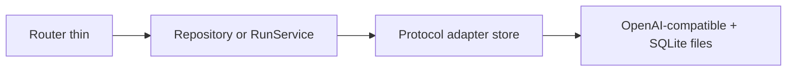

# SOLID · KISS · YAGNI

How we keep the backbone thin.



| Letter | Here |
| --- | --- |
| S | `OfficeRepository` owns desk files; routers stay thin |
| O | New stack = new `StackAdapter`, not `if stack ==` sprawl |
| I/D | Depend on small protocols; wire in `main.py` |
| KISS | Empty office; one create path; one OpenAI-compatible adapter |
| YAGNI | No seed agents, no Celery, no floors UI, no MCP matrix in v0 |

```text
+ OK: get_agent for duplicate id; reuse orphan folder without agent.yaml
- BAD: desk.exists() pre-check + FileExistsError mapped to AgentExists (noise)

+ OK: CreateAgentRequest.tools_mode flat while ToolsConfig has one field
- BAD: over-abstract factories for one adapter

+ OK: phase-sized PRs; wait for OK before next slice
- BAD: build chat + OKF + UI + HITL in one commit
```

When unsure: **prefer less code** that matches [`docs/V0_SCOPE.md`](../V0_SCOPE.md).
