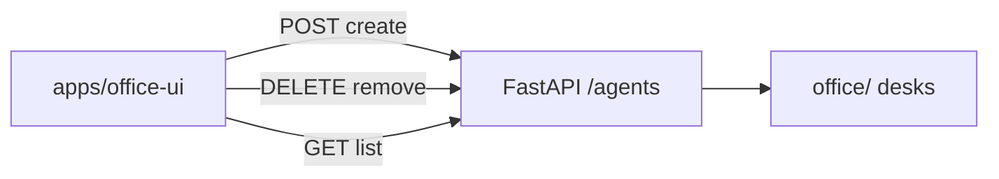

# Office UI shell

Simple functional shell — not the vision mockup.



| Nav | Status |
| --- | --- |
| Team | List desks + create/remove; **Chat** opens unified channel with desk selected |
| Chat | One channel: Office / desk chips, per-user history, inline pending approvals |
| Memory | Gold + team OKF + Export OKF |
| Approvals | Board (propose / Accept / Reject) — also mirrored in Chat |
| Floor / Analytics / Connect / Settings | Stub |

Served by orchestrator: `GET /` → `index.html`, assets under `/assets/*`.  
Path: `OFFICE_UI_PATH` (local `./apps/office-ui`, Docker `/ui`).

```text
+ OK: Create agent in UI → files under office/teams/...
+ OK: Remove confirms, then DELETE /agents/{id} removes desk folder
- BAD: ship seed desks; UI only lists what exists

+ OK: same-origin fetch /agents (no CORS needed)
- BAD: pixel-perfect floor canvas in v0
```
