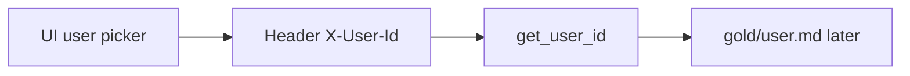

# User id stub

No SSO yet. Every API call carries who is acting.



| Piece | Role |
| --- | --- |
| `X-User-Id` header | Stub identity |
| `GET /me` | Echo `{ "user_id": "alice" }` |
| Default | `anonymous` if header missing |
| UI select | alice / bob / anonymous → sent on every fetch |

```text
+ OK: alice and bob same BA desk → separate gold later
- BAD: skip user_id and share one notepad forever

+ OK: curl -H "X-User-Id: alice" http://127.0.0.1:8787/me
- BAD: real passwords / SSO in this phase
```
