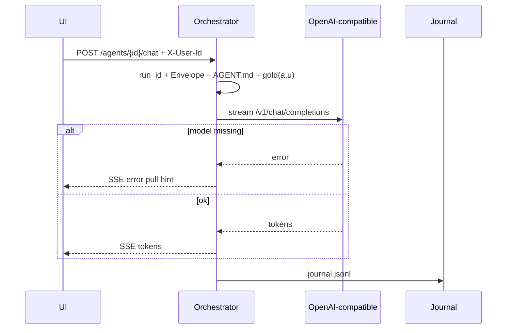
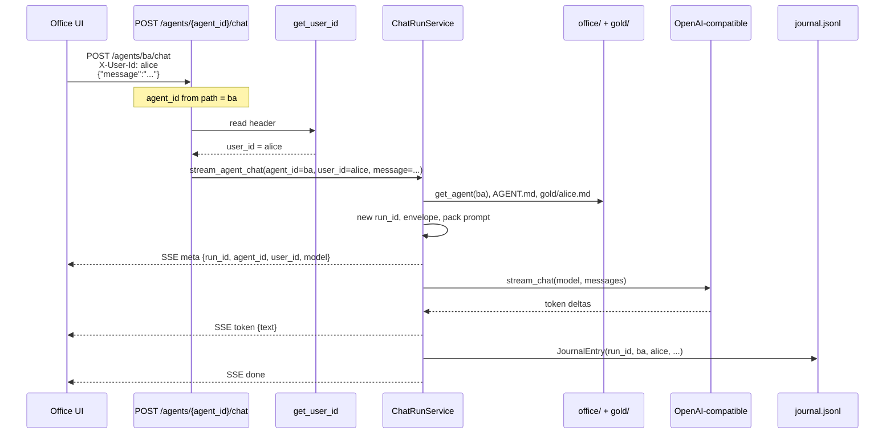
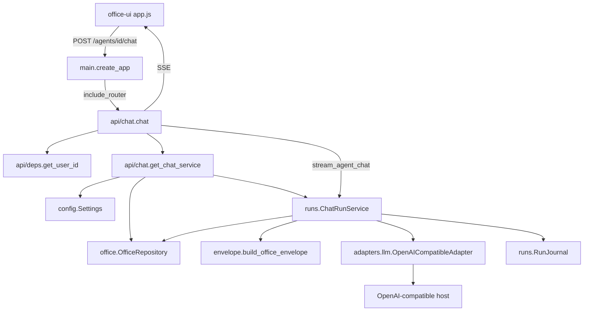
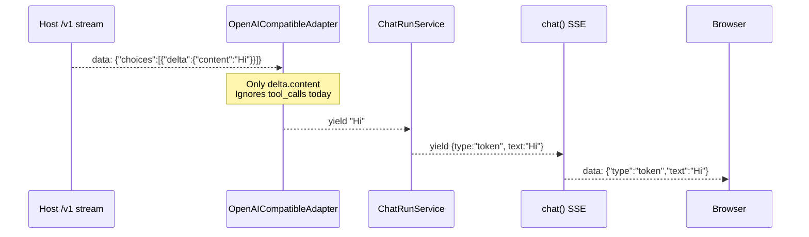
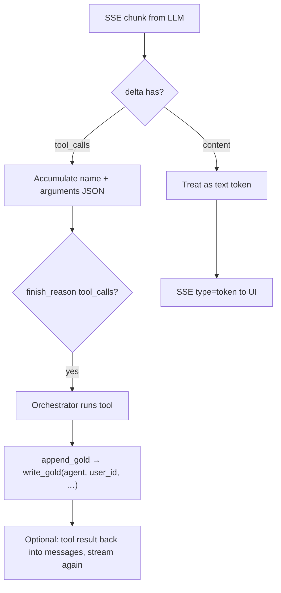
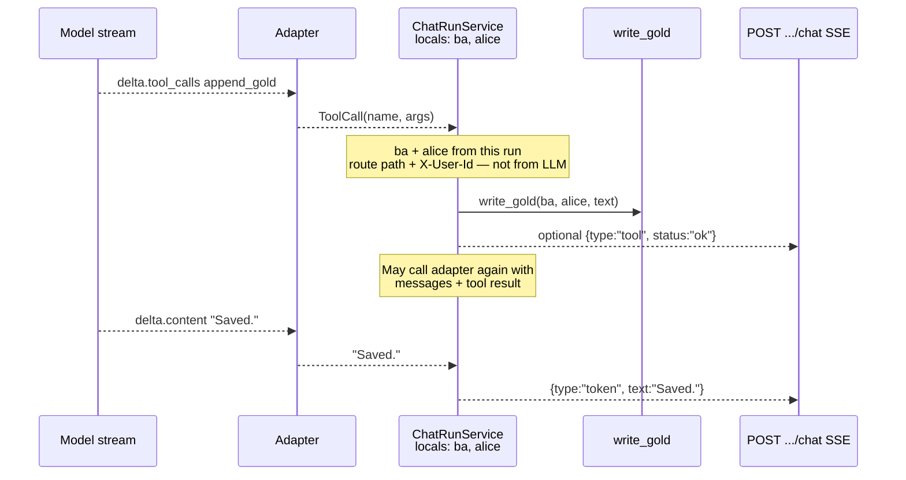

# Chat run path (P8) · gold pack (P9)

UI → orchestrator → OpenAI-compatible server (default Ollama `/v1`). Pull model separately.  
Full call chain: main → router → classes. See [V0_SCOPE.md](../V0_SCOPE.md) for product cut.

## What v0 will have (this path)

**Decision:** gold **write** in v0 is **human/API only**. Do **not** build `append_gold` (or any stream-agent gold tool) in this cut. The chat agent only **reads** packed gold.

| In v0 | Status |
| --- | --- |
| `POST /agents/{id}/chat` SSE (`meta` / `token` / `error` / `done`) | **Built** |
| `agent_id` from URL + `user_id` from `X-User-Id` (run locals, not cache) | **Built** |
| Office Envelope + `AGENT.md` + pack **gold(a,u)** into system prompt (read) | **Built** |
| One OpenAI-compatible adapter (`adapters/llm.py`); switch host via URL | **Built** |
| Journal row per run (team, project_id, stack, autonomy, …) | **Built** |
| Human gold CRUD: `GET/PUT/DELETE /agents/{id}/gold` + Memory UI (**only** write path) | **Built** |
| Pack formula grows to `C(a,p,u)` ≈ gold ∪ team OKF | **Built** (shelf ∩ P(p) later) |
| Background extract after run | **Built** (P11 — BackgroundTasks) |
| Thin office Q&A | **Built** (P12 — `POST /office/ask`) |
| One HITL card | **Built** (P13 — Approvals board) |
| Autonomy on one gate | **Built** (P14 — `external_send`) |

### Explicitly not v0 (design only below)

| Out of v0 | Why |
| --- | --- |
| Mediated **`append_gold(text)`** / stream tool-calling for gold | Human-only gold write for this cut; tool loop is a later phase |
| Model calling FastAPI `PUT /gold` itself | Even later, tools stay orchestrator-mediated — never raw REST from the LLM |
| Full MCP / `_locked` matrix / multi-stack polish | [V0_SCOPE.md](../V0_SCOPE.md) non-goals |
| Persisting full chat transcript server-side | Journal = ops log only |
| Redis/session cache of `user_id` | Request locals only |

**Current architecture:** human writes gold → chat packs it → model answers from prompt. No agent write-back to `gold/<user>.md` in v0.



## Where `agent_id` and `user_id` come from

Example: Alice chats with desk `ba`.

```http
POST /agents/ba/chat
X-User-Id: alice
Content-Type: application/json

{"message": "Summarize my notes"}
```

| Value | Source |
| --- | --- |
| `agent_id` = `ba` | URL path `/agents/{agent_id}/chat` |
| `user_id` = `alice` | Header `X-User-Id` → `api/deps.get_user_id` |
| `message` | JSON body |
| `run_id` | Created inside `ChatRunService` (not from client) |

UI: desk click → path id; user picker → `X-User-Id` on every `fetch`.

These stay as **locals on that one async run** (`stream_agent_chat`). They are **not** a Redis/LRU cache and are **not** sent back by the model as tool args.



## End-to-end modules



## Module roles and importance

| Layer | Module / symbol | Role | Why it matters |
| --- | --- | --- | --- |
| Boot | `main.py` `create_app` | Registers chat + gold routers (+ UI) | Without this, routes do not exist |
| HTTP | `api/chat.py` `chat` | Thin route: validate agent, SSE wrap | Keeps HTTP out of business logic |
| HTTP | `ChatRequest` | Body `{ message }` | Input contract |
| HTTP | `get_chat_service` | Wires Settings + repo + journal + base URL | Dependency injection / testability |
| Identity | `api/deps.py` `get_user_id` | `X-User-Id` stub | Same desk, distinct gold(a,u) |
| Config | `config.py` `Settings` | `openai_compatible_base_url`, `gold_max_chars`, … | Platform knobs |
| Desks | `office/repository.py` | `get_agent`, persona, **gold read/write** | Desk data from git |
| Orchestrate | `runs/service.py` `ChatRunService` | One run: meta → pack → stream → journal | Choke point — ids bound here for tools later |
| Policy text | `envelope.py` | Musts + workspace + autonomy intent | LLM compliance |
| Autonomy | `effective_autonomy` | Org ceiling × agent default/max | Intent in Envelope; gates own allow/deny |
| Stack | `adapters/llm.py` `OpenAICompatibleAdapter` | Stream `/v1/chat/completions` | One module; URL switches host |
| Errors | `StackError` | Unreachable / model-not-pulled | Testable without a model |
| Ops log | `runs/journal.py` | `JournalEntry` row | Analytics fuel — not business facts |

## Inside `stream_agent_chat` (order)

```text
1. repo.get_agent          → desk
2. repo.load_org           → ceiling
3. new_run_id              → run_id
4. yield meta              → UI
5. build_office_envelope   → system rules
6. repo.read_persona       → AGENT.md
7. repo.read_gold(a,u)     → gold/<user_id>.md (if any)
8. okf.list_team_facts     → SQLite mem(team)
9. pack_memory_sections    → gold + team OKF markdown (budget)
10. system = envelope + persona + memory
11. adapter.stream_chat     → yield tokens / StackError
12. journal.append         → journal.jsonl
13. yield done (+ ExtractJob if enabled)
14. api/chat BackgroundTasks → run_okf_extract (after SSE)
```

## Backwards journey: LLM stream → UI (today)

Today the adapter only reads **text** deltas. No tool-call parsing yet.



```text
SSE line from model server
  → json.loads
  → choices[0].delta.content   ← text token
  → yield str to ChatRunService
  → yield {"type":"token",...} to chat route
  → "data: {...}\n\n" to UI
```

`agent_id` / `user_id` never come back from the LLM — they remain locals from the original HTTP request.

## Token vs tool_call (after v0 — design only)

**Not in this v0 cut.** Kept so the binding story is clear when mediated tools ship later. Until then the adapter only handles `delta.content` (tokens).

### Same wire — not a different HTTP Content-Type

Tool calling does **not** switch media type. Still:

- Request: `POST {base}/v1/chat/completions` with `stream: true` (`application/json` body)
- Response: SSE `data: {…}` lines (same as today’s token stream)
- Browser chat: still `text/event-stream` from our FastAPI `StreamingResponse`

What changes is (1) **`tools` on the request** and (2) **fields inside each JSON delta** (`content` vs `tool_calls`).

### How `delta.tool_calls` is generated (model + host, not our Envelope)

The stream agent does **not** invent this format in Python. The **OpenAI-compatible tools protocol** does:

1. Orchestrator sends tool definitions on the chat-completions request, e.g.:

```json
"tools": [{
  "type": "function",
  "function": {
    "name": "append_gold",
    "description": "Append to this user's gold notepad",
    "parameters": {
      "type": "object",
      "properties": { "text": { "type": "string" } },
      "required": ["text"]
    }
  }
}]
```

2. The inference host (Ollama / vLLM / …) runs a **tool-capable** model. When the model decides to use a tool, the host serializes that as OpenAI-style streamed chunks — not free-text like `CALL append_gold(...)`.

3. Typical streamed shape (arguments often arrive in pieces and must be concatenated):

```text
{
  "choices": [{
    "delta": {
      "tool_calls": [{
        "index": 0,
        "id": "call_abc",
        "function": {
          "name": "append_gold",
          "arguments": "{\"text\": \"buy milk\"}"
        }
      }]
    }
  }]
}
```

`arguments` is a **string** containing JSON.

4. Orchestrator parses `name` + `arguments`, runs the tool (e.g. `write_gold` with run-bound `agent_id` / `user_id`), then usually continues the conversation with a `role: tool` result and streams again for the final answer.

| Does **not** generate `tool_calls` | What actually does |
| --- | --- |
| Office Envelope / `AGENT.md` text alone | Prompt may encourage tools; wire format needs `tools` + host support |
| Browser or `PUT /gold` | Human write path — separate |
| `OpenAICompatibleAdapter` inventing the shape | Adapter only **parses** what the host streams |

Today’s adapter only reads `delta.content` and `yield`s strings — it **ignores** `tool_calls` until a later change.

```text
You: messages + tools schema
Model+host: delta.content  OR  delta.tool_calls  (OpenAI wire)
You: execute tool (bound to this run’s user/agent), continue
```

If the model/host does not support tools, you will not get `tool_calls` even when `tools` is sent.

### Distinguishing token vs tool in the same SSE

Parse OpenAI-compatible deltas so the orchestrator can run mediated tools (e.g. `append_gold`) while still streaming normal reply tokens.

OpenAI-compatible streams share one SSE channel; **delta shape** distinguishes them:

```text
# Reply token
delta: { "content": "Hello" }

# Tool call (often streamed in pieces)
delta: { "tool_calls": [ { "index": 0, "id": "call_…",
         "function": { "name": "append_gold", "arguments": "{\"text\":" } } ] }
# later chunks append more of arguments; finish_reason: "tool_calls"
```



### Later: `append_gold(text)` — ids from run, not from the model

**Out of v0.** When (if) built: tool schema the model sees is tiny: `{ "name": "append_gold", "parameters": { "text": "string" } }`.  
It must **not** pass `user_id` / `agent_id` (Alice must not overwrite Bob).



Human/UI path is the **v0 write path**: `PUT /agents/{id}/gold` (Memory tab). Same file; agent does not write it in v0. See [04_MEMORY.md](./04_MEMORY.md).

### What is / is not “cached”

| Thing | Mechanism |
| --- | --- |
| `agent_id`, `user_id`, `run_id` | Request/run **locals** for one `stream_agent_chat` |
| Partial tool `arguments` string | Accumulator while streaming one tool call (**after v0**, if tools ship) |
| Gold notepad | Disk `gold/<user_id>.md` — **human-written in v0** |
| Chat tokens to UI | SSE — full transcript **not** persisted server-side yet |

```text
+ OK: UI → orchestrator → OpenAI-compatible → SSE (envelope + gold pack + journal)
- BAD: UI → model host directly

+ OK: Envelope = musts + workspace + autonomy intent; AGENT.md = role; gold(a,u) labeled
- BAD: repeat agent/user/stack/model in every prompt (orchestrator already knows)

+ OK (v0): human PUT/Memory UI writes gold; chat only packs/reads it
- BAD (v0): build append_gold / expect the stream agent to update gold

+ OK (later): tool append_gold(text only); orchestrator binds agent_id + user_id from the run
- BAD: model chooses user_id / calls PUT /gold itself

+ OK: Ollama up, no model → StackError with pull hint
+ OK: ollama pull llama3.2 then chat streams
- BAD: silent hang with no journal line
```
