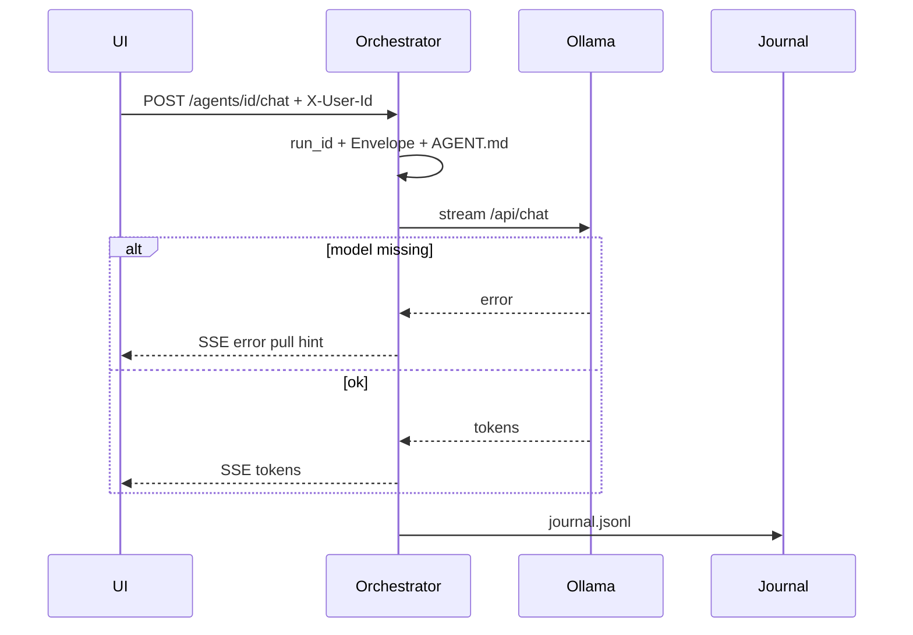
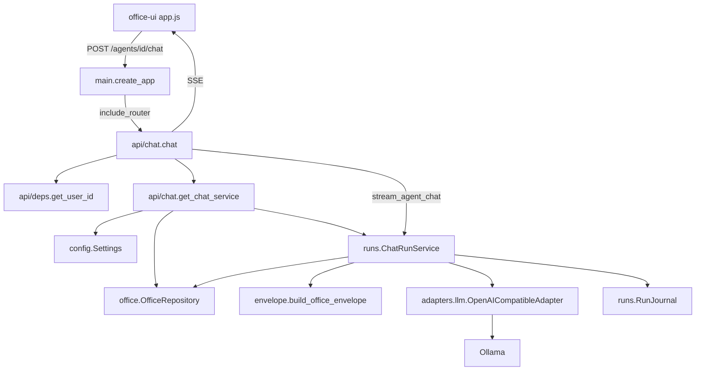

# Chat run path (P8)

UI → orchestrator → Ollama. Pull model separately. Full call chain: main → router → classes.



## End-to-end modules



## Module roles and importance

| Layer | Module / symbol | Role | Why it matters |
| --- | --- | --- | --- |
| Boot | `main.py` `create_app` | Registers `chat_router` (+ UI/static) | Without this, chat route does not exist |
| HTTP | `api/chat.py` `chat` | Thin route: validate agent, SSE wrap | Keeps HTTP out of business logic |
| HTTP | `ChatRequest` | Body `{ message }` | Input contract |
| HTTP | `get_chat_service` | Wires Settings + repo + journal + Ollama URL | Dependency injection / testability |
| Identity | `api/deps.py` `get_user_id` | `X-User-Id` stub | Same desk, distinct users (gold later) |
| Config | `config.py` `Settings` | `openai_compatible_base_url`, DB/journal path | Platform knobs; switch Ollama↔vLLM via URL |
| Desks | `office/repository.py` | `get_agent`, `read_persona`, `load_org` | Desk data from git; source of model/persona |
| Orchestrate | `runs/service.py` `ChatRunService` | One run: meta → prompt → stream → journal | Choke point — controllability + memory hooks live here |
| Policy text | `envelope.py` | Thin musts + workspace path | LLM compliance; identity/routing stay in orchestrator |
| Autonomy | `effective_autonomy` | Org ceiling × agent default/max | Intent line in Envelope; gates own allow/deny |
| Stack | `adapters/llm.py` `OpenAICompatibleAdapter` | Stream via OpenAI `/v1/chat/completions` | One module; URL switches Ollama↔vLLM; other wires = new classes in same file |
| Errors | `StackError` | Unreachable / model-not-pulled messages | Testable without a model |
| Ops log | `runs/journal.py` | Append `JournalEntry` (team, project_id, stack, autonomy, …) | Transparency / analytics — not business facts |
| Domain | `AgentConfig` / `OrgConfig` | Typed desk + org | Contracts for yaml |

## Inside `stream_agent_chat` (order)

```text
1. repo.get_agent          → desk
2. repo.load_org           → ceiling
3. new_run_id              → run_id
4. yield meta              → UI
5. build_office_envelope   → system rules
6. repo.read_persona       → AGENT.md
7. system = envelope + persona   (memory pack stub empty)
8. adapter.stream_chat     → yield tokens / StackError
9. journal.append          → journal.jsonl
10. yield done
```

```text
+ OK: UI → orchestrator → Ollama → SSE (envelope + journal always)
- BAD: UI → Ollama directly

+ OK: Envelope = musts + workspace + autonomy intent; AGENT.md = role; gold(a,u) = user scope
- BAD: repeat agent/user/stack/model in every prompt (orchestrator already knows)

+ OK: Ollama up, no model → StackError with pull hint
+ OK: ollama pull llama3.2 then chat streams
- BAD: silent hang with no journal line
```
