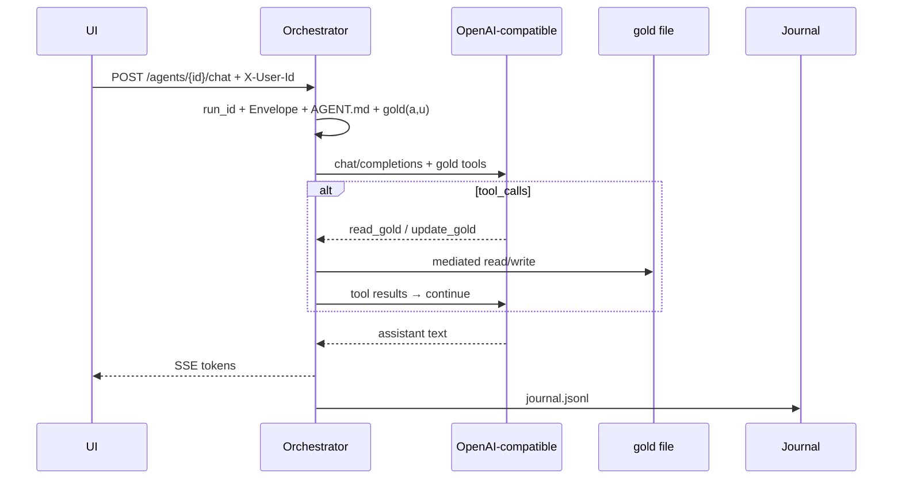
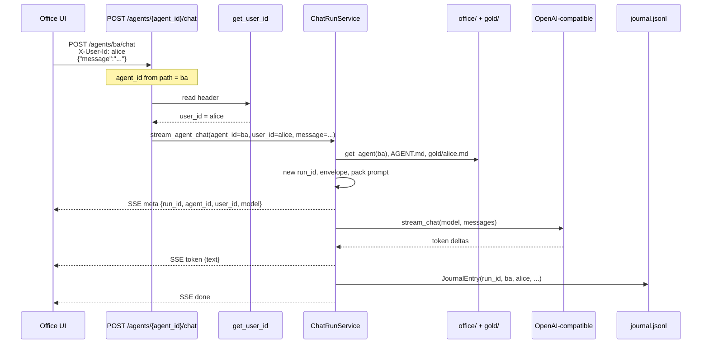
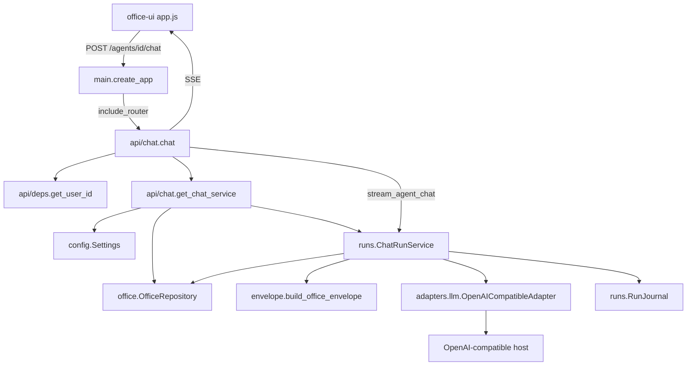
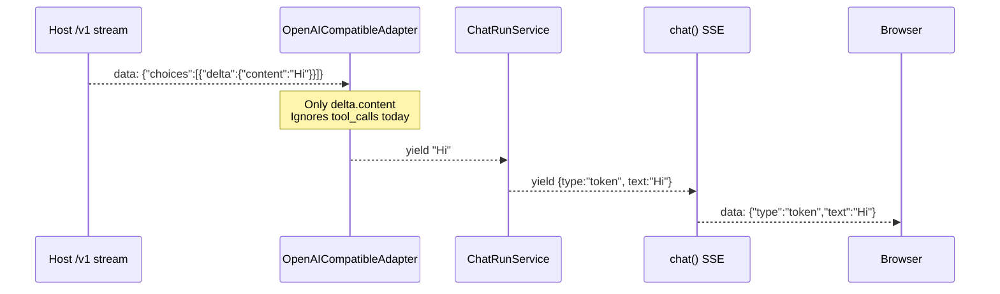
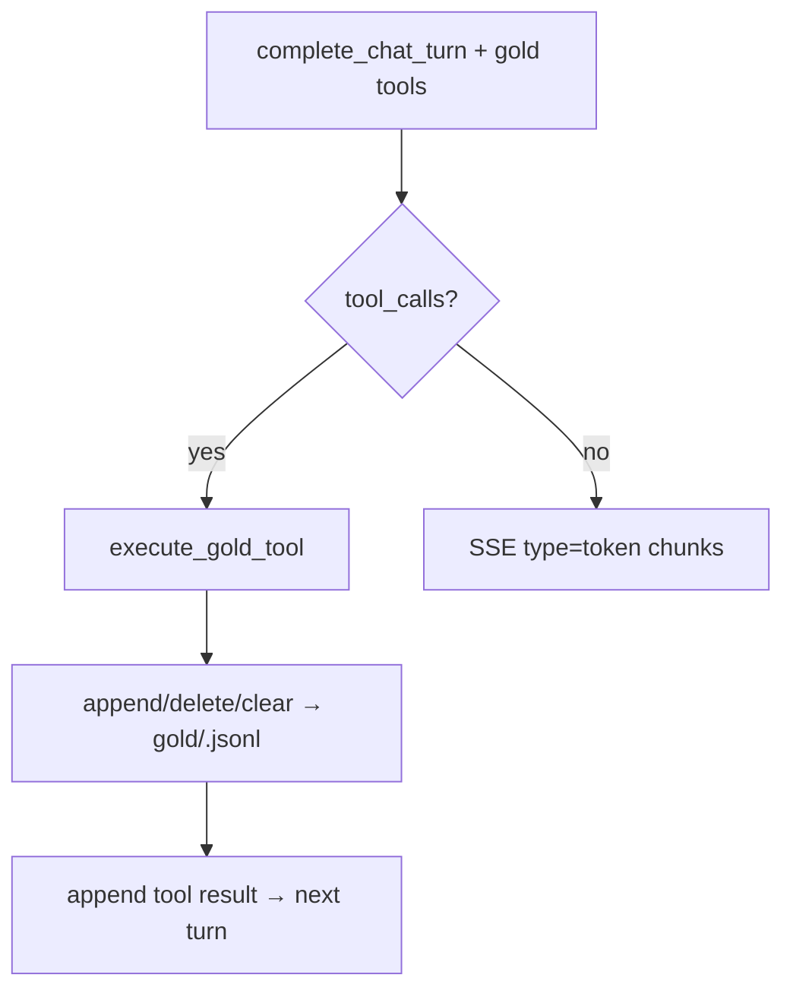

# Chat run path (P8) · gold pack (P9) · gold tools

UI → orchestrator → OpenAI-compatible server (default Ollama `/v1`). Pull model separately.  
Full call chain: main → router → classes. See [V0_SCOPE.md](../V0_SCOPE.md) for product cut.

## What this path has

**Decision:** gold is the agent’s personal notepad (id-addressable notes in `gold/<user>.jsonl`). Writes go through orchestrator-mediated tools (`read_gold` / `append_gold` / `delete_gold` / `clear_gold`) with `(agent_id, user_id)` from the run — never raw `PUT /gold` from the model. Memory UI is **view-only**.

| In path | Status |
| --- | --- |
| `POST /agents/{id}/chat` SSE (`meta` / `token` / `tool` / `error` / `done`) | **Built** |
| `agent_id` from URL + `user_id` from `X-User-Id` (run locals, not cache) | **Built** |
| Office Envelope + `AGENT.md` + pack **gold(a,u)** into system prompt | **Built** |
| Mediated **`read_gold` / `append_gold` / `delete_gold` / `clear_gold`** | **Built** |
| One OpenAI-compatible adapter (`adapters/llm.py`); switch host via URL | **Built** |
| Journal row per run (team, project_id, stack, autonomy, …) | **Built** |
| Gold HTTP `GET` (UI view) + optional `PUT/DELETE` (ops) | **Built** |
| Pack formula `C(a,p,u)` ≈ gold ∪ team OKF | **Built** (shelf ∩ P(p) later) |
| Background extract after run | **Built** (P11 — BackgroundTasks) |
| Thin office Q&A | **Built** (P12 — `POST /office/ask`) |
| One HITL card | **Built** (P13 — Approvals board) |
| Autonomy on one gate | **Built** (P14 — `external_send`) |

### Still out of cut (design only)

| Out | Why |
| --- | --- |
| Model calling FastAPI `PUT /gold` itself | Tools stay orchestrator-mediated — never raw REST from the LLM |
| Full MCP / `_locked` matrix / multi-stack polish | [V0_SCOPE.md](../V0_SCOPE.md) non-goals |
| Persisting full chat transcript server-side | Journal = ops log only |
| OpenCode harness path | Design: [18_OPENCODE.md](./18_OPENCODE.md) — not built |
| Thinking SSE / `GET /runs/{id}/thinking` | Design with OpenCode A — not built |
| Redis/session cache of `user_id` | Request locals only |

**Current architecture:** chat packs gold → model may call `read_gold` / `update_gold` → orchestrator writes `gold/<user>.md` → tokens stream to UI.



## Where `agent_id` and `user_id` come from

Example: Alice chats with desk `ba`.

```http
POST /agents/ba/chat
X-User-Id: alice
Content-Type: application/json

{"message": "Summarize my notes"}
```

| Value | Source |
| --- | --- |
| `agent_id` = `ba` | URL path `/agents/{agent_id}/chat` |
| `user_id` = `alice` | Header `X-User-Id` → `api/deps.get_user_id` |
| `message` | JSON body |
| `run_id` | Created inside `ChatRunService` (not from client) |

UI: desk click → path id; user picker → `X-User-Id` on every `fetch`.

These stay as **locals on that one async run** (`stream_agent_chat`). They are **not** a Redis/LRU cache and are **not** sent back by the model as tool args.



## End-to-end modules



## Module roles and importance

| Layer | Module / symbol | Role | Why it matters |
| --- | --- | --- | --- |
| Boot | `main.py` `create_app` | Registers chat + gold routers (+ UI) | Without this, routes do not exist |
| HTTP | `api/chat.py` `chat` | Thin route: validate agent, SSE wrap | Keeps HTTP out of business logic |
| HTTP | `ChatRequest` | Body `{ message }` | Input contract |
| HTTP | `get_chat_service` | Wires Settings + repo + journal + base URL | Dependency injection / testability |
| Identity | `api/deps.py` `get_user_id` | `X-User-Id` stub | Same desk, distinct gold(a,u) |
| Config | `config.py` `Settings` | `openai_compatible_base_url`, `gold_max_chars`, … | Platform knobs |
| Desks | `office/repository.py` | `get_agent`, persona, **gold read/write** | Desk data from git |
| Orchestrate | `runs/service.py` `ChatRunService` | One run: meta → pack → stream → journal | Choke point — ids bound here for tools later |
| Policy text | `envelope.py` | Musts + workspace + autonomy intent | LLM compliance |
| Autonomy | `effective_autonomy` | Org ceiling × agent default/max | Intent in Envelope; gates own allow/deny |
| Stack | `adapters/llm.py` `OpenAICompatibleAdapter` | Stream `/v1/chat/completions` | One module; URL switches host |
| Errors | `StackError` | Unreachable / model-not-pulled | Testable without a model |
| Ops log | `runs/journal.py` | `JournalEntry` row | Analytics fuel — not business facts |

## Inside `stream_agent_chat` (order)

```text
1. repo.get_agent          → desk
2. repo.load_org           → ceiling
3. new_run_id              → run_id
4. yield meta              → UI
5. build_office_envelope   → system rules
6. repo.read_persona       → AGENT.md
7. repo.read_gold(a,u)     → gold/<user_id>.md (if any)
8. okf.list_team_facts     → SQLite mem(team)
9. pack_memory_sections    → gold + team OKF markdown (budget)
10. system = envelope + persona + memory
11. adapter.stream_chat     → yield tokens / StackError
12. journal.append         → journal.jsonl
13. yield done (+ ExtractJob if enabled)
14. api/chat BackgroundTasks → run_okf_extract (after SSE)
```

## Backwards journey: LLM stream → UI (today)

Today the adapter only reads **text** deltas. No tool-call parsing yet.



```text
SSE line from model server
  → json.loads
  → choices[0].delta.content   ← text token
  → yield str to ChatRunService
  → yield {"type":"token",...} to chat route
  → "data: {...}\n\n" to UI
```

`agent_id` / `user_id` never come back from the LLM — they remain locals from the original HTTP request.

## Token vs tool_call (gold tools)

Gold tools use **non-streaming** `complete_chat_turn` rounds (tools on the request), then the final assistant text is emitted as SSE `token` chunks. Hosts that reject `tools` fall back to plain `stream_chat`.

### Wire (OpenAI-compatible)

1. Orchestrator sends tool definitions:

```json
"tools": [
  { "type": "function", "function": { "name": "read_gold", "parameters": { "type": "object", "properties": {} } } },
  { "type": "function", "function": {
      "name": "append_gold",
      "parameters": { "type": "object", "properties": { "text": { "type": "string" } }, "required": ["text"] }
  }},
  { "type": "function", "function": {
      "name": "delete_gold",
      "parameters": { "type": "object", "properties": { "ids": { "type": "array", "items": { "type": "string" } } }, "required": ["ids"] }
  }},
  { "type": "function", "function": { "name": "clear_gold", "parameters": { "type": "object", "properties": {} } } }
]
```

2. Model returns `message.tool_calls` (or plain `content`). Orchestrator runs `execute_gold_tool` with **run-bound** `agent_id` / `user_id` / `run_id` (provenance on append) — never from model args.

3. Tool result → `role: tool` message → next turn. SSE may include `{ "type": "tool", "name": "…" }` for the UI meta line.



### Binding: ids from the run, not the model

Tool schema is content-only (`content`, optional `mode`).  
`ChatRunService` locals (`agent_id`, `user_id` from path + `X-User-Id`) bind the file write.

Memory UI is **view-only** (`GET /gold` + Refresh). HTTP `PUT/DELETE` remain for ops.

### What is / is not “cached”

| Thing | Mechanism |
| --- | --- |
| `agent_id`, `user_id`, `run_id` | Request/run **locals** for one `stream_agent_chat` |
| Gold notepad | Disk `gold/<user_id>.md` — **agent tools** (orchestrator-mediated) |
| Chat tokens to UI | SSE — full transcript **not** persisted server-side yet |

```text
+ OK: UI → orchestrator → OpenAI-compatible → SSE (envelope + gold pack + gold tools + journal)
- BAD: UI → model host directly

+ OK: Envelope = musts + workspace + autonomy intent; AGENT.md = role; gold = personal notes (no user_id in prompt)
- BAD: teach the model about user_id / gold file paths

+ OK: tools read_gold / update_gold; orchestrator binds agent_id + user_id from the run
- BAD: model chooses user_id / calls PUT /gold itself

+ OK: Ollama up, no model → StackError with pull hint
+ OK: ollama pull llama3.2 then chat streams
- BAD: silent hang with no journal line
```
