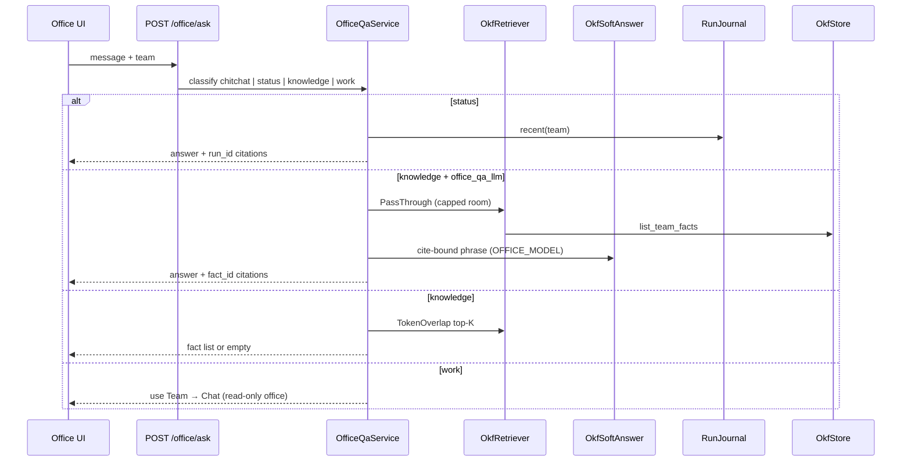
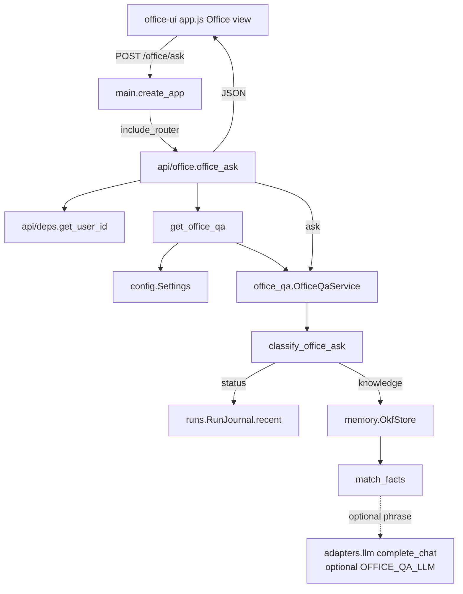
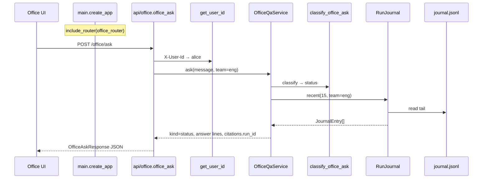
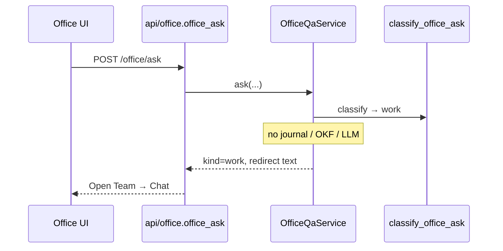

# Office Q&A (P12)

Front desk — talk to the **office**, not a desk agent. Read-only status (journal) + knowledge (OKF + citations). Work requests route to Team → Chat.



| Ask | Source | LLM? |
| --- | --- | --- |
| Status (“what’s running?”) | `journal.jsonl` | No |
| Knowledge | Retriever → optional soft phrase | Soft: `office_qa_llm` + `model` — must cite `fact_id` |
| Work (“build the hero”) | — | Refuse; route to desk chat |
| Chitchat (“hi”) | Fixed greeting | No OKF dump |
| Empty retrieve | — | “Nothing found” — never invent |

**Soft LLM layer (v0):** `OkfSoftAnswer` phrases only the **retrieved slice**. Retriever today = `PassThroughRetriever` (entire team OKF, max 80 facts / pack char budget). Later: filter → FTS/vector top-K, same soft hop.

**Rules:** empty → say so; never invent; read-only (no OKF write). Product intent: [ORCHESTRATOR.md](../ORCHESTRATOR.md) §2.9.

| Piece | Path |
| --- | --- |
| Service | `office_qa.py` |
| Retriever / soft | `memory/okf_retrieve.py`, `memory/okf_soft.py` |
| HTTP | `api/office.py` → `POST /office/ask` |
| UI | nav **Office** / Chat Office chip |
| Config | `office_qa_llm`, `model` in `office/orchestrator.yaml` |

---

## Example flow: main → route → classify → answer

**Scenario:** Alice uses the Office view for team `eng`. Journal has a recent `ba` run; OKF has “Retail commission is 8 percent.”

### Request contract

```http
POST /office/ask
X-User-Id: alice
Content-Type: application/json

{"message":"what's running?","team":"eng"}
```

| Value | Source |
| --- | --- |
| `message` | JSON body |
| `team` | JSON body (default `eng`) |
| `user_id` | `X-User-Id` (auth stub; not used to pack gold — front desk is team-scoped) |
| Response | `{ kind, answer, citations[{fact_id\|run_id}], team }` — **JSON**, not SSE |

### End-to-end modules



### A) Status (“what’s running?”)

```http
POST /office/ask
X-User-Id: alice
{"message":"what's running?","team":"eng"}
```



**Answer shape (deterministic):**

```text
Recent runs (newest last):
- [run-1] agent=ba user=alice status=ok at …
```

### B) Knowledge (“what is our retail commission?”)

```http
POST /office/ask
X-User-Id: alice
{"message":"what is our retail commission?","team":"eng"}
```

```mermaid
sequenceDiagram
    participant UI as Office UI
    participant R as api/office.office_ask
    participant QA as OfficeQaService
    participant CLS as classify_office_ask
    participant OKF as OkfStore
    participant M as match_facts
    participant LLM as complete_chat optional

    UI->>R: POST /office/ask
    R->>QA: ask(message, team=eng)
    QA->>CLS: classify → knowledge
    QA->>OKF: list_team_facts(eng)
    OKF-->>QA: OkfFact[]
    QA->>M: tokenize query ∩ body
    M-->>QA: ranked facts
    alt OFFICE_QA_LLM=false (default)
        QA-->>R: list with [fact-id] lines
    else OFFICE_QA_LLM=true
        QA->>LLM: phrase; must include fact_id
        alt citation missing / error
            Note over QA: fall back to deterministic list
        end
        QA-->>R: phrased answer + citations
    end
    R-->>UI: kind=knowledge JSON
```

**Default answer (no LLM):**

```text
From team OKF (team:eng):
- [fact-abc123] Retail commission is 8 percent
```

No match → `kind=empty`, explicit “will not invent.”

### C) Work (“build the hero component”)

```http
POST /office/ask
X-User-Id: alice
{"message":"build the hero component","team":"eng"}
```



### Module map for the example

| Step | Module |
| --- | --- |
| Boot | `main.create_app` registers `office` router |
| HTTP | `api/office.office_ask` + `OfficeAskRequest` |
| Identity | `deps.get_user_id` (stub; team from body) |
| Wire | `get_office_qa` → Settings + journal path + OkfStore (+ optional adapter) |
| Classify | `office_qa.classify_office_ask` |
| Status | `runs.journal.RunJournal.recent` |
| Knowledge | `memory.store.OkfStore` + `match_facts` |
| Optional phrase | `adapters.llm.OpenAICompatibleAdapter.complete_chat` |
| UI | `apps/office-ui` Office view → `POST /office/ask` |

### Classify order (inside `ask`)

```text
1. work hints without status/knowledge → kind=work (refuse)
2. status hints → journal.recent(team)
3. else → knowledge: list_team_facts → match_facts
4. if knowledge + OFFICE_QA_LLM → phrase; require fact_id in text or keep list
```

```text
+ OK: office Q&A = retrieve + cite; empty says empty
- BAD: invent company facts with no citations

+ OK: work → redirect to desk chat
- BAD: fake build/deploy from front desk

+ OK: OFFICE_QA_LLM off by default; on = cite-bound phrase only
- BAD: free-roam LLM persona on /office/ask
```

**Status (P12):** `POST /office/ask` + Office UI + cite rules = done. HITL next.
