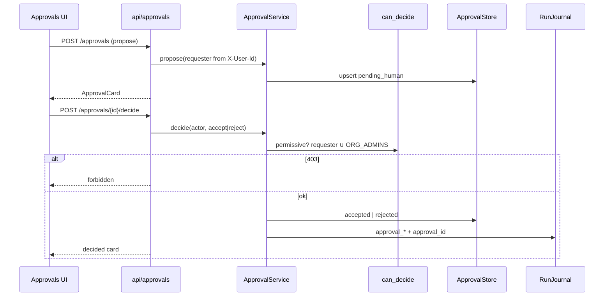
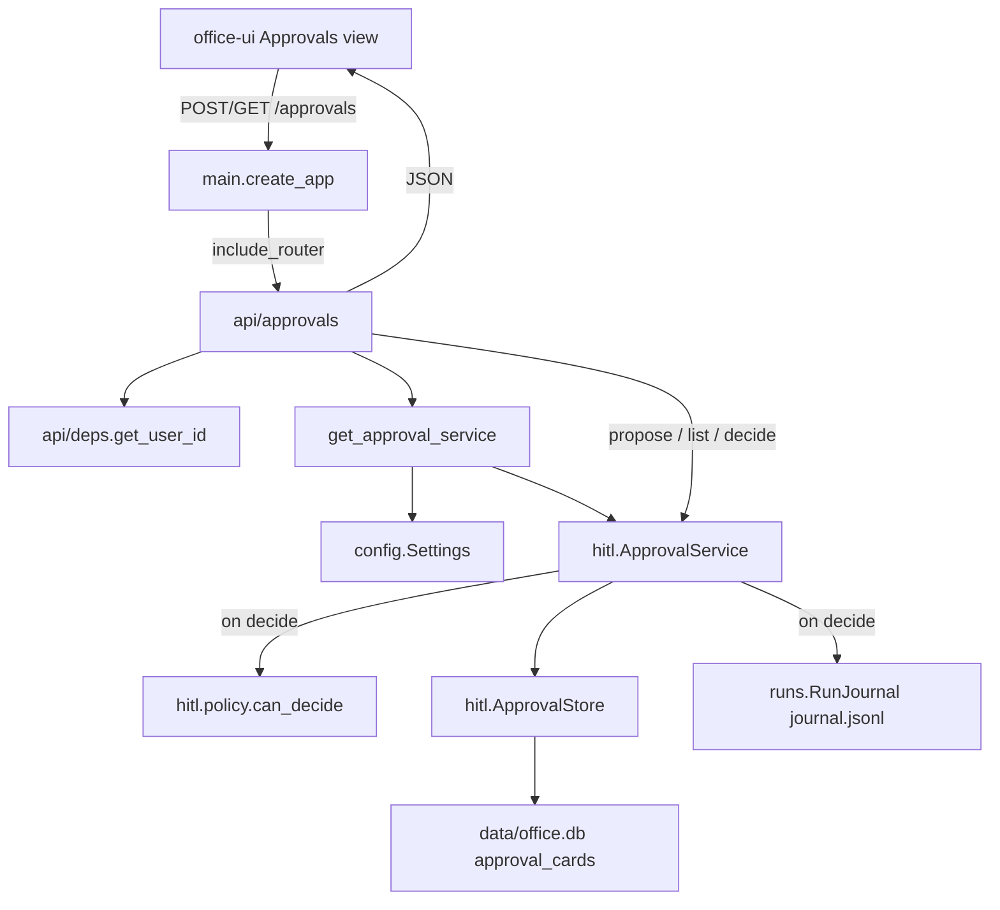
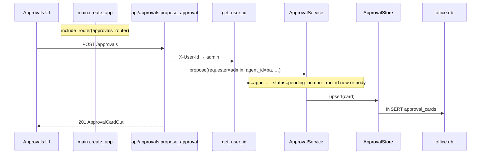
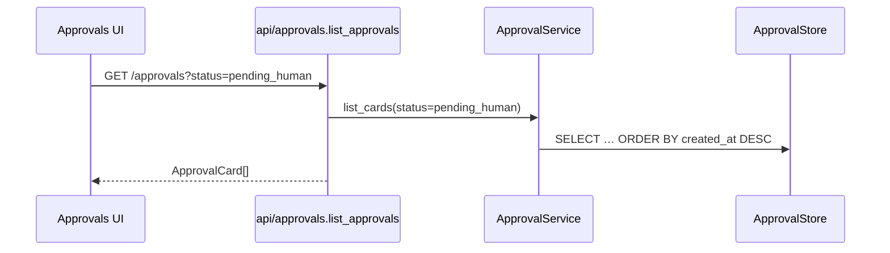
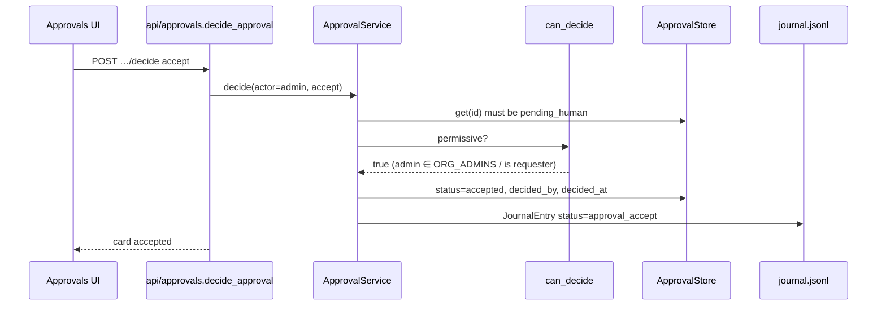
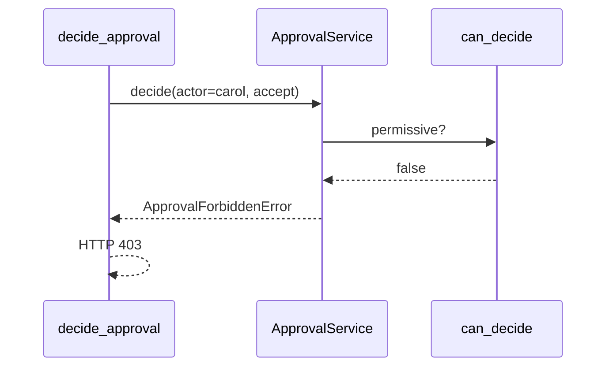

# HITL approval board (P13)

One **action** card path — propose → board → Accept/Reject → journal.  
Orchestrator **gates**; it does **not** execute Slack/send/etc. on Accept (agent execute / MCP grant = later).

**P14:** `external_send` propose is gated by effective autonomy — see **[14_AUTONOMY_GATE.md](./14_AUTONOMY_GATE.md)**. This file is the human board path (HITL mid-band + decide).

Product intent: [ORCHESTRATOR.md](../ORCHESTRATOR.md) §6.0 · formula index: [06_HITL.md](./06_HITL.md).



| Step | HTTP | Result |
| --- | --- | --- |
| Propose | `POST /approvals` | `status=pending_human` in SQLite |
| List | `GET /approvals?status=pending_human` | Board |
| Decide | `POST /approvals/{id}/decide` | Card + **journal** row |
| Forbidden | same decide, wrong actor | **403** |

| Piece | Path |
| --- | --- |
| Model | `hitl/card.py` — `ApprovalCard` |
| Policy | `hitl/policy.py` — `can_decide` |
| Store | `hitl/store.py` — table `approval_cards` |
| Service | `hitl/service.py` — `ApprovalService` |
| HTTP | `api/approvals.py` |
| UI | nav **Approvals** |
| Config | `APPROVER_MODE`, `ORG_ADMINS` (community default `admin`) |

**Community:** default user + `ORG_ADMINS` = `admin`. Multi-user via `X-User-Id` still works; edition lock later. See [10_USER.md](./10_USER.md).

---

## Example flow: main → route → propose → decide → journal

**Scenario (community):** `admin` proposes a gated Slack send for desk `ba`, then Accepts. A non-admin stranger (`carol`) cannot decide.

**Scenario (multi-user demo):** `alice` proposes; `admin` (in `ORG_ADMINS`) may Accept; `bob` who is neither requester nor admin → 403 under permissive unless bob is the requester.

### Request contract

```http
POST /approvals
X-User-Id: admin
Content-Type: application/json

{
  "agent_id": "ba",
  "team": "eng",
  "action_type": "external_send",
  "summary": "Send Slack to #sales: Q3 numbers ready"
}
```

```http
GET /approvals?status=pending_human
X-User-Id: admin
```

```http
POST /approvals/appr-…/decide
X-User-Id: admin
{"decision":"accept"}
```

| Value | Source |
| --- | --- |
| `requester` | `X-User-Id` on propose → card.`user_id` |
| `actor` | `X-User-Id` on decide |
| `run_id` | Optional body; else `new_run_id()` |
| `tag` | Always `action` in P13 |
| Response | JSON `ApprovalCard` — **not** SSE |

**Permissive (`APPROVER_MODE=permissive`):**

```text
can_decide ⇔ actor == requester  OR  actor ∈ ORG_ADMINS
```

**Strict (supported in policy, not the community default):** org admin only — requester cannot Accept.

### End-to-end modules



### A) Propose (pending card)

```http
POST /approvals
X-User-Id: admin
{"agent_id":"ba","team":"eng","action_type":"external_send","summary":"Send Slack to #sales"}
```



**Card shape (response):**

```json
{
  "id": "appr-…",
  "tag": "action",
  "status": "pending_human",
  "run_id": "run-…",
  "agent_id": "ba",
  "user_id": "admin",
  "team": "eng",
  "summary": "Send Slack to #sales",
  "action_type": "external_send",
  "created_at": "…",
  "decision": null,
  "decided_by": null
}
```

### B) List board

```http
GET /approvals?status=pending_human
X-User-Id: admin
```



UI: Pending filter = `status=pending_human`; All = no status query.

### C) Accept → journal

```http
POST /approvals/appr-…/decide
X-User-Id: admin
{"decision":"accept"}
```



**Journal row (audit — not chat history):**

```json
{
  "run_id": "run-…",
  "agent_id": "ba",
  "user_id": "admin",
  "team": "eng",
  "channel": "office_ui",
  "stack": "hitl",
  "status": "approval_accept",
  "approval_id": "appr-…",
  "decision": "accept",
  "decided_by": "admin",
  "started_at": "<card.created_at>",
  "ended_at": "<decided_at>"
}
```

Reject → `status=approval_reject`, card `status=rejected`. Optional body `note` → journal `error` field.

### D) Forbidden actor (403)

```http
POST /approvals/appr-…/decide
X-User-Id: carol
{"decision":"accept"}
```

(`carol` ∉ `ORG_ADMINS`, not requester)



Already decided / missing id → **404** (`ApprovalNotPendingError`).

### Inside `decide` (order)

```text
1. store.get(id)                     → must exist + pending_human
2. can_decide(actor, requester, …)   → else 403
3. set decision / decided_by / time  → status accepted|rejected
4. store.upsert(card)
5. journal.append(… approval_*)
```

### Module map for the example

| Step | Module |
| --- | --- |
| Boot | `main.create_app` → `approvals` router |
| Identity | `deps.get_user_id` (`admin` default) |
| Wire | `get_approval_service` → Settings + SQLite + journal path |
| Propose | `ApprovalService.propose` |
| Policy | `hitl.policy.can_decide` |
| Persist | `ApprovalStore` / `approval_cards` |
| Audit | `RunJournal.append` |
| UI | `apps/office-ui` Approvals → propose / Accept / Reject |

```text
+ OK: Accept writes journal; board lists pending
- BAD: orchestrator sends Slack itself on Accept

+ OK: P13 = board + decide only
- BAD: run pause, MCP `_locked` grant, memory cards, autonomy-on-gate in this slice

+ OK: community default ORG_ADMINS=admin; multi-user header still works
- BAD: remove user_id from cards/gold and re-plumb for enterprise later
```

### Explicitly not P13

| Later | Why deferred |
| --- | --- |
| Effective autonomy opens/skips card | **P14** — [14_AUTONOMY_GATE.md](./14_AUTONOMY_GATE.md) |
| Pause chat run mid-stream | Needs tool loop |
| Deliver grant → agent ACK | MCP `_locked` |
| Memory HITL cards | Async pipeline |
| Community “single user only” switch | Edition flag on top of this plumbing |

**Status:** P13 board + P14 gate + **P15 OKF export** = core slices done.  
**Optional:** shelf ∩ P(p), OKF import.
