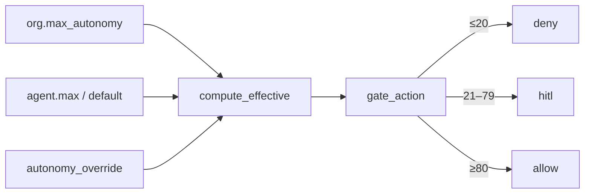
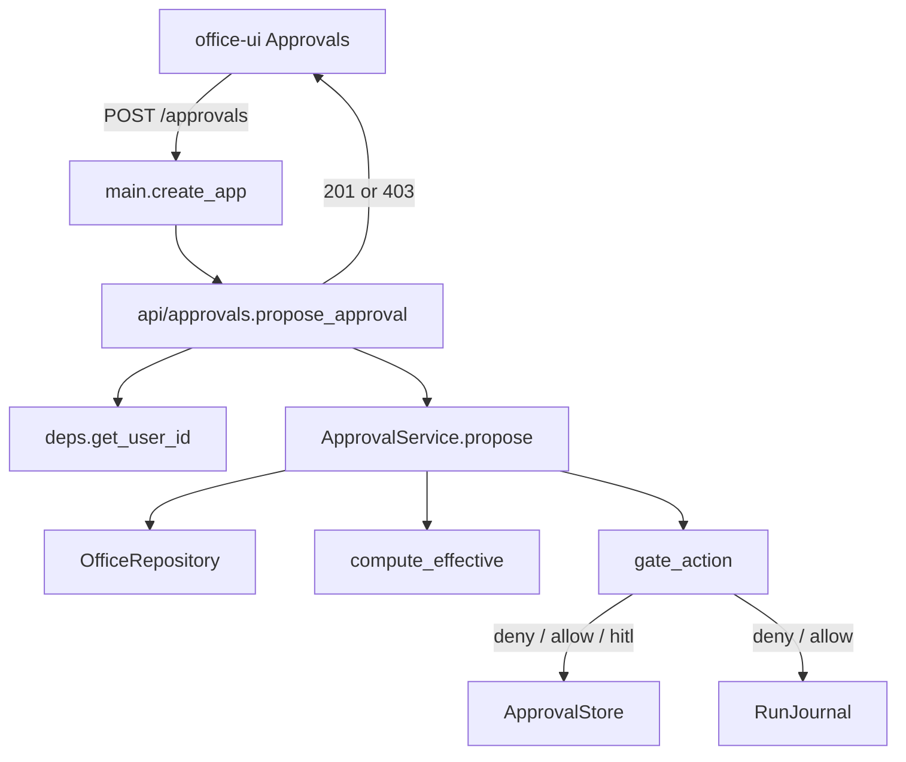
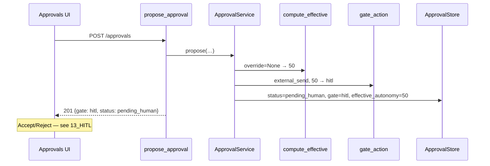
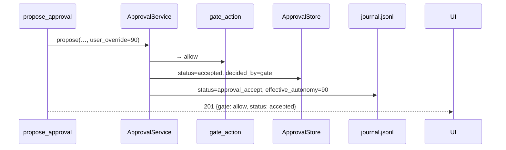
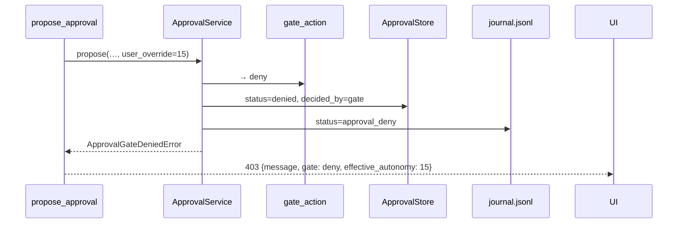
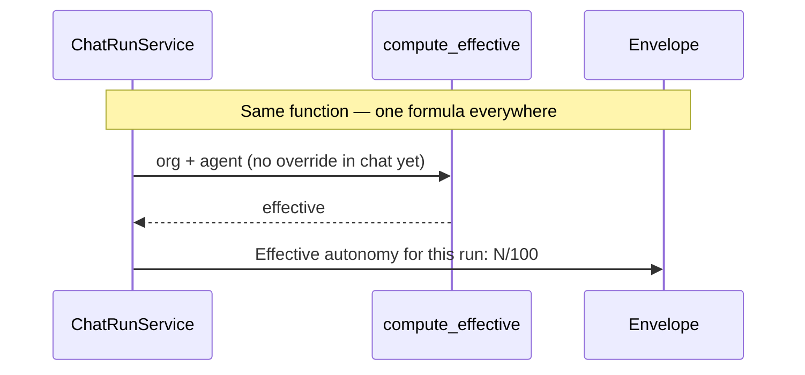

# Autonomy gate (P14)

Effective autonomy (§4.1) drives **one gate** on `POST /approvals` for `action_type=external_send`.

| effective | Gate | Result |
| --- | --- | --- |
| ≤20 | **deny** | Card `denied` + journal `approval_deny` + HTTP **403** |
| 21–79 | **hitl** | Card `pending_human` → human board ([13_HITL.md](./13_HITL.md)) |
| ≥80 | **allow** | Card `accepted`, `decided_by=gate` + journal `approval_accept` |

Other action types → always **hitl** (no band). Orchestrator still does **not** send Slack itself on allow.

Formula + ceiling: [06_HITL.md](./06_HITL.md) · Product: [ORCHESTRATOR.md](../ORCHESTRATOR.md) §4.1.



| Piece | Path |
| --- | --- |
| Formula + gate | `hitl/autonomy.py` |
| Wire | `hitl/service.ApprovalService.propose` |
| HTTP | `api/approvals.propose_approval` |
| Chat reuse | `runs/service` → `compute_effective` for Envelope |
| UI | Approvals · optional override field |

---

## Example flow: main → route → effective → gate → outcome

**Scenario:** Desk `ba` exists (`autonomy.default: 50`, max 100). Org `max_autonomy: 100`. User `admin`.

| Call | `autonomy_override` | effective | Outcome |
| --- | --- | --- | --- |
| `external_send` | — | 50 | hitl |
| `external_send` | `15` | 15 | deny |
| `external_send` | `90` | 90 | allow |
| `external_send` | `200` (invalid body) | — | 422 validation |
| `external_send` | `99` with agent max 70 | 70 | hitl (clamped) |
| `demo` | `90` | 90 | hitl (not gated type) |

### Request contract

```http
POST /approvals
X-User-Id: admin
Content-Type: application/json

{
  "agent_id": "ba",
  "team": "eng",
  "action_type": "external_send",
  "summary": "Send Slack to #sales: Q3 numbers ready",
  "autonomy_override": 90
}
```

| Value | Source |
| --- | --- |
| `agent_id` | Body — must exist (404 else) |
| `action_type` | Body — only `external_send` is banded |
| `autonomy_override` | Optional 0–100; clamped to `effective_max` |
| `requester` | `X-User-Id` |
| Response | `201` + card (`gate`, `effective_autonomy`) **or** `403` deny detail |

### End-to-end modules



### Inside `propose` (order)

```text
1. repo.get_agent(agent_id)     → 404 if missing
2. repo.load_org()
3. compute_effective(org, agent, user_override=…)
4. gate_action(action_type, effective)
5a. deny  → upsert denied + journal approval_deny → raise → HTTP 403
5b. allow → upsert accepted (decided_by=gate) + journal approval_accept → 201
5c. hitl  → upsert pending_human → 201 (no journal until human decide)
```

### A) HITL band (default desk = 50)

```http
POST /approvals
X-User-Id: admin
{"agent_id":"ba","action_type":"external_send","summary":"Send Slack","team":"eng"}
```



### B) Allow band (override ≥ 80)

```http
POST /approvals
X-User-Id: admin
{"agent_id":"ba","action_type":"external_send","summary":"Send Slack","autonomy_override":90}
```



**Journal snippet:**

```json
{
  "status": "approval_accept",
  "approval_id": "appr-…",
  "decision": "accept",
  "decided_by": "gate",
  "effective_autonomy": 90,
  "stack": "hitl"
}
```

### C) Deny band (override ≤ 20)

```http
POST /approvals
X-User-Id: admin
{"agent_id":"ba","action_type":"external_send","summary":"Send Slack","autonomy_override":15}
```



### D) Formula detail (same as chat)

```text
effective_max = min(org.max_autonomy, agent.autonomy.max ?? 100)
raw           = autonomy_override ?? agent.autonomy.default ?? org.autonomy.default
effective     = clamp(raw, 0, effective_max)
```



### Module map

| Step | Module |
| --- | --- |
| Boot | `main` → `approvals` router |
| HTTP | `api/approvals.py` |
| Service | `hitl/service.ApprovalService.propose` |
| Formula | `hitl/autonomy.compute_effective` |
| Gate | `hitl/autonomy.gate_action` (`GATED_ACTION_TYPE`) |
| Desk/org | `office.OfficeRepository` |
| Persist | `hitl/store` — `gate`, `effective_autonomy` columns |
| Audit | `runs/journal` |
| Human path | [13_HITL.md](./13_HITL.md) when `gate=hitl` |

```text
+ OK: external_send bands on effective; journal stamps effective_autonomy
- BAD: orchestrator executes Slack on allow

+ OK: non-external_send → always HITL board
- BAD: full catalog hil / MCP matrix in this slice

+ OK: override clamped to effective_max (no self-promote)
- BAD: free raise above org/agent ceiling
```

### Explicitly not P14

| Later | Why |
| --- | --- |
| Hard floor: never auto `external_send` even at 100 | Product intent; P14 allows ≥80 to **prove the knob** |
| Pause chat mid-run when gate=hitl | Needs tool loop |
| MCP `_locked` grant after allow | Later |
| Memory HITL bands | Later |
| User override on chat Envelope | Optional; chat uses agent default today |

**Status (P14):** one gate on propose = done.  
**Core v0:** also [15_OKF_EXPORT.md](./15_OKF_EXPORT.md). Optional: shelf / import.
