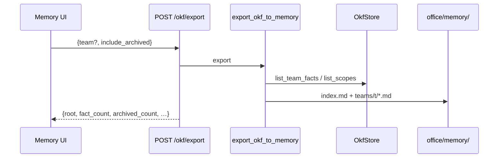
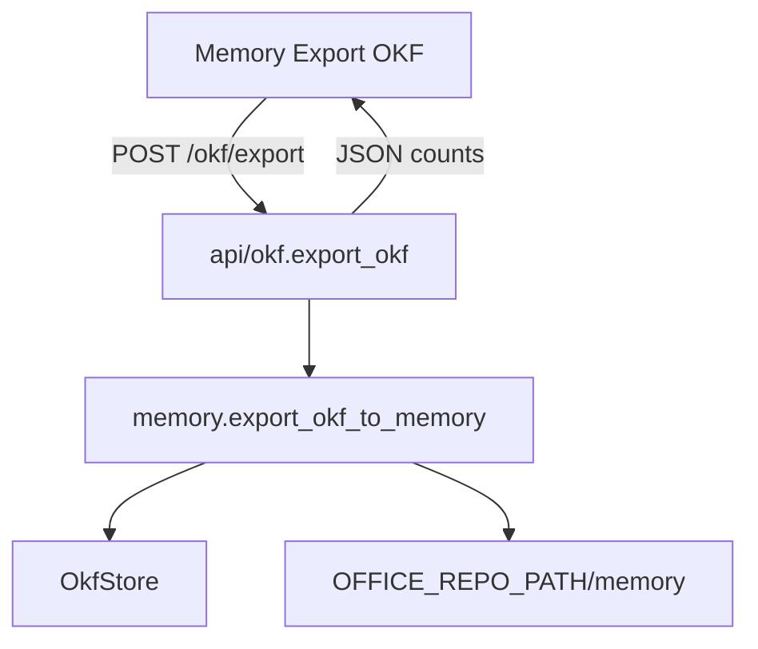
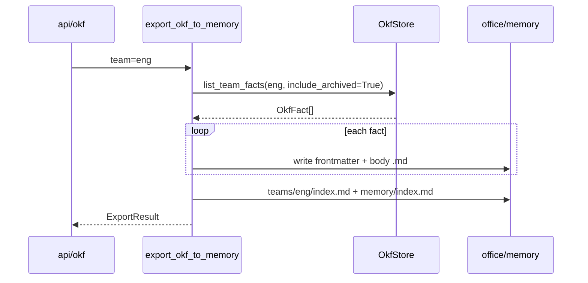

# OKF export (P15)

Leave-path: SQLite shared OKF → portable markdown under `office/memory/`.  
**Hot pack still reads DB** — export is backup / DR / take-your-data, not the chat path.

Product: [MEMORY_ARCHITECTURE.md](../MEMORY_ARCHITECTURE.md) §3 · [V0_SCOPE.md](../V0_SCOPE.md) pillar 4.



| Piece | Path |
| --- | --- |
| Export | `memory/export.py` — `export_okf_to_memory` |
| HTTP | `POST /okf/export` |
| UI | Memory → **Export OKF** |
| Tree | `office/memory/` |

---

## Example flow: main → route → DB → memory/

**Scenario:** Team `eng` has one active fact and one archived. Admin clicks Export.

### Layout written

```text
office/memory/
  index.md
  teams/eng/
    index.md
    fact-abc123.md          # YAML frontmatter + body
    archive/
      fact-old999.md        # archived facts
```

### Fact file shape

```markdown
---
id: fact-abc123
type: fact
scope: team:eng
projects: []
tags: []
domain: general
created_by_user: admin
created: 2026-…
pinned: false
archived: false
sensitivity: internal
source_run: null
---

Retail commission is 8 percent
```

### Request

```http
POST /okf/export
X-User-Id: admin
{"team":"eng","include_archived":true}
```

Omit `team` → export every `team:*` scope found in SQLite.

### Modules





### Inside export (order)

```text
1. resolve office/memory/
2. teams = [team] or scopes from list_scopes()
3. per team: list_team_facts(include_archived)
4. replace prior *.md for that team (snapshot replace)
5. active → teams/<t>/<id>.md ; archived → teams/<t>/archive/<id>.md
6. write team index.md + root index.md
```

### Module map

| Step | Module |
| --- | --- |
| HTTP | `api/okf.export_okf` |
| Writer | `memory/export.export_okf_to_memory` |
| Read | `OkfStore.list_team_facts` / `list_scopes` |
| Disk | `Settings.office_repo_path` / `memory/` |

```text
+ OK: export = markdown OKF under office/memory/; DB remains hot path
- BAD: pack chat from memory/ files instead of SQLite

+ OK: agents must not browse office/memory/ (AGENT_DEFINITION)
- BAD: mount export tree as agent workspace

+ OK: import from OKF → DB later (leave-path restore)
- BAD: claim export alone restores a live office without DB/import
```

**Status (P15):** export leave-path = done. Core IMPLEMENTATION slices 1–10 complete.  
**Optional later:** OKF import, shelf ∩ P(p), Settings read-only page.
