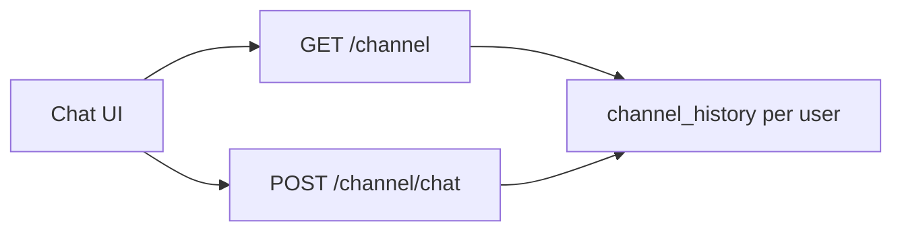

# Unified channel (P16)

One orchestrator chat per user: **Office + desks + history + pending HITL**.

| HTTP | Role |
| --- | --- |
| `GET /channel` | agents + pending_approvals + **messages** (this user) |
| `GET /channel/history` | transcript only |
| `POST /channel/chat` | SSE office or agent; **appends** to user history; ends with `approvals` |

Desk **Chat** → same Chat view with that agent chip selected. Nav **Chat** → same thread (Office chip default).

History file: `data/channel/<user_id>.jsonl` (one thread per user, all agents).

Desk chat packs **recent thread** (default last 7 days, char-capped) into the system prompt for continuity — not OKF/gold. Env: `RECENT_HISTORY_DAYS`, `RECENT_HISTORY_CHAR_BUDGET`.

Decide still: `POST /approvals/{id}/decide`.

See also earlier SSE event types in this file’s previous section / README.

**UI:** nav Chat · agent chips · desk Chat opens channel with desk selected.
