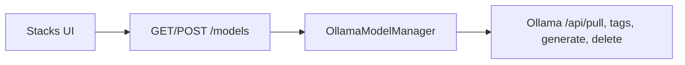

# P17 — Local models (Stacks)

Curated Ollama pull from the UI. Inference stays OpenAI-compatible `/v1`; management uses Ollama native API only.



| HTTP | Role |
| --- | --- |
| `GET /models` | engine reachability + curated catalog (`pulled`) + installed |
| `GET /models/health` | **On-demand** GPU ladder (Stacks only) — steps + fix hints + run tags |
| `POST /models/verify` | Warm-load curated tag + report `running_gpu` / `running_cpu` (SSE) |
| `POST /models/pull` | SSE progress (`meta` / `progress` / `done` / `cancelled` / `error`); client abort closes Ollama stream |
| `POST /models/flush` | unload **all** models in `/api/ps` via `keep_alive: 0` (weights stay on disk; not a driver reset) |
| `POST /models/delete` | remove curated tag from `./data/ollama` |

**Health** runs only when Stacks loads or user clicks **Check GPU** — never from chat/channel.  
Needs `nvidia-smi` (orchestrator with `docker-compose.gpu.yml`) and/or host `docker exec`.

**Flush** frees Ollama-held RAM/VRAM only. If Check GPU still shows high VRAM with `still_loaded: []`, restart the Ollama container or inspect other GPU processes — that is outside app-level unload.

**Timeouts (env):** `OPENAI_COMPATIBLE_TIMEOUT` (chat/soft jobs), `OLLAMA_PULL_TIMEOUT` (Stacks pull).

**Class:** `OllamaModelManager` in `adapters/ollama_models.py` (only Ollama-specific module).  
**UI:** nav **Stacks** — Pull / Cancel / Verify / Delete; header **Flush** + **Check GPU**.  

**Prereq (CPU — default):**

```bash
docker compose --profile ollama up -d
```

**NVIDIA GPU (optional):** same stack + `docker-compose.gpu.yml`. If start fails, use the CPU command (fallback). Details: [07_DOCKER.md](./07_DOCKER.md).

```bash
docker compose --profile ollama -f docker-compose.yml -f docker-compose.gpu.yml up -d
```

**Token limits vs Ollama context:** Office / agents expose **max input / max output** only. We do **not** send Ollama `options.num_ctx` on Verify or chat — that sized KV at load time, forced reloads, and on ~4 GB Docker/WSL GPUs produced `timed out waiting for llama-server to start` with GPU stuck near idle. Cap KV with compose `OLLAMA_CONTEXT_LENGTH` instead. Full write-up: [LOCAL_MODEL_STACK.md](../LOCAL_MODEL_STACK.md) §9 “Why we do not send per-request num_ctx”.

```text
+ OK: pull allowlisted curated tags only
- BAD: expose arbitrary registry pull from UI
+ OK: chat via /v1; pull via /api/pull
- BAD: bake weights into the image
+ OK: CPU default; GPU opt-in override
- BAD: hard-require NVIDIA in base compose
+ OK: server OLLAMA_CONTEXT_LENGTH; app max_input / max_output
- BAD: per-request options.num_ctx on small VRAM Docker GPU
```
