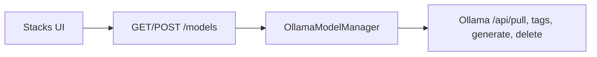

# P17 — Local models (Stacks)

Curated Ollama pull from the UI. Inference stays OpenAI-compatible `/v1`; management uses Ollama native API only.



| HTTP | Role |
| --- | --- |
| `GET /models` | engine reachability + curated catalog (`pulled`) + installed |
| `GET /models/health` | **On-demand** GPU ladder (Stacks only) — steps + fix hints + run tags |
| `POST /models/verify` | Warm-load curated tag + report `running_gpu` / `running_cpu` (SSE) |
| `POST /models/pull` | SSE progress (`meta` / `progress` / `done` / `cancelled` / `error`); client abort closes Ollama stream |
| `POST /models/unload` | free RAM/VRAM via `POST /api/generate` `{keep_alive: 0}` (weights stay on disk) |
| `POST /models/delete` | remove curated tag from `./data/ollama` |

**Health** runs only when Stacks loads or user clicks **Check GPU** — never from chat/channel.  
Needs `nvidia-smi` (orchestrator with `docker-compose.gpu.yml`) and/or host `docker exec`.

**Timeouts (env):** `OPENAI_COMPATIBLE_TIMEOUT` (chat/soft jobs), `OLLAMA_PULL_TIMEOUT` (Stacks pull).

**Class:** `OllamaModelManager` in `adapters/ollama_models.py` (only Ollama-specific module).  
**UI:** nav **Stacks** — Pull / Cancel / Verify / Unload / Delete.  

**Prereq (CPU — default):**

```bash
docker compose --profile ollama up -d
```

**NVIDIA GPU (optional):** same stack + `docker-compose.gpu.yml`. If start fails, use the CPU command (fallback). Details: [07_DOCKER.md](./07_DOCKER.md).

```bash
docker compose --profile ollama -f docker-compose.yml -f docker-compose.gpu.yml up -d
```

```text
+ OK: pull allowlisted curated tags only
- BAD: expose arbitrary registry pull from UI
+ OK: chat via /v1; pull via /api/pull
- BAD: bake weights into the image
+ OK: CPU default; GPU opt-in override
- BAD: hard-require NVIDIA in base compose
```
