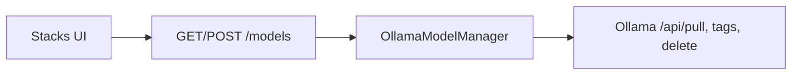

# P17 — Local models (Stacks)

Curated Ollama pull from the UI. Inference stays OpenAI-compatible `/v1`; management uses Ollama native API only.



| HTTP | Role |
| --- | --- |
| `GET /models` | engine reachability + curated catalog (`pulled`) + installed |
| `POST /models/pull` | SSE progress (`meta` / `progress` / `done` / `error`) |
| `POST /models/delete` | remove curated tag from local volume |

**Class:** `OllamaModelManager` in `adapters/ollama_models.py` (only Ollama-specific module).  
**UI:** nav **Stacks** — Pull / progress / Delete.  
**Prereq:** `docker compose --profile ollama up -d`

```text
+ OK: pull allowlisted curated tags only
- BAD: expose arbitrary registry pull from UI
+ OK: chat via /v1; pull via /api/pull
- BAD: bake weights into the image
```
