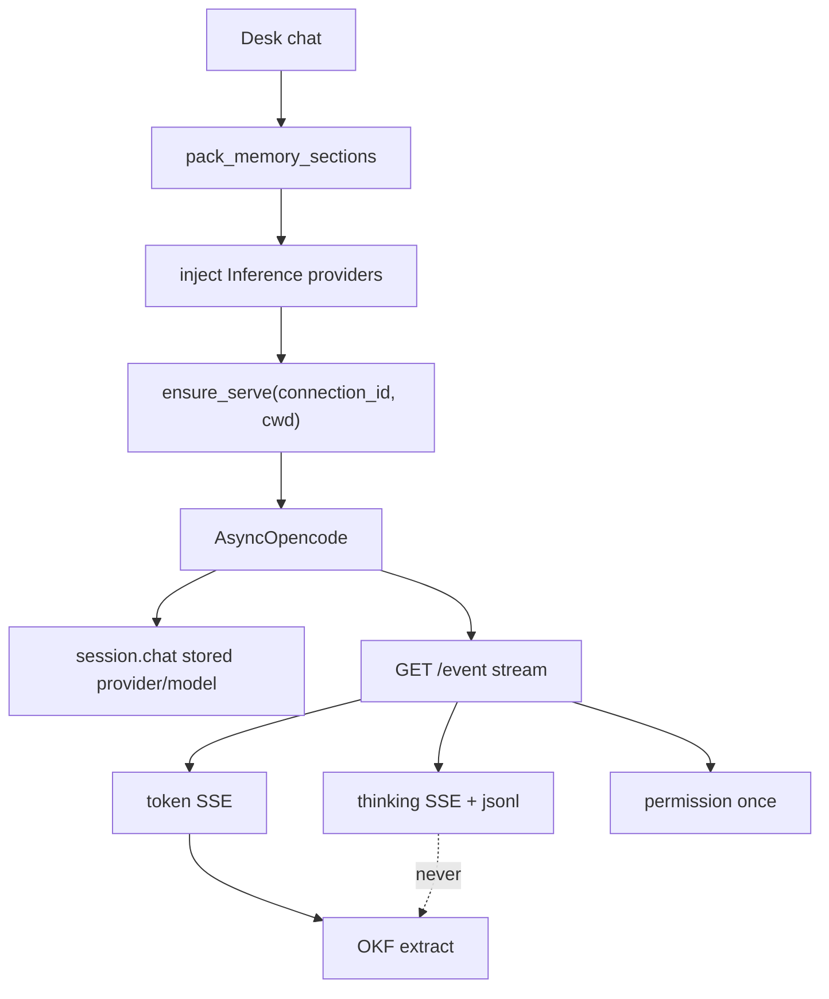
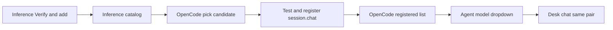

# OpenCode harness (first worker stack)

Coding knowledge for integrating **OpenCode** as the first `tools.mode: worker` runtime. Product detail: [STACK_ADAPTERS.md](../STACK_ADAPTERS.md) §11–§12.

**Status:** Slice A shipped **`0.3.0`**. Runtime registry / idle TTL shipped **`0.3.2`**.  
**Registered models / provider inject:** **`0.3.3`**. Token-exchange register gate: **`0.3.4`**. Desk chat idle race: **`0.3.5`**. Bedrock API key auth: **`0.3.6`**. OpenCode thinking harvest: **`0.3.7`**.

### Versioning (single line)

| Line | Use |
| --- | --- |
| **0.3.0** | OpenCode harness slice A (serve + chat + thinking) |
| **0.3.1** | Stacks connections (thin cards) |
| **0.3.2** | Runtime registry (serves + sessions + idle TTL) |
| **0.3.4** | Test & register waits for assistant tokens + `session.idle` (refuse if Inference Test is already error) |
| **0.3.5** | Desk chat ignores empty `session.idle` before `session.chat`; pass = ≥1 token then idle |
| **0.3.6** | Bedrock: IAM keys or Bedrock API key + region; OpenCode inject uses `AWS_BEARER_TOKEN_BEDROCK` |
| **0.3.7** | Map OpenCode reasoning parts (sessionID on envelope / deltas) + harvest after idle |
| **0.3.x** | Further bugfixes / minors on the same line |

Do **not** maintain a separate `release/0.2` patch branch unless an external consumer requires it.

---

## Rule: `stack` · `connection_id` · `model`

| Field | Meaning |
| --- | --- |
| **`stack`** | Adapter family — how AAS talks to the engine (`opencode`, `bedrock`, `openai-compatible`) |
| **`connection_id`** | One Stacks **profile** (endpoint / keys / serve spawn rules) — e.g. `oc-local`, `bed-prod` |
| **`model`** | Model id on that engine |

Desk `stack` is copied from the connection’s product (or derived). Do **not** invent a second meaning.

**Never:** `connection_id: opencode` or `connection_id: qwen`. OpenCode is **stack**. Qwen / Nova Lite is **model**. `oc-local` is **connection_id**.

Session ids (`ses_…`) and serve ports are **ephemeral runtime** — never written into `agent.yaml` or used as `connection_id`.

---

## Why AAS starts serve

OpenCode serve is bound to **one working directory**. Desks are bound to `workspace.path` (project).

| Approach | Result |
| --- | --- |
| User starts global `opencode serve` | Cwd = wherever they launched — too broad |
| **Orchestrator spawns/supervises** serve | Tools only see that project tree |

### Serve key (locked)

```text
serve key = (connection_id, workspace.path)   →  ONE opencode serve + port
  developer × user A  →  ses_aaa
  developer × user B  →  ses_bbb
  tester    × user A  →  ses_ccc   # same serve if same path + same connection
```

| Change | New `connection_id`? |
| --- | --- |
| Another user on the same desk | **No** — new `ses_…` only |
| Another desk, same path + same OpenCode profile | **No** — share serve; new session |
| Second OpenCode host / long-lived other port operators pick | **Yes** (`oc-lab`) |
| Cursor: second API key | **Yes** (when Cursor lands) |

Do **not** put desk or user on the serve key unless harness spawn config is truly per-desk (unusual). Idle TTL stops unused serves (`OPENCODE_SERVE_IDLE_TTL_SECONDS`).

### Docker / binary (not a Compose OpenCode service)

| Approach | Use? |
| --- | --- |
| Long-lived Compose `opencode:` like Ollama | **No** |
| **Install OpenCode CLI in the orchestrator Linux image** | **Yes** |
| AAS `subprocess` / supervise `opencode serve` with `cwd=/projects/...` | **Yes** |

---

## Two model catalogs (do not collapse)

| Catalog | Where | Meaning |
| --- | --- | --- |
| **Inference catalog** | Bedrock / Ollama / … Stacks tile | Office can call this id (`Verify & add` / discover) |
| **OpenCode registered list** | OpenCode Stacks tile | This harness profile can run this id (**Test & register** passed) |

**Agent / desk UI** (OpenCode runtime): flat model dropdown = **OpenCode registered list only**.  
No “Models via Bedrock” control on the desk — the model id already implies which Inference profile owns it.

### Soft link vs hard wire

| Soft only (avoid) | Hard (do this) |
| --- | --- |
| UI shows Nova because Bedrock catalog has it | OpenCode process has Bedrock provider + creds |
| Operator configures OpenCode UI themselves | AAS configures providers on spawn from Inference `secretRef` / `base_url` |
| Dropdown without inject | **Test & register** proves `session.chat` works |

---

## Stacks surfaces (jobs)

| Surface | User does | AAS does |
| --- | --- | --- |
| **Stacks · Inference** | Add Bedrock / OpenAI-compat / … kind-specific fields + **Test** / **Verify & add** | Save connection + secretRef; store model allowlist |
| **Stacks · OpenCode** | Connect OpenCode (serve/spawn). **Select** models from Inference catalogs → **Test & register**. No default models linked | On Test/spawn: inject providers from linked Inference; persist working `(provider_id, model_id)` |
| **Agent / desk UI** | Pick OpenCode connection + model from registered list | Persist `connection_id` + `model`; chat uses stored pair |

**Cursor** stays out of Create/Configure until a real adapter exists.

### Inference: register models (existing Bedrock pattern)

```text
Stacks → Bedrock (bed-prod)
  Inference id:  amazon.nova-lite-v1:0
  Display name:  Nova Lite
  [Verify & add]  → Converse (or equivalent) with bed-prod creds
                  → Inference catalog row
```

Same idea for OpenAI-compatible: base_url + Test / list `/v1/models` → catalog tags.

### OpenCode: Test & register (next slice)

OpenCode card starts with **empty** registered list (no auto-import of all Inference models).

```text
Stacks → OpenCode (oc-local)
  Candidates from linked Inference (operator picks):
    ○ amazon.nova-lite-v1:0  Nova Lite  [from bed-prod]
  [ Test & register in OpenCode ]

  Registered for desks:
    ✓ amazon.nova-lite-v1:0
      provider_id=amazon-bedrock  model_id=amazon.nova-lite-v1:0
      tested_at=…
```

**Test & register** algorithm:

1. `ensure_serve(connection_id, cwd)` (scratch or desk workdir)
2. Inject Inference provider config into that serve (Bedrock keys/region, Ollama base_url, …) — **same recipe as production chat**
3. Build **candidate** `(provider_id, model_id)` pairs (CLI `opencode models`, known provider names, Inference id)
4. `AsyncOpencode` → `session.create` → `session.chat` with nested `extra_body.model`
5. **Pass** = ≥1 assistant `token` then `session.idle` (same event path as desk chat). Do not persist on HTTP-accept alone
6. **Fail** = Inference Test already `error`, event `error` / `session.error`, HTTP exception, or timeout with no tokens
7. First passing pair → persist on the OpenCode connection; else show error and **do not** add to desk dropdown

Desk chat **replays the stored pair** — never re-guess Anthropic vs Bedrock shapes.

### SDK chat shape (locked)

Flat SDK fields alone are **ignored** by current OpenCode; always send nested model:

```python
await client.session.chat(
    id=session_id,
    provider_id=provider_id,   # e.g. "opencode" or "amazon-bedrock"
    model_id=model_id,         # e.g. "big-pickle" or "amazon.nova-lite-v1:0"
    parts=[{"type": "text", "text": "..."}],
    extra_body={
        "agent": "build",
        "model": {
            "providerID": provider_id,
            "modelID": model_id,
        },
    },
)
```

Known curated pair: `opencode` + `big-pickle`.  
Bedrock Nova pair: **whatever Test persisted** (likely `amazon-bedrock` + `amazon.nova-lite-v1:0`) — not a guessed `anthropic` / `claude-2`.

### Chat path after register

```text
desk: connection_id=oc-local  stack=opencode  model=amazon.nova-lite-v1:0
  → model must be on oc-local registered list
  → ensure_serve(oc-local, workspace.path)
  → inject providers (same as Test)
  → session.chat with stored (provider_id, model_id)
  → run_id + ses_… (runtime registry)
```

Chat-only Qwen (no harness): different connection — `ollama-local` + `stack: openai-compatible` + same model tag. Same Qwen string, different stack.

---

## Example desks

```yaml
# BA / chat — Inference only
connection_id: ollama-local   # or seeded "ollama" until rename
stack: openai-compatible
model: qwen2.5:7b
tools: { mode: none }

# Developer — OpenCode + Nova (after Test & register)
connection_id: oc-local
stack: opencode
model: amazon.nova-lite-v1:0
tools: { mode: worker }
workspace: { path: /projects/loan-portal }
```

---

## Slice A (shipped `0.3.0`)

| In | Out (later) |
| --- | --- |
| Spawn serve @ `workspace.path` | **Slice C:** clarifying-question UI |
| `AsyncOpencode` + official `opencode_ai` SDK only | Mid-run gold tools inside OpenCode loop |
| Pack → session.chat | Auto OKF from thinking |
| SSE: `token` + **`thinking`** | |
| Permission **auto-`once`** | Autonomy-gated once / HITL / deny |
| Default suggest **`opencode` / `big-pickle`** | |

### Permission `once`

OpenCode `permission.asked` → `POST …/permissions/{id}` with `{"response": "once"}`.

| When | Behavior |
| --- | --- |
| **0.3.0 (A)** | Always auto-`once` |
| **Later** | Autonomy chooses auto / HITL / deny; allow grant still **`once`** |

### Slice C (later)

`question.asked` → office UI options → SDK `post` reply. Out of early 0.3.x.

---

## Runtime registry (shipped `0.3.2`)

Under the OpenCode Stacks connection (not in yaml):

| Live | Inference connections |
| --- | --- |
| Serves `(connection_id, cwd)` + idle TTL | Journal `run_id` rows only (no fake `ses_`) |
| Sessions `ses_…` + Kill | |
| Stop serve (refuses if busy) | |
| Disable OpenCode → stop all serves | |

---

## SDK usage

Package: official **`opencode_ai`** (e.g. `0.1.0a36`).

| Need | Use |
| --- | --- |
| Session / chat | `AsyncOpencode.session.create` / `.chat` (+ nested `extra_body.model`) |
| Live events | `client.get("/event", stream=True, …)` |
| Permission | `client.post(.../permissions/{id}, body={"response": "once"})` |

**Client:** `AsyncOpencode` only inside FastAPI — never sync `Opencode` on the event loop.

**Test & register** and **desk chat** use the **same** serve + client + chat wiring. Desk chat also ignores `session.idle` until `session.chat` is in flight, then requires ≥1 assistant `token` before treating idle as the end of the turn (journal `error` if the turn ends with no tokens).

---

## Memory & extract

```text
Pack (unchanged)     → Envelope + AGENT.md + gold ∪ team OKF ∪ recent → OpenCode
Assistant final text → OKF extract (as today)
Thinking stream      → store + UI only — NEVER OKF extract
```

Gold **read** via pack works. Gold **tools** mid-OpenCode-run are a later slice.

## Thinking store

| Path | Role |
| --- | --- |
| Live SSE `type: "thinking"` | Open chat panel |
| `data/runs/<run_id>/thinking.jsonl` | Desk / run click-back |
| `GET …/runs/{run_id}/thinking` | Load API |

## Modules

```text
adapters/opencode/
  serve.py       # spawn / health / stop — key (connection_id, cwd)
  runtime.py     # sessions, busy, idle TTL sweeper
  events.py      # SSE dict → office events
  adapter.py     # chat + model pair from registered list
  # providers.py (0.3.3) — inject Inference → OpenCode config; Test & register
```

## Event map (slice A)

| OpenCode | Office SSE |
| --- | --- |
| text `message.part.updated` | `token` |
| thinking / reasoning parts | `thinking` |
| `permission.asked` | auto `once` |
| `session.idle` | end turn **after** `session.chat` is in flight and ≥1 assistant `token` (ignore idle on a new empty session) |
| `session.error` / `message.updated` errors | `error` |




